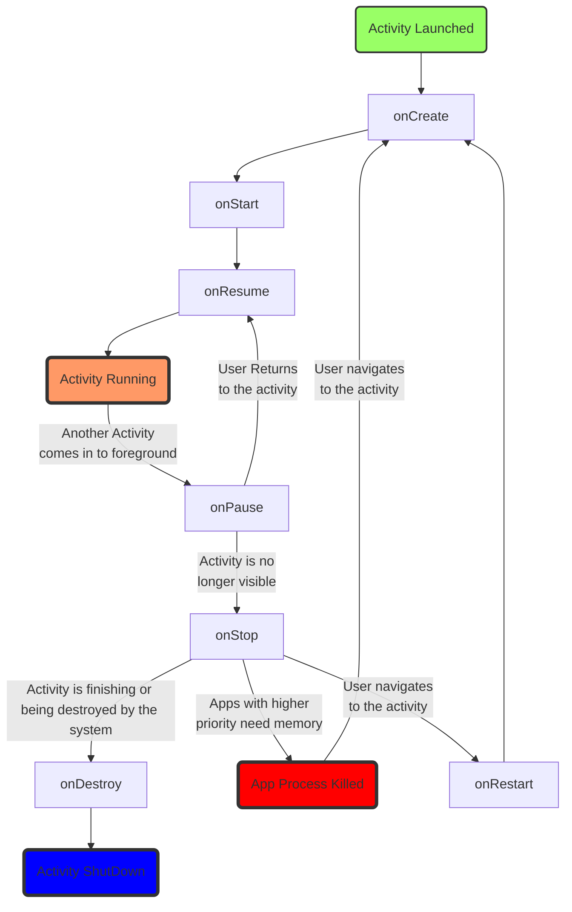

# Activity LifeCycle

```mermaid
graph TD;
A(Activity Launched)-->B[onCreate]-->C[onStart]-->D[onResume]
D-->E(Activity Running)
E--Another Activity <br/> comes in to foreground-->F[onPause]
F--Activity is no <br/> longer visible-->G[onStop]
G--Activity is finishing or <br/>being destroyed by the system-->H[onDestroy]
H-->I(Activity ShutDown)
G--Apps with higher<br/>priority need memory-->J(App Process Killed)--User navigates <br/>to the activity-->B
G--User navigates <br/>to the activity-->K[onRestart]-->B
F--User Returns<br/>to the activity-->D
classDef green fill:#9f6,stroke:#333,stroke-width:2px;
classDef orange fill:#f96,stroke:#333,stroke-width:4px;
classDef red fill:#f00,stroke:#333,stroke-width:4px;
classDef blue fill:#00f,stroke:#333,stroke-width:4px;
class A green
class E orange
class I blue
class J red
```
