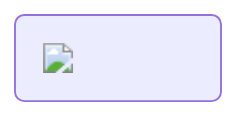
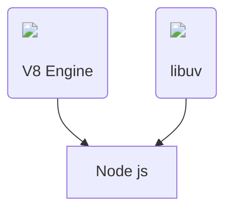
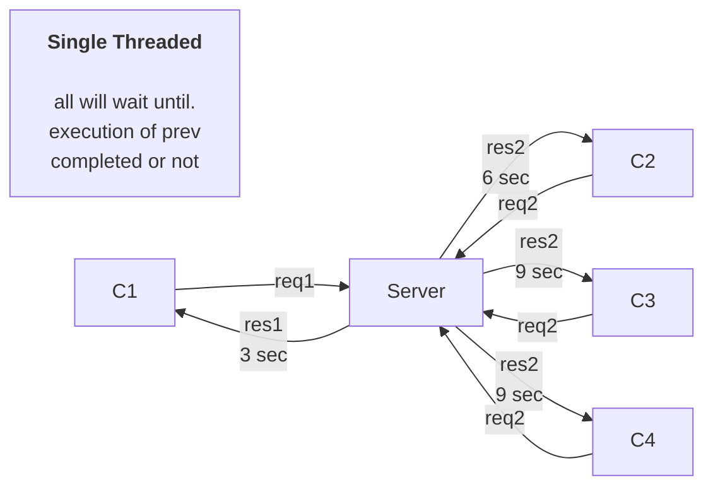
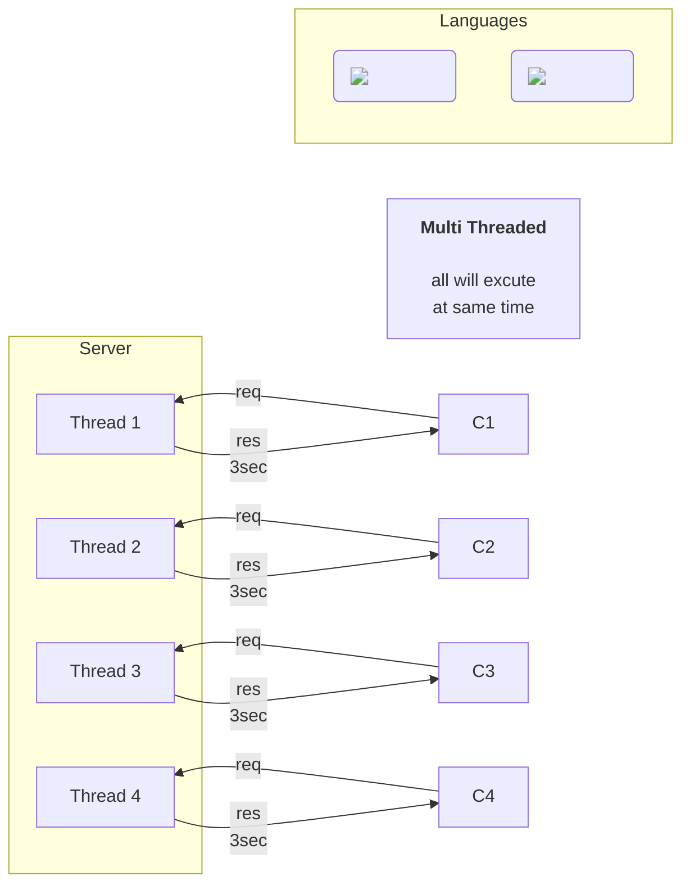

# What is Node JS

- Runtime environment
- Not a frame work not a language
- **Node.**  **js is a JavaScript runtime built on top of the V8 JavaScript engine** .
- Work on V8 Engine
- Chrome--> V8 JS Engine
- Mozilla Firefox --> Spider Monkey JS Engine
- Microsoft Edge --> Chakra JS Engine
- Intially js was working on browsers so **Rayn Dahl** used V8 Engine and created a new Runtime Environment called Node.js that can run on our system. Our index.js js file can communicate with our system.

## libuv

- written in c++
- make js asynchronous I/O operations

## Threading

- Node js is single threaded run time environment
- Java Runtime Environment Supports Multi threading
- so let's understanding how node js executes multiple requests simultaneously

