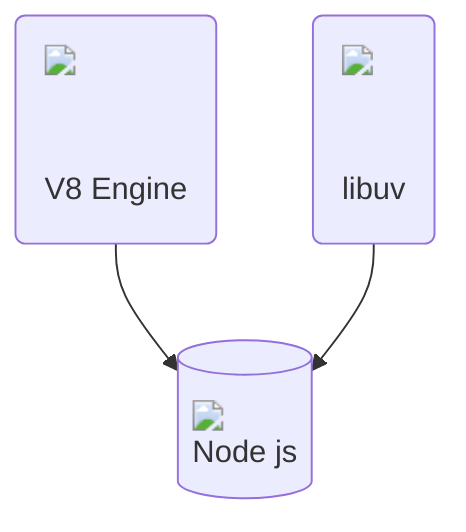
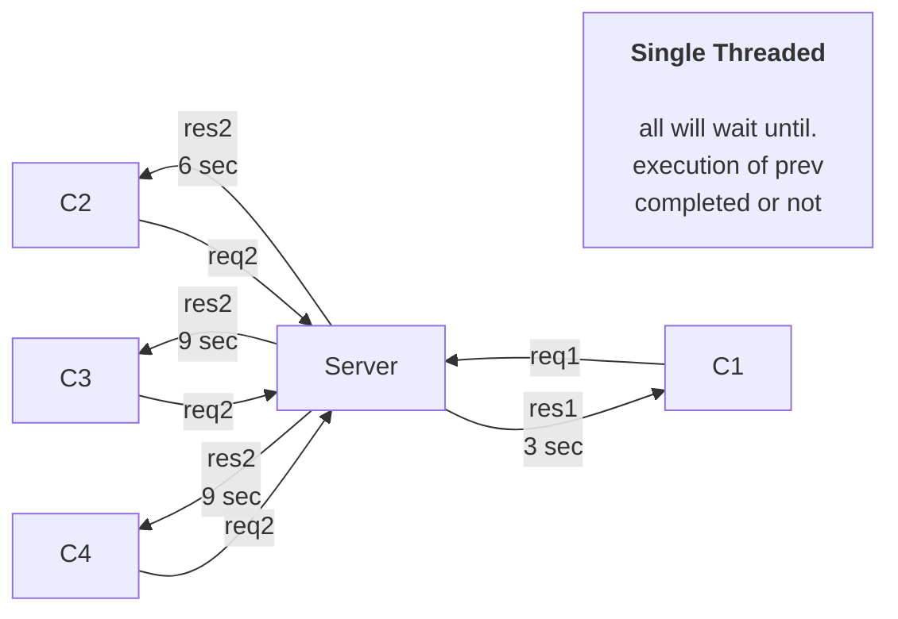
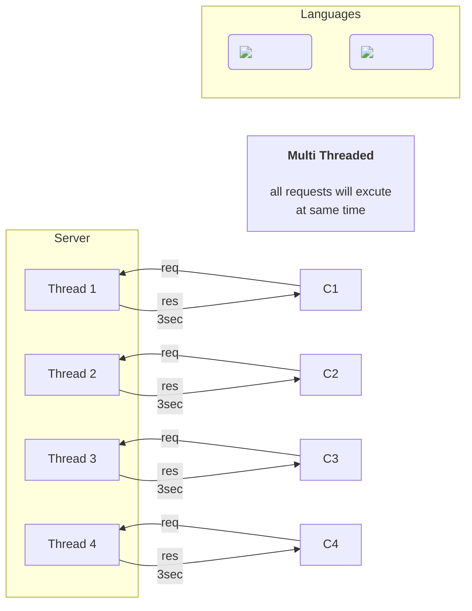
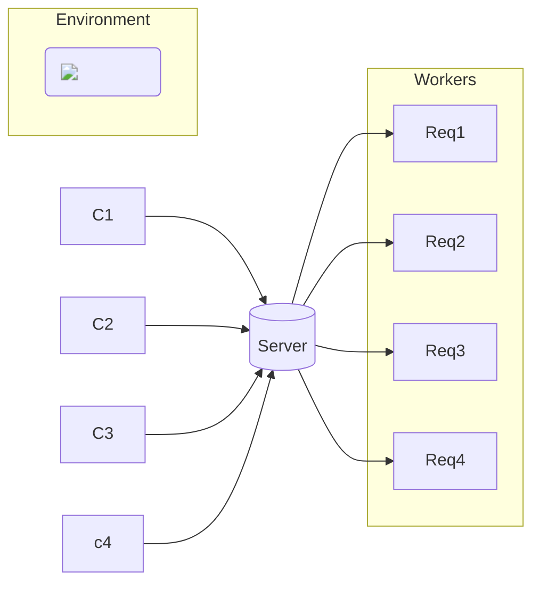
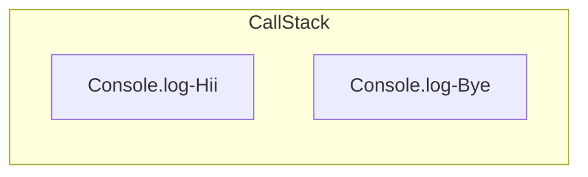
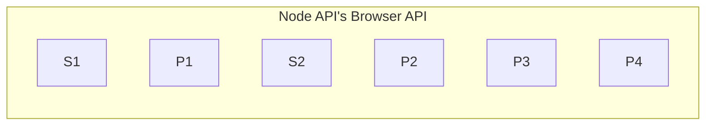
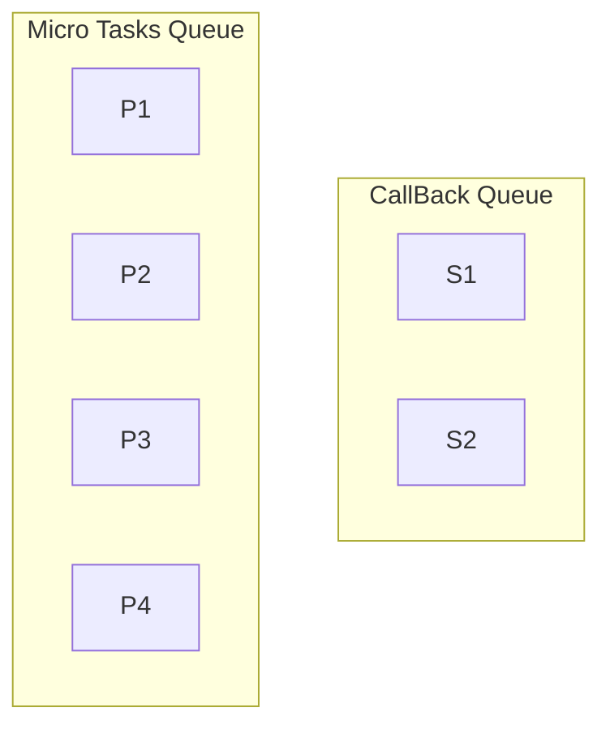
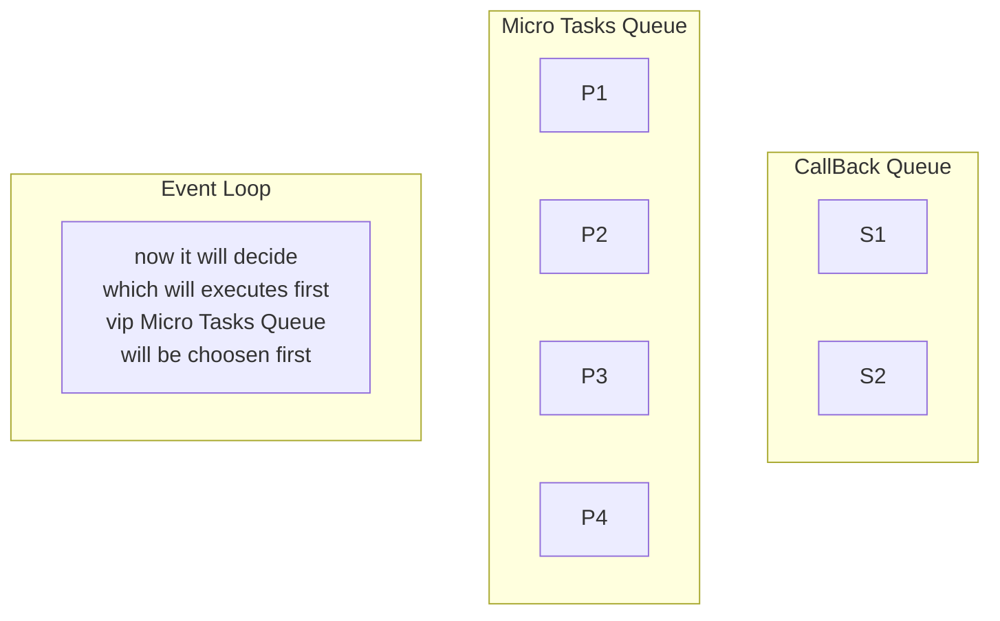

# What is Node JS

- Runtime environment
- Not a frame work not a language
- **Node.**  **js is a JavaScript runtime built on top of the V8 JavaScript engine** .
- Work on V8 Engine
- Chrome--> V8 JS Engine
- Mozilla Firefox --> Spider Monkey JS Engine
- Microsoft Edge --> Chakra JS Engine
- Intially js was working on browsers so **Rayn Dahl** used V8 Engine and created a new Runtime Environment called Node.js that can run on our system. Our index.js js file can communicate with our system.



## Threading

- Node js is single threaded run time environment
- Java Runtime Environment Supports Multi threading
- so let's understanding how node js executes multiple requests simultaneously





- But Node js is Single Threaded so how it is fast



## Synchronous vs Asynchronous


## libuv

- written in c++
- make js asynchronous I/O operations
- Above Async. given by libuv

```js
console.log("Hii")
SetTimeOut(cb)
Promises
SetTimeOut
Promises
Promises
Promises
console.log("Bye")
```


### Step 1



### Step 2



### Step 3



### Step 4



```js
Output
Hii
Bye
P1
P2
P3
P4
S1
S2
```

## Event Loop and Thread Pool


## Streams

- Data Chunk by Chunk

### Node js Streams

- Readable
  - Read Data from a source
- Writable
  - Write Data to a destination
- Duplex
  - Read and Write Data to a destination
- Transform
  - Read Data from a source and write to a destination

### Strems By Node js fs module

#### Readable Stream

```js
const fs = require('fs');
let data = '';
let readStream = fs.createReadStream('input.txt');
readStream.setEncoding('UTF8');
readStream.on('data', function(chunk) {
    data += chunk;
});
readStream.on('end', function() {
    console.log(data);
});
readStream.on('error', function(err) {
    console.log(err.stack);
});
console.log("Program Ended");
```

#### Writable Stream

```js
const fs = require('fs');
let data = 'Simply Easy Learning';
let writeStream = fs.createWriteStream('output.txt');
writeStream.write(data, 'UTF8');
writeStream.end();
writeStream.on('finish', function() {
    console.log("Write completed.");
});
writeStream.on('error', function(err) {
    console.log(err.stack);
});
console.log("Program Ended");
```

#### Piping

- Piping is a mechanism where we provide the output of one stream as the input to another stream.

```js
const fs = require('fs');
let readStream = fs.createReadStream('input.txt');
let writeStream = fs.createWriteStream('output.txt');
readStream.pipe(writeStream);
console.log("Program Ended");
```

#### Chaining

- Chaining is a mechanism to connect the output of one stream to another stream and create a chain of multiple stream operations.

```js
const fs = require('fs');
let zlib = require('zlib');
const gzip = zlib.createGzip();
var readStream = fs.createReadStream('input.txt');
var writeStream = fs.createWriteStream('input.txt.gz');
readStream.pipe(gzip).pipe(writeStream);
console.log("File Compressed.");
```
