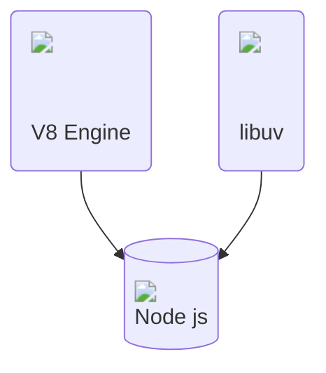
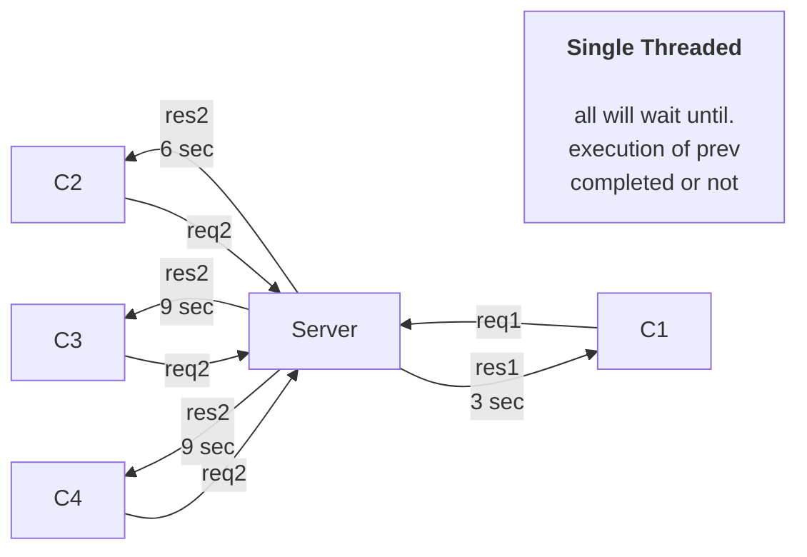
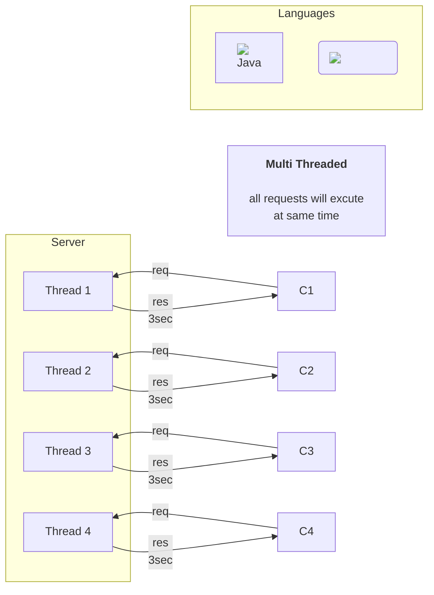
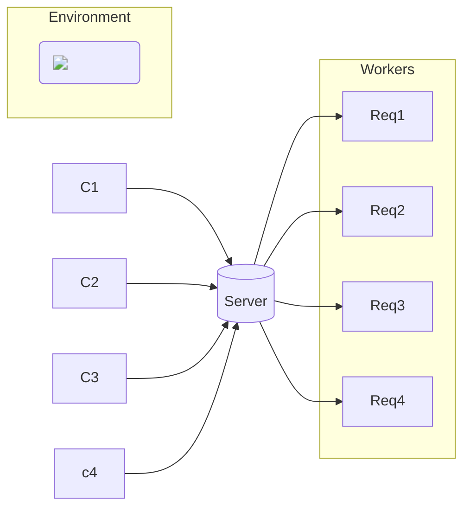
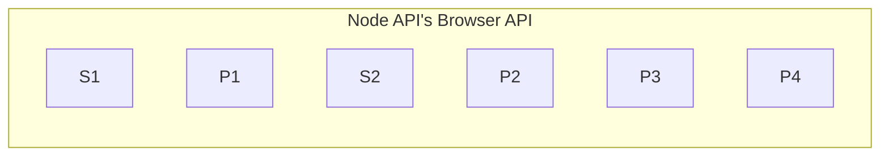
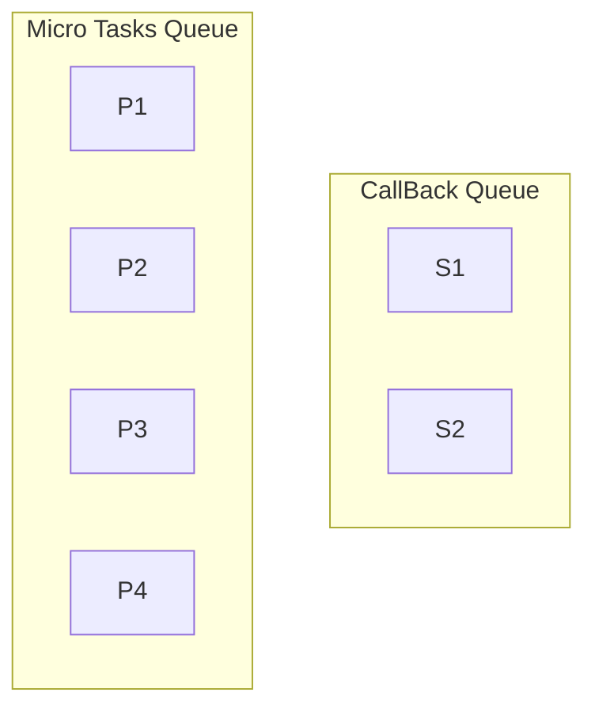
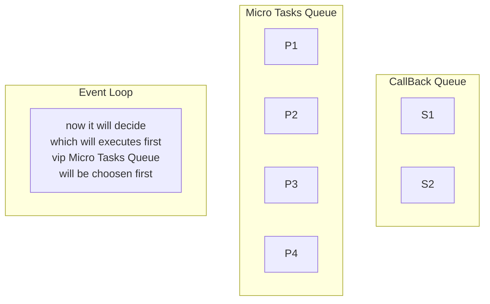
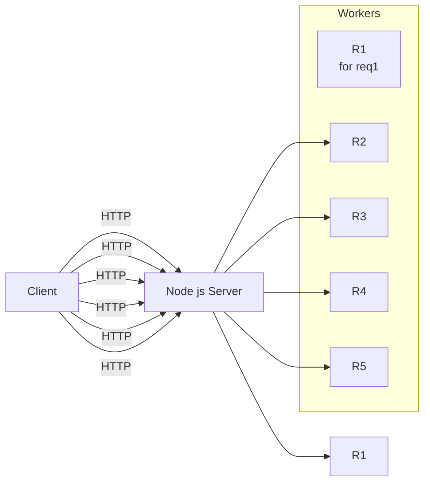

# What is Node JS

- Runtime environment
- Not a frame work not a language
- **Node.**  **js is a JavaScript runtime built on top of the V8 JavaScript engine** .
- Work on V8 Engine
- Chrome--> V8 JS Engine
- Mozilla Firefox --> Spider Monkey JS Engine
- Microsoft Edge --> Chakra JS Engine
- Intially js was working on browsers so **Rayn Dahl** used V8 Engine and created a new Runtime Environment called Node.js that can run on our system. Our index.js js file can communicate with our system.



## Threading

- Node js is single threaded run time environment
- Java Runtime Environment Supports Multi threading
- so let's understanding how node js executes multiple requests simultaneously





- But Node js is Single Threaded so how it is fast



## Synchronous vs Asynchronous


## libuv

- written in c++
- make js asynchronous I/O operations
- Above Async. given by libuv

```js
console.log("Hii")
SetTimeOut(cb)
Promises
SetTimeOut
Promises
Promises
Promises
console.log("Bye")
```


### Step 1


### Step 2



### Step 3



### Step 4



```js
Output
Hii
Bye
P1
P2
P3
P4
S1
S2
```

## Event Loop and Thread Pool


## Streams

- Data Chunk by Chunk

### Node js Streams

- Readable
  - Read Data from a source
- Writable
  - Write Data to a destination
- Duplex
  - Read and Write Data to a destination
- Transform
  - Read Data from a source and write to a destination

### Strems By Node js fs module

#### Readable Stream

```js
const fs = require('fs');
let data = '';
let readStream = fs.createReadStream('input.txt');
readStream.setEncoding('UTF8');
readStream.on('data', function(chunk) {
    data += chunk;
});
readStream.on('end', function() {
    console.log(data);
});
readStream.on('error', function(err) {
    console.log(err.stack);
});
console.log("Program Ended");
```

#### Writable Stream

```js
const fs = require('fs');
let data = 'Simply Easy Learning';
let writeStream = fs.createWriteStream('output.txt');
writeStream.write(data, 'UTF8');
writeStream.end();
writeStream.on('finish', function() {
    console.log("Write completed.");
});
writeStream.on('error', function(err) {
    console.log(err.stack);
});
console.log("Program Ended");
```

#### Piping

- Piping is a mechanism where we provide the output of one stream as the input to another stream.

```js
const fs = require('fs');
let readStream = fs.createReadStream('input.txt');
let writeStream = fs.createWriteStream('output.txt');
readStream.pipe(writeStream);
console.log("Program Ended");
```

#### Chaining

- Chaining is a mechanism to connect the output of one stream to another stream and create a chain of multiple stream operations.

```js
const fs = require('fs');
let zlib = require('zlib');
const gzip = zlib.createGzip();
var readStream = fs.createReadStream('input.txt');
var writeStream = fs.createWriteStream('input.txt.gz');
readStream.pipe(gzip).pipe(writeStream);
console.log("File Compressed.");
```

# Process Model of Node JS



# Globals

- Def: Global objects are global in nature and they are available in all modules. We do not need to include these objects in our application, rather we can use them directly. These objects are modules, functions, strings and object itself as explained below.

## When to use Node js and when not to use Node js

- Node js is not good for CPU intensive applications
- Node js is good for I/O intensive applications
- Node js is not good for heavy computation
- Node js is good for real time applications
- in Chat Application Node js is good
- in Video Encoding Node js is not good
- in Image Processing Node js is not good
- in Machine Learning Node js is not good
- in Data Science Node js is not good
- in Web Scraping Node js is good
- in Web Crawling Node js is good
- in Web Server Node js is good
- in Web Socket Node js is good
- in Micro Services Node js is good
- in Rest Api Node js is good
- in CRUD Application Node js is good
- in Single Page Application Node js is good
- in Multi Page Application Node js is good
- in Web Application Node js is good
- in Desktop Application Node js is good
- in Mobile Application Node js is good
- in IOT Application Node js is good
- in Embedded System Node js is good

## setImmediate vs setTimeout vs process.nextTick

```js
console.log("Start");
setTimeout(() => {
    console.log("Set Timeout");
}, 0);
setImmediate(() => {
    console.log("Set Immediate");
});
process.nextTick(() => {
    console.log("Process Next Tick");
});
console.log("End");
```

```js
Output
Start
End
Process Next Tick
Set Timeout
Set Immediate
```

- setImmediate --> Check Handelers/ Queue
- setTimeout --> timer Queue

# Child Process Module

- Def: Child processes always have three streams child.stdin, child.stdout, and child.stderr which may be shared with the stdio streams of the parent process.
- Basically we can run any command of command line in our system using child process module
- We used to integrate languages like python, java, c++ with node js using child process module

```js
const cp=require("child_process");
cp.execSync("mkdir hello");
```

```js
const cp=require("child_process");
cp.execSync("start chrome");
```

```js
const cp=require("child_process");
cp.execSync("start chrome https://www.google.com");
```

```js
const cp=require("child_process");
cp.execSync("start chrome https://www.google.com");
```

# Event Emitter

- Def: Node.js core API is built around an idiomatic asynchronous event-driven architecture in which certain kinds of objects (called "emitters") emit named events that cause Function objects ("listeners") to be called.
- Node js is event driven architecture
- Node js is single threaded
- Node js is non blocking I/O

```js
const EventEmitter=require("events");
const event=new EventEmitter();
event.on("sayMyName",()=>{
    console.log("Your name is Shubham");
});
event.on("sayMyName",()=>{
    console.log("Your name is Shubham Patel");
});
event.on("sayMyName",()=>{
    console.log("Your name is Shubham Patel and you are a web developer");
});
event.emit("sayMyName");
```

```js
Output
Your name is Shubham
Your name is Shubham Patel
Your name is Shubham Patel and you are a web developer
```

# PolyFill of Event Emitter

```js
  class EventEmitter {
    constructor() {
      this.events = {};
    }
    on(eventName, callback) {
      if (this.events[eventName]) {
        this.events[eventName].push(callback);
      } else {
        this.events[eventName] = [callback];
      }
    }
    emit(eventName) {
      if (this.events[eventName]) {
        this.events[eventName].forEach((callback) => {
          callback();
        });
      }
    }
  }
  module.exports = EventEmitter;
```
