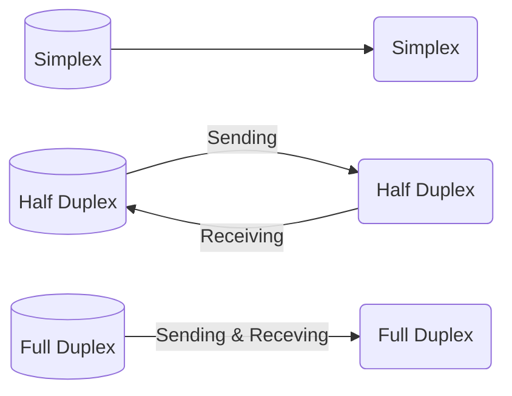
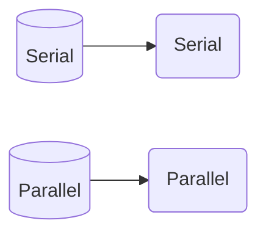
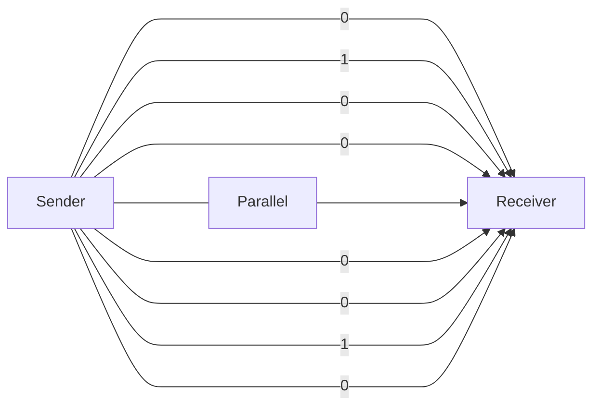
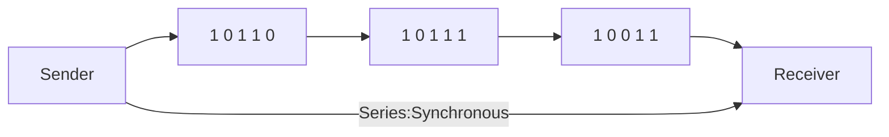
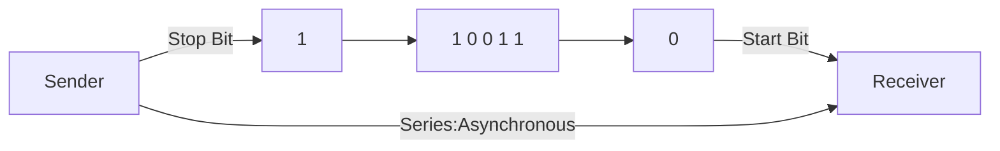
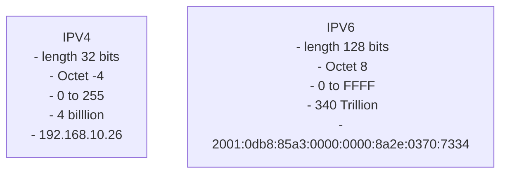

# Data Transmission Modes

- Data Transfer between two devices over network.
- also known as mode of Communication
- **Types**
  - **Simplex**
    - Uni Directional
    - Data can only be sent in one direction
    - loudspeaker ,monitor, keyboard etc
  - **Half Duplex**
    - Bi Directional
    - But only one action can be taken at a time
    - Walkie Talkie
  - **FULL DUPLEX**
    - Bi directional
    - Receiving and sending at same instance
    - Telephone network



# Data Transmission

- process of transferring data b/w two or more digital devices in analog or digital form
- **Types**
  - **Serial**
    - One bit at a time
    - Slow
    - Long Distance
    - Types
      - Synchronous
        - A lot of data sent in a block
      - Asynchronous
        - only one character is sent at a time
        - Uses start and stop bits for transferring data
    - Ex: Keyboard, Mouse
  - **Parallel**
    - Multiple bits at a time
    - Fast
    - Short Distance
    - Ex: Printer, Scanner





```mermaid
graph LR;
A[Sender]--0--1--0--1--1-->B[Receiver]
A--Series-->B
```





# Data Communication

- Process of sending and receiving digital data b/w two or more computers via transmission medium such as wire cable
- 5 Components of Data Communication
  - Message
  - Sender
  - Receiver
  - Transmossion Medium
  - Protocol

# IP Address

- Internet Protocol Address
- unique number provided to each and every address
- form of integric number separated by dots
- 192.168.10.26

  ```mermaid
  graph TB;
  A[Address]-->B[IP Address <br/> Logical]
  A-->C[MAC Address <br/> Physical]
  subgraph IP Types;
  IP-->X[IPV4 <br> - length 32 bits <br> - Octet -4 <br> - 0 to 255<br> - 4 billlion<br> - 192.168.10.26]
  IP-->Y[IPV6<br> - length 128 bits<br> - Octet 8<br> - 0 to FFFF<br> - 340 Trillion<br> - 2001:0db8:85a3:0000:0000:8a2e:0370:7334]
  end
  ```
- IPV6 & IPV4

  - FFFF:65535
  - 4 billion-> $2^{3 \\ 2}$
  - 340 trillion -> $2^{1\\2\\8}$
  - Uses of IP
    - PUBLIC
    - PRIVATE
- Classes of IP

  - Class A: 0 to 126 (127 reserved):125.255.23.17
  - Class B: 128 to 191: 191.23.34.123
  - Class C: 192 to 223:192.204.10.14
  - Class D: 224 to 239:used for multicasting
  - Class E: 240 to 255:reserved for research
- Network ID : 1
- Host ID: 0
- OCTET

  ```mermaid
  graph LR;
  subgraph 1:8
  end
  subgraph 2:8
  end
  subgraph 3:8
  end
  subgraph 4:8
  end
  1:8-->2:8-->3:8-->4:8
  A[Each Octet has 8 bits]
  B[Each Octet has 8 bits]
  ```
- Class A

  ```mermaid
  graph TB;
  subgraph A[H]
  end
  subgraph B[H]
  end
  subgraph H
  end
  subgraph N
  end
  ```
- Class B

  ```mermaid
  graph TB;
  subgraph A[H]
  end
  subgraph B[H]
  end
  subgraph C[N]
  end
  subgraph D[N]
  end
  ```
- Class C

  ```mermaid
    graph TB;
    subgraph A[H]
    end
    subgraph B[H]
    end
    subgraph C[H]
    end
    subgraph D[N]
    end
  ```

## Difference Between IPV4 & IPV6



# Mac Address

- Media Access Control
- physical address
- hardware address
- unique and permanent for all n/w devices
- **FORMAT**
  - MM:MM:MM:SS:SS:SS
  - MM-MM-MM-SS-SS-SS
  - MMM.MMM.SSS.SSS
- Start 6: manufacturer
- End 6:NIC number
- USES
  - DEVICE tracking
  - Private communication

# Difference b/w IP & MAC
| IP | MAC |
| --- | --- |
| Logical | Physical |
| Network Layer | Data Link Layer |
| Software | Hardware |
| Assigned by ISP | Assigned by Manufacturer |
| Can be changed | Can be changed only changing LAN card|
| 32 bits/128 bits | 48 bits |
| identifies network | identifies device |
