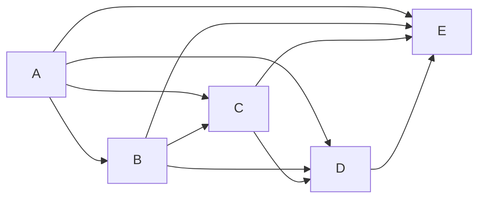
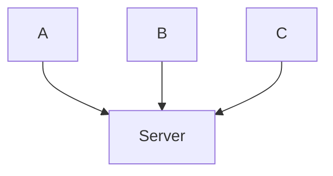

# Network Architecture

- Network Layer Which tells us how compters are arranged and how tasks are allocated to computers
- Types of Network Architecture
  - Peer to Peer architecture
  - Client Server Architecture

- Advantages of Peer to Peer Architecture
  - Cheaper because it hasn't any server
  - setup easy
  - maintainance easy
  - single failure don't disturb all
- Disadvantages of Peer to Peer Architecture
  - Security Issue
  - Can't take the backup of data
  - Server is not present so above two are problems
- **Client Server Architecture**
  - Server is present
  - Server is used to store data
  - Server is used to take backup of data
  - Server is used to provide security
  - Server is used to provide services
  - Server is used to provide resources
  - Server is used to provide applications
  - Server is used to provide storage
  - Server is used to provide processing
  - Server is used to provide communication
  - Server is used to provide printing
  - Server is used to provide database
  - Server is used to provide web
  - Server is used to provide mail
  - Server is used to provide file
  - Server is used to provide proxy
  - Server is used to provide ftp
  - Server is used to provide dns
  - Server is used to provide dhcp
  - Server is used to provide ntp
  - Server is used to provide ldap
  - Server is used to provide vpn
  - Server is used to provide voip
  - Server is used to provide web
  - Server is used to provide mail
  - Server is used to provide file
  - Server is used to provide proxy
  - Server is used to provide ftp
  - Server is used to provide dns
  - Server is used to provide dhcp
  - Server is used to provide ntp
  - Server is used to provide ldap
  - Server is used to provide vpn
  - Server is used to provide voip
  - Server is used to provide web
  - Server is used to provide mail
  - Server is used to provide file
  - Server is used to provide proxy
  - Server is used to provide ftp
  - Server is used to provide dns
  - Server is used to provide dhcp
  - Server is used to provide ntp
  - Server is used to provide ldap
  - Server is used to provide vpn
  - Server is used to provide voip
  - Server is used to provide web
  - Server is used to provide mail
  - Server is used to provide file
  - Server is used to provide proxy
  - Server is used to provide ftp
  - Server is used to provide dns
  - Server is used to provide dhcp
  - Server is used to provide ntp
  - Server is used to provide ldap
  - Server is used to provide

- Advantage of Client Server Architecture
  - centrallised system through which back up can easily be done
  - better security
  - entire system maintained by server
  - also increase the speed of resource sharing
- Disadvantages of Client Server Architecture
  - Server failure cause unaccessibilty of the resource
  - expensive (ec2,lambda)

# Guided And Unguided Media
| Guided Media | Unguided Media |
| ------------ | -------------- |
| Twisted Pair | Radio          |
| Coaxial      | Microwave      |
| Optical      | Satellite      |
|              | Infrared       |
|Speed: 10Mbps to 10Gbps|Speed: 1Mbps to 2Mbps|
|Distance: 100m to 2km|Distance: 2km to 100km|
|Cost: Low|Cost: High|
|Installation: Easy|Installation: Difficult|
