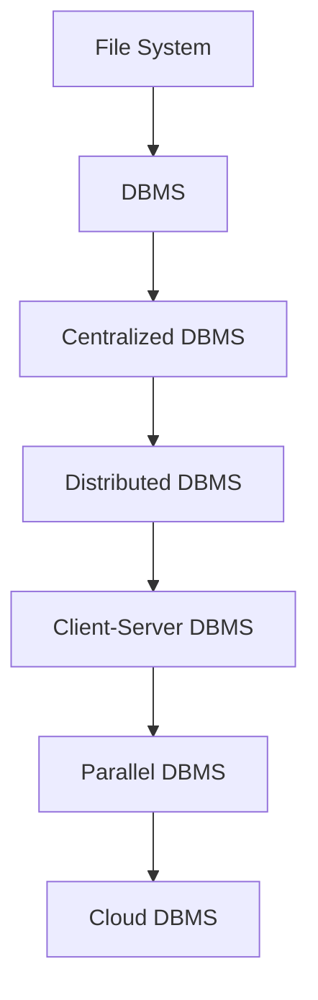

# DBMS

## Evolution of DBMS

## Problems of File System and how DBMS solves them
### Data Redundancy
- Data redundancy is a condition created within a database or data storage technology in which the same piece of data is held in two separate places. This can lead to a host of problems, including data corruption and data inconsistency.
   - As Example: 
    Student 1: name: John, age: 20, address: 1234, phone: 1234
    Student 2: name: Doe, age: 22, address: 1235, phone: 1809
    storing pattern: Basic Details, Address, Phone
    - Here, the address is stored twice, which is a redundancy.
- DBMS solves this problem by storing data in a structured way, which reduces redundancy.   
   - Stored in the form of tables, rows, and columns.
   - Basic Details table includes name and age
   - Address table includes address and there will be a foreign key in the Basic Details table.
   - Phone table includes phone and there will be a foreign key in the Basic Details table.
    - This way, the address is stored only once and can be accessed using the foreign key.

In a traditional file system, while there may not always be exact duplication of data (like in two files), the way data is managed can still lead to logical redundancy and inefficiencies. Here’s how:

Data Redundancy in File Systems

	1.	Unstructured Data Storage:
	•	In a file system, data is often stored in flat files, meaning there’s no inherent structure or relationships between different pieces of data. For example, if you have student data stored in different files (e.g., one for contact information and another for academic details), you may need to repeat data like student names or IDs across those files.
	2.	No Centralized Control:
	•	Without a centralized system, different files can store similar or overlapping information, leading to redundancy. For example, the same address may be stored in multiple files if the system doesn’t recognize the commonality between them.
	3.	Data Duplication Across Departments:
	•	In large organizations, departments might store their own versions of the same data. For instance, HR might store employee addresses in one file, while payroll stores them in another. This leads to potential data redundancy and inconsistency when one file is updated and the other is not.

How DBMS Solves This

	•	A Database Management System (DBMS) ensures that data is stored in a centralized, structured format:
	•	Tables in a database are related through foreign keys.
	•	For example, instead of storing the same address multiple times, a DBMS uses a single address entry and links it to the relevant person through a relationship, reducing redundancy.
	•	DBMS enforces data integrity rules to ensure consistency, so if an address is updated, it is reflected wherever it is referenced.

In summary, while file systems don’t always involve physical duplication, they can suffer from logical redundancy, which DBMS is designed to minimize.

### Poor Memory Utilization
- In a file system, data is stored in files, and each file is stored in a separate location. This can lead to poor memory utilization, as there may be unused space within files or gaps between files.
- DBMS solves this problem by managing data more efficiently:
   - Data is stored in tables, which can be optimized for memory usage.
   - Tables can be indexed for faster access and retrieval.
   - DBMS can manage memory allocation and deallocation more effectively than a file system.
### Data Inconsistency
- Data inconsistency occurs when different copies of the same data do not match. In a file system, data can be copied and stored in multiple locations, leading to inconsistencies if updates are not synchronized.
- DBMS solves this problem by enforcing data integrity rules:
   - Updates are made through transactions, ensuring that changes are applied consistently across all related data.
   - DBMS can enforce constraints to maintain data consistency, such as foreign key relationships or unique constraints.
   - Data is stored in a centralized location, reducing the risk of inconsistencies due to multiple copies.
### Data Isolation
- In a file system, data is often isolated within individual files or applications, making it difficult to share or access data across different systems.
- DBMS solves this problem by providing a centralized data repository:
   - Data can be accessed and shared across different applications or users.
   - DBMS provides mechanisms for data security and access control, ensuring that data is protected and isolated when necessary.
### Data Security
- File systems may lack robust security features, making it difficult to protect sensitive data from unauthorized access or modification.
- DBMS provides security features to protect data:
   - Access control mechanisms can restrict who can view, modify, or delete data.
   - Encryption can be used to secure data at rest and in transit.
   - Audit trails can track changes to data and provide accountability.
### Benefits of DBMS
#### Querying 
