# DNS: Domain Name System

- Facilitates the mapping of website name to ip address and vice versa

```cpp
unordered_map<string,string>mp;
mp["www.shubhamiitbhu.in"]="76.76.21.22"
```

```cpp
unordered_map<string,string>mp;
mp["76.76.21.22"]="www.shubhamiitbhu.in"
```

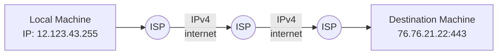

- After this request, a packet is generated by our browser

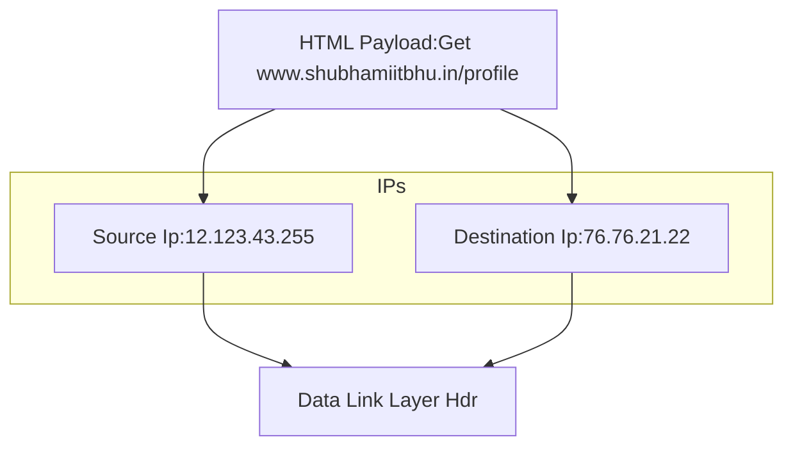

- How our machine knows the ip address of the destination machine?
  - It sends a request to the DNS server
  - DNS server is a server which maintains a mapping of website name to ip address
  - It is maintained by the ISP
  - It is a distributed database
  - It is a distributed database because it is not possible to maintain a single database for all the websites in the world
- DNS
  - Application Layer Protocol
  - It uses UDP
  - It uses port 53
  - works completely transparently to the user

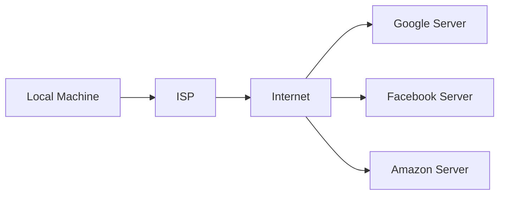

# DNS System Architecture & Geographical Distribution

- DNS system is a group of DNS servers which works in collaboration with each other to implement the DNS system
- DNS servers are distributed geographically
- DNS Machines are managed and monitored by central authority
- Global DNS Server machine works at two levels
  - Root DNS Server
  - Top Level Domain Server

# DNS : A Hierarchical and Decentralised System

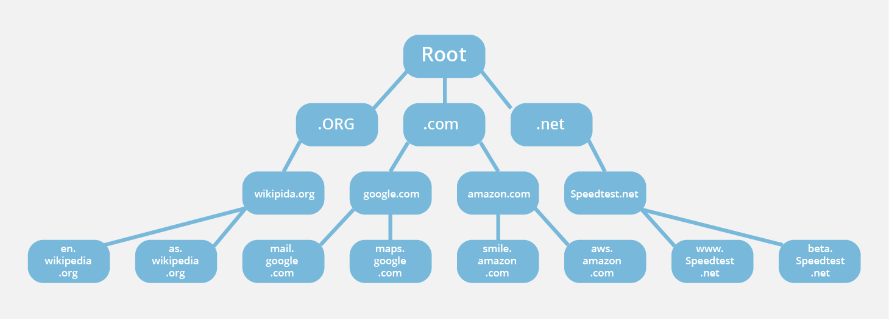

## Literals in C

```cpp
int a=10;
int ->keyword
a ->identifier
10 ->literal
= ->punctuator
```

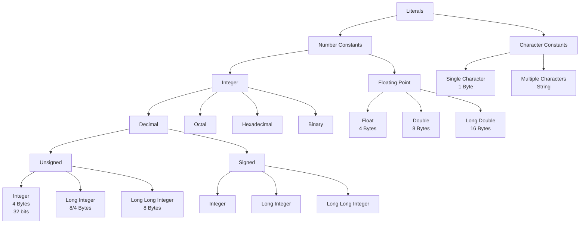

# Website Domain Name

- A Website Domain Name consists of individual words called literals separated by dots
- Each literal is called a label

```cpp
go.learn.shubhamiitbhu.in
consists of 4 literals
[go,learn,shubhamiitbhu,in]
this is opposite of DNS hierarchy
in->Top Level Domain TLDs
shubhamiitbhu->Shubham's DNS Server
learn->Shubham's sub DNS Server
go->Shubham's Server that is hosting the website(Not a DNS Server)
FQDN: Fully Qualified Domain Name

```

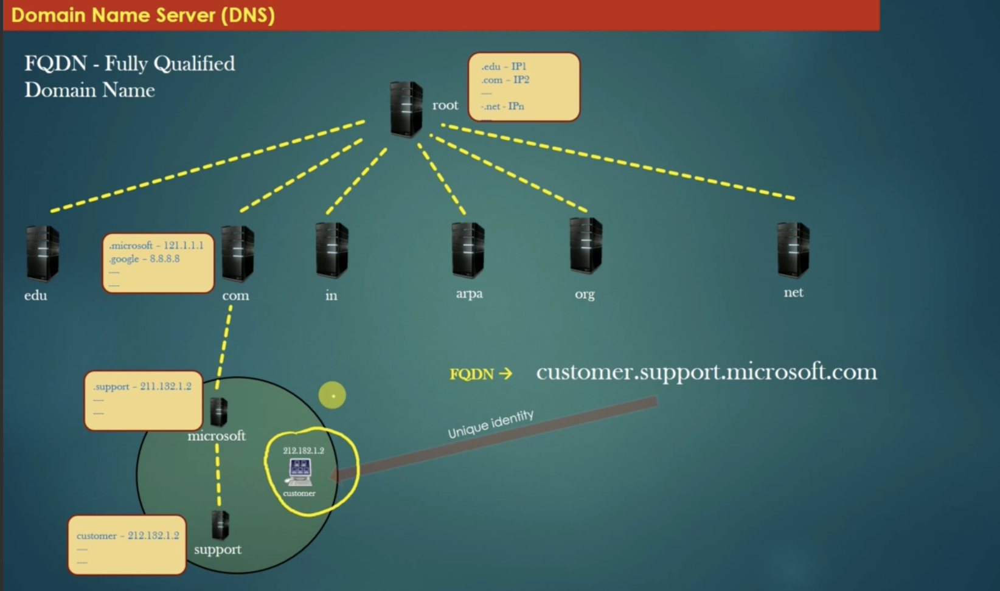
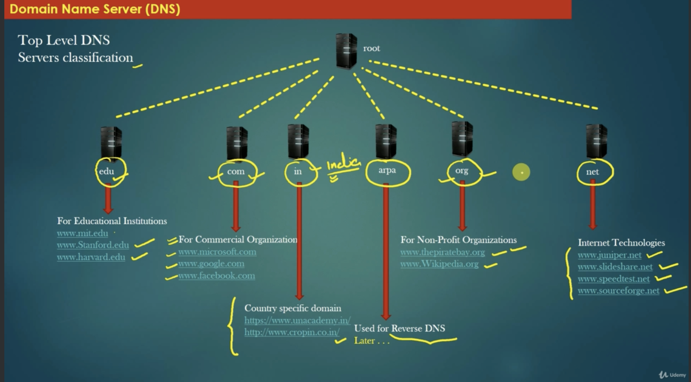

# First Hope DNS Server

- First Hope DNS Server is the DNS Server which is contacted by our machine
- It is the DNS Server of our ISP
- Our local machine first contacts the First Hope DNS Server to get the ip address of the destination machine
- Our local machine also have some DNS cache which stores the ip address of the frequently visited websites / recently visited websites
- Our local machine knows the ip address of the First Hope DNS Server because it is configured in the network settings of our machine by the ISP when we connect to the internet

# DNS Resolver

- DNS Resolver is a software which is present in our local machine
- It is responsible for contacting the First Hope DNS Server
- It is also responsible for maintaining the DNS cache
- It is also responsible for sending the DNS request to the First Hope DNS Server
- It is also responsible for receiving the DNS response from the First Hope DNS Server
- It is also responsible for sending the DNS response to the browser
- It is also responsible for sending the DNS response to the browser

# DNS Query Types

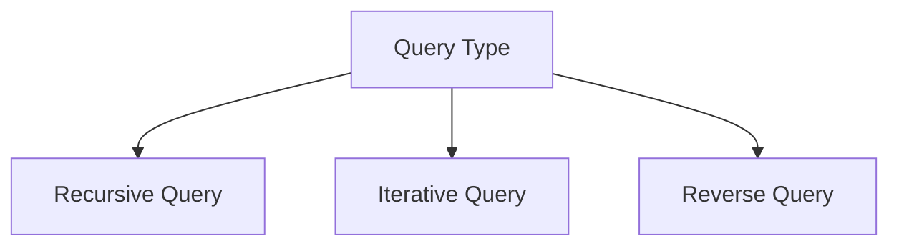

# Recursive DNS Query

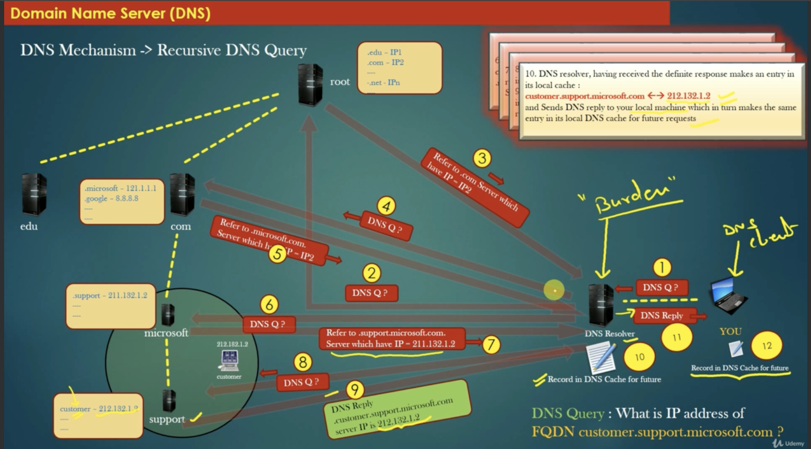

# Iterative DNS Query

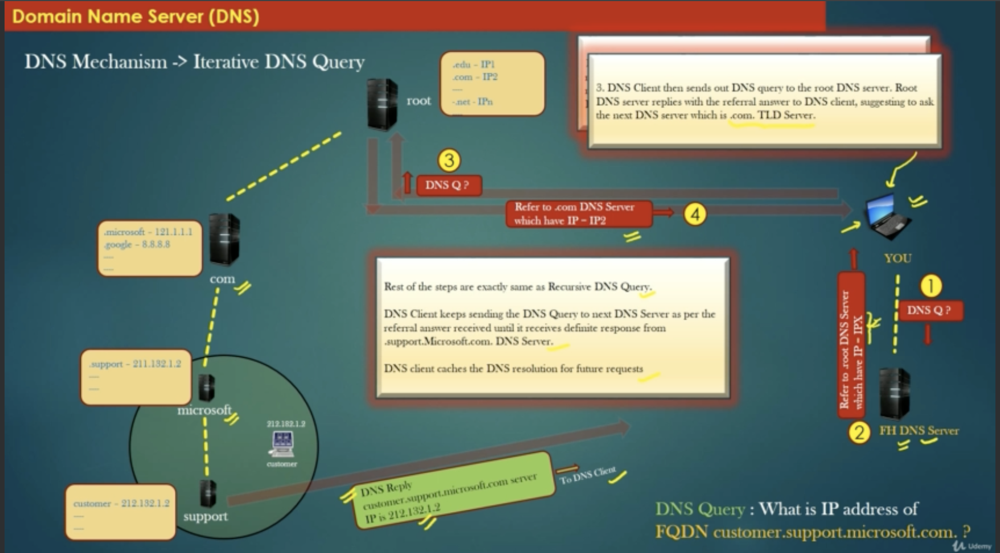

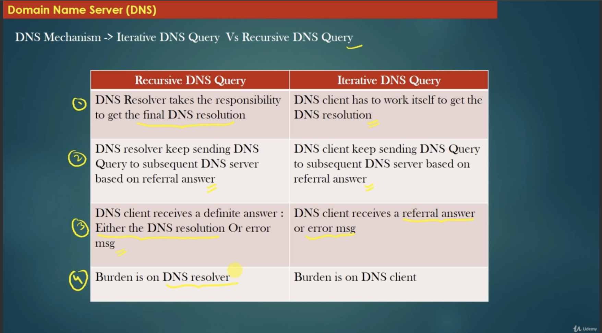

# Reverse DNS Query

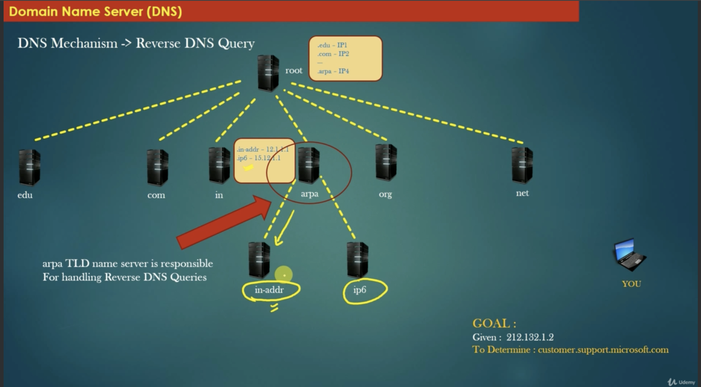

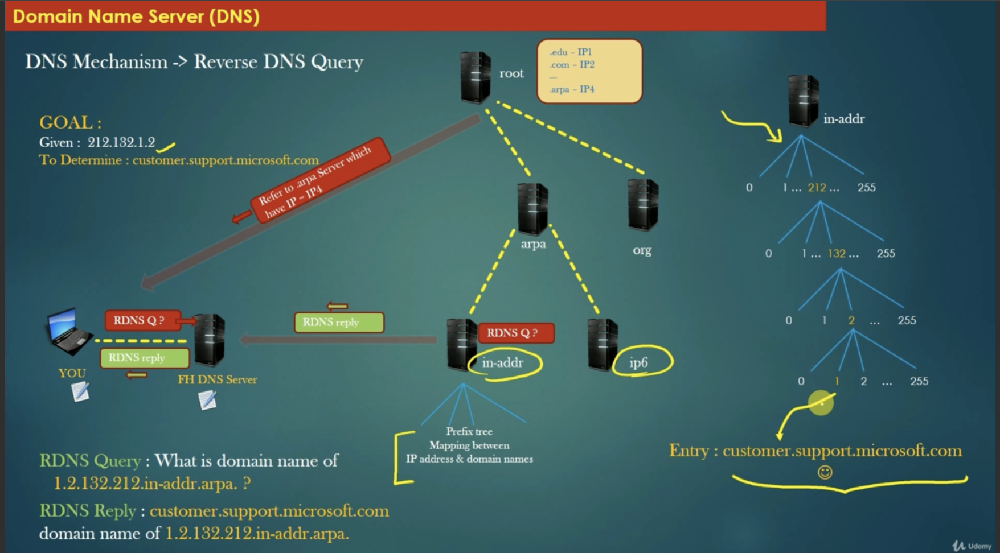

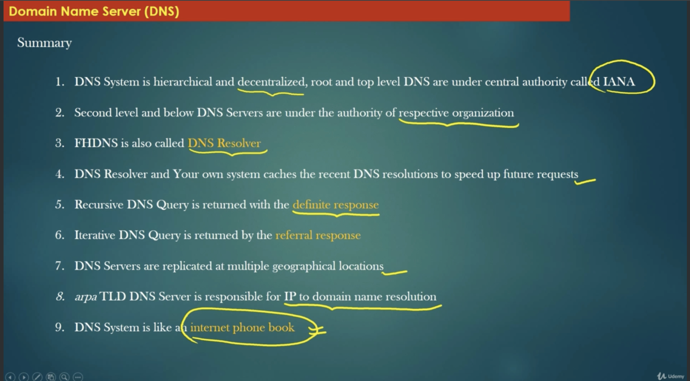
