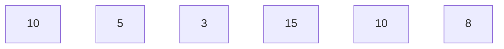
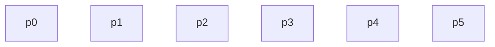
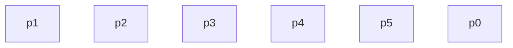
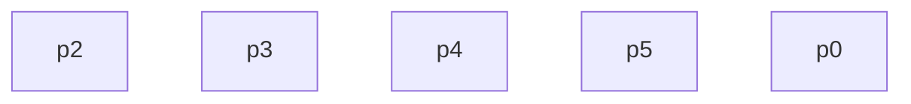
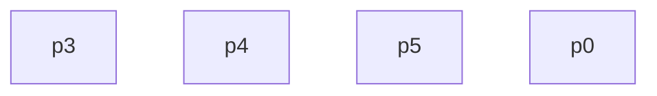
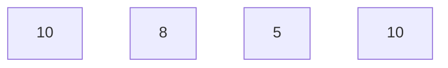
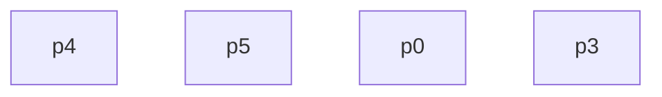
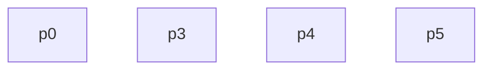
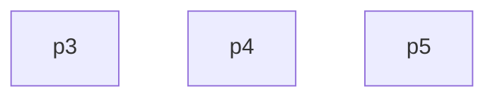

# Linked List

- Why Linked List & Problem with Array
  ------------------------------------

  - fixed size
  - worst case insertion
  - insertion in middle costly
  - deletion from middle costly
  - implementation of deque and queue complex
  - **Robin Round Scheduling**

























```mermaid
graph TD;
p5
p3
```

```mermaid
graph TD;
10[5]
```

```mermaid
graph TD;
p3
```

```mermaid
graph TD;
```

```mermaid
graph TD;
```

## Implementations

```cpp
#include <iostream>
using namespace std;
struct Node{
  int data;
  Node* next;
  Node(int x){
    this->data=x;
    this->next=nullptr;
  }
};
int main(){
    Node *ll=new Node(5);
    ll->next=new Node(10);
    ll->next->next=new Node(15);
    while(ll){
        int x=ll->data;
        cout<<x<<" ";
        ll=ll->next;
    }
    cout<<"\n";
   return 0;
}
```

```java
package DSA.LinkedList.java;
public class _1 {
    public static void main(String[] args) {
        Node ll = new Node(10);
        Node temp1 = new Node(5);
        Node temp2 = new Node(7);
        ll.next = temp1;
        temp1.next = temp2;
        while (ll != null) {
            int x = ll.data;
            System.out.print(x);
            System.out.print(" ");
            ll = ll.next;
        }
        System.out.println();
    }
}
```

```java
package DSA.LinkedList.java;
public class Node {
    public int data;
    public Node next;
      Node(int x){
      this.data=x;
      this.next=null;
    }
}
```

## Print List

```java
 public static void PrintList(Node head) {
        if (head == null)
            return;
        System.out.print(head.data + " ");
        PrintList(head.next);
    }
```

```cpp
void PrintList(Node *head){
    if(head==nullptr)
    return ;
    cout<<head->data<<" ";
    PrintList(head->next);
}
```

## Insert At Head

```cpp
Node *insertAtHead(Node* head,int x){
  Node* ll=new Node(x);
  ll->next=head;
  return ll;
}
```

```java
public static Node insertAtHead(int x, Node head) {
        Node ll = new Node(x);
        ll.next = head;
        return ll;
    }
```

## Insert At Tail

```cpp
Node *insertAtTail(Node* head,int x){
  Node* ll=new Node(x);
  Node* temp=head;
  while(temp->next!=nullptr){
    temp=temp->next;
  }
  temp->next=ll;
  return head;
}
```

```java
 public static Node insertAtTail(int x, Node head) {
        Node ll = new Node(x);
        Node temp = head;
        while (temp.next != null) {
            temp = temp.next;
        }
        temp.next = ll;
        return head;
    }
```

## Delete At Head

```cpp
Node *deleteAtHead(Node *head)
{
  if (head == NULL)
    return NULL;
  else
  {
    // return head->next;
    Node *temp = head->next;
    delete head;
    return temp;
  }
}
```

```java
 public static Node deleteAtHead(Node head) {
        if (head == null) {
            return null;
        } else {
            return head.next;
        }
    }
```

## Delete At Tail

```cpp
Node *deleteAtTail(Node *head)
{
  if (head == nullptr)
    return nullptr;
  if (head->next == nullptr)
  {
    delete head;
    return nullptr;
  }
  Node *temp = head;
  while (temp->next->next != nullptr)
  {
    temp=temp->next;
  }
  delete temp->next;
  temp->next=nullptr;
  return head;
}
```
```java
 public static Node deleteAtTail(Node head) {
        if (head == null)
            return null;
        if (head.next == null)
            return null;
        Node temp = head;
        while (temp.next != null)
            temp = temp.next;
        temp.next = null;
        return head;
    }
```

## Insert At Given Position
