# Linked List

- Why Linked List & Problem with Array
  ------------------------------------

  - fixed size
  - worst case insertion
  - insertion in middle costly
  - deletion from middle costly
  - implementation of deque and queue complex
  - **Robin Round Scheduling**

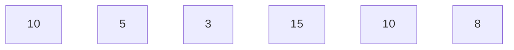

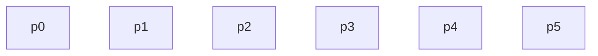


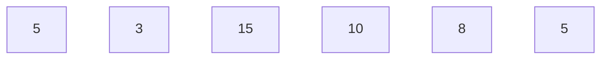

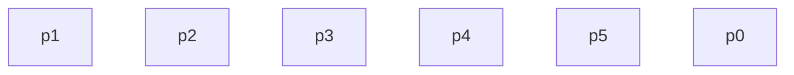

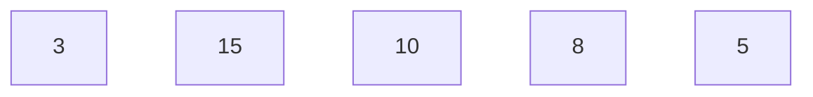

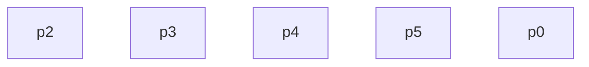

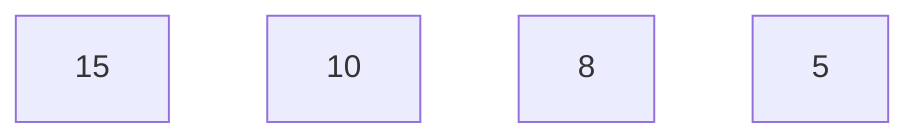

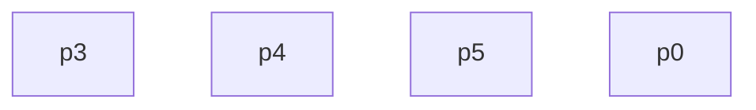

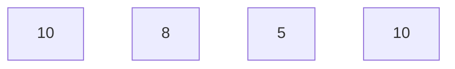

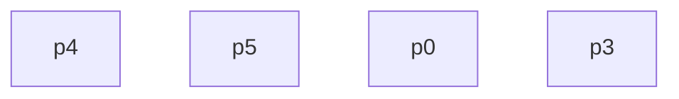

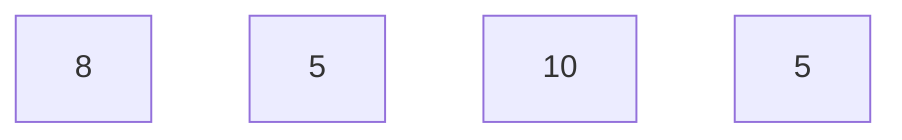

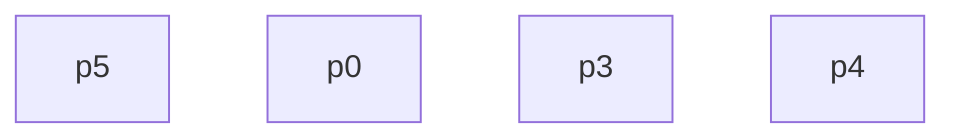

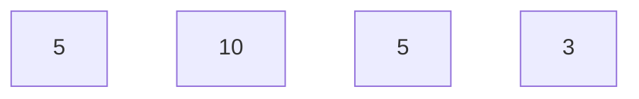

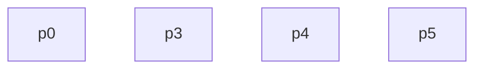

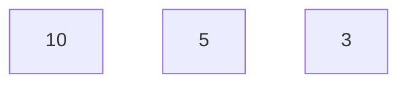

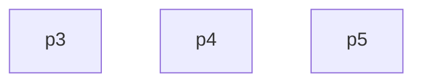

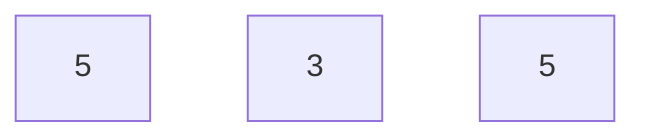

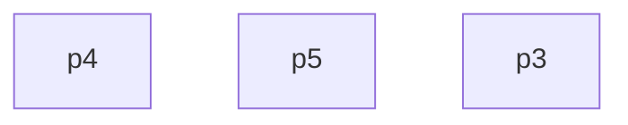

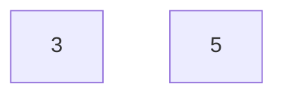

```mermaid
graph TD;
p5
p3
```

```mermaid
graph TD;
10[5]
```

```mermaid
graph TD;
p3
```

```mermaid
graph TD;
```

```mermaid
graph TD;
```

## Implementations

```cpp
#include <iostream>
using namespace std;
struct Node{
  int data;
  Node* next;
  Node(int x){
    this->data=x;
    this->next=nullptr;
  }
};
int main(){
    Node *ll=new Node(5);
    ll->next=new Node(10);
    ll->next->next=new Node(15);
    while(ll){
        int x=ll->data;
        cout<<x<<" ";
        ll=ll->next;
    }
    cout<<"\n";
   return 0;
}
```

```java
package DSA.LinkedList.java;
public class _1 {
    public static void main(String[] args) {
        Node ll = new Node(10);
        Node temp1 = new Node(5);
        Node temp2 = new Node(7);
        ll.next = temp1;
        temp1.next = temp2;
        while (ll != null) {
            int x = ll.data;
            System.out.print(x);
            System.out.print(" ");
            ll = ll.next;
        }
        System.out.println();
    }
}
```

```java
package DSA.LinkedList.java;
public class Node {
    public int data;
    public Node next;
      Node(int x){
      this.data=x;
      this.next=null;
    }
}
```

## Print List

```java
 public static void PrintList(Node head) {
        if (head == null)
            return;
        System.out.print(head.data + " ");
        PrintList(head.next);
    }
```

```cpp
void PrintList(Node *head){
    if(head==nullptr)
    return ;
    cout<<head->data<<" ";
    PrintList(head->next);
}
```

## Insert At Head

```cpp
Node *insertAtHead(Node* head,int x){
  Node* ll=new Node(x);
  ll->next=head;
  return ll;
}
```

```java
public static Node insertAtHead(int x, Node head) {
        Node ll = new Node(x);
        ll.next = head;
        return ll;
    }
```

## Insert At Tail

```cpp
Node *insertAtTail(Node* head,int x){
  Node* ll=new Node(x);
  Node* temp=head;
  while(temp->next!=nullptr){
    temp=temp->next;
  }
  temp->next=ll;
  return head;
}
```

```java
 public static Node insertAtTail(int x, Node head) {
        Node ll = new Node(x);
        Node temp = head;
        while (temp.next != null) {
            temp = temp.next;
        }
        temp.next = ll;
        return head;
    }
```

## Delete At Head

```cpp
Node *deleteAtHead(Node *head)
{
  if (head == NULL)
    return NULL;
  else
  {
    // return head->next;
    Node *temp = head->next;
    delete head;
    return temp;
  }
}
```

```java
 public static Node deleteAtHead(Node head) {
        if (head == null) {
            return null;
        } else {
            return head.next;
        }
    }
```

## Delete At Tail

```cpp
Node *deleteAtTail(Node *head)
{
  if (head == nullptr)
    return nullptr;
  if (head->next == nullptr)
  {
    delete head;
    return nullptr;
  }
  Node *temp = head;
  while (temp->next->next != nullptr)
  {
    temp=temp->next;
  }
  delete temp->next;
  temp->next=nullptr;
  return head;
}
```

```java
 public static Node deleteAtTail(Node head) {
        if (head == null)
            return null;
        if (head.next == null)
            return null;
        Node temp = head;
        while (temp.next != null)
            temp = temp.next;
        temp.next = null;
        return head;
    }
```

## Insert At Given Position

```cpp
Node *insertAtPosition(int x, int pos, Node *head)
{
  if (pos == 1)
  {
    head = insertAtHead(head, x);
    return head;
  }
  Node *temp = new Node(x);
  Node *curr = head;
  for (int i = 1; i <= pos - 2 && head != nullptr; i++)
    curr = curr->next;
  if (curr == nullptr)
  {
    cout << "out of range you are saying to insert so inserting at tail"
         << "\n";
    head = insertAtTail(head, x);
    return head;
  }
  temp->next=curr->next;
  curr->next=temp;
  return head;
}
```

```java
 public static Node insertAtPosition(int pos, int x, Node head) {
        if (pos <= 0) {
            System.out.println("Invalid position");
            return head;
        }

        if (pos == 1) {
            head = insertAtHead(x, head);
            return head;
        }

        Node temp = new Node(x);
        Node curr = head;

        for (int i = 1; i <= pos - 2 && curr != null; i++) {
            curr = curr.next;
        }

        if (curr == null) {
            System.out.println("Position exceeds the length of the list. Inserting at the end.");
            return insertAtTail(x, head);
        }

        temp.next = curr.next;
        curr.next = temp;
        return head;
    }
```

## Search A Node

```cpp
int search(int x,Node *head){
  int pos=1;
  if(head==nullptr) return -1;
  Node* curr=head;
  while(curr!=nullptr){
    if(curr->data==x) return pos;
    curr=curr->next;
    pos++;
  }
  return -1;
}
```

```java
 public static int search(int x,Node head){
        int pos=0;
        if(head==null) return -1;
        Node curr=head;
        while (curr!=null) {
            if(curr.data==x)
            return pos;
            curr=curr.next;
            pos++;
        }
        return -1;
    }
```

# Doubly Linked List

```cpp
#include <iostream>
using namespace std;
struct Node{
  int data;
  Node* prev;
  Node* next;
  Node(int x){
    this->data=x;
    prev=nullptr;
    next=nullptr;
  }
};
int main(){
    Node *head=new Node(56);
    Node* temp1=new Node(34);
    Node* temp2=new Node(45);
    head->next=temp1;
    temp1->prev=head;
    temp1->next=temp2;
    temp2->prev=temp1;
    Node* trav1=head;
    while(trav1!=nullptr){
        cout<<trav1->data<<" ";
        trav1=trav1->next;
    }
    return 0;
}
```

## Why DLL over SLL

- Can be traversed in both direction
- previously in sll we were only traversing in only one direction
- as example we can take the example of web page we go forward and sometime want to go back
- deleting a node O(1) time
- can insert and delete before a given node
- insert/delete both ends in O(1)

**Disadvantages**

- Extra Space
- code becomes more complex

```java
package DSA.LinkedList.java;

public class Node_DLL {
    public int data;
    public Node_DLL prev;
    public Node_DLL next;
    Node_DLL(int x){
        this.data=x;
        this.prev=null;
        this.next=null;
    }
}

```

```java
package DSA.LinkedList.java;

public class DoublyLinkedList {
   public static void main(String[] args) {
     Node_DLL head=new Node_DLL(12);
    Node_DLL temp1=new Node_DLL(34);
    Node_DLL temp2=new Node_DLL(8);
    head.next=temp1;
    temp1.prev=head;
    temp1.next=temp2;
    temp2.prev=temp1;
    Node_DLL trav1=head;
    while(trav1!=null){
        System.out.print(trav1.data+" ");
        trav1=trav1.next;
    }
   }
  
}

```
