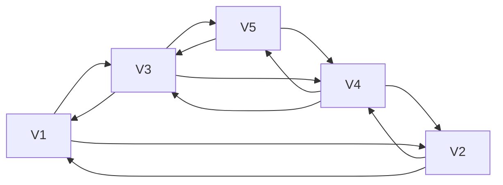
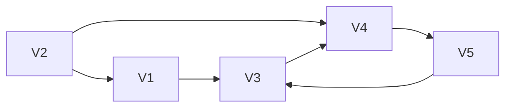

# Graphs

- Used insted of tree when there is a need to represent a many-to-many relationship.
- in representation of a hierarchy, a tree is a special case of a graph.
- A graph is a collection of nodes and edges.
- A graph is a set of vertices and a collection of edges that each connect a pair of vertices.
- Social networks are a good example of graphs:Undirected graphs are used to represent social networks, where there is no direction associated with the relationship between two people.
- World Wide Web is a directed graph, where the edges represent links from one page to another.
- Directed Graph
  - Indegree of a vertex is the number of edges that are directed into the vertex.
  - Outdegree of a vertex is the number of edges that are directed out of the vertex.
- A path in a graph is a sequence of vertices that are connected by edges.



- Degreee V3=3
- Sum of Deg=2*|E|
- Maximum Edges=|v|*(|v|-1)/2



## BFS Adjacency List

```java
package graph;

import java.util.Scanner;
import java.util.List;
import java.util.ArrayList;
import java.util.Queue;
import java.util.LinkedList;
public class _1_bfs {
  public static void main(String[] args) {
    int n = 5;
    boolean visited[] = new boolean[n];
    for (int i = 0; i < n; i++) {
      visited[i] = false;
    }
    List adj[] = new List[n];
    for (int i = 0; i < n; i++) {
      adj[i] = new ArrayList<>();
    }
    adj[0].add(1);
    adj[0].add(2);

    adj[1].add(0);
    adj[1].add(2);
    adj[1].add(3);

    adj[2].add(0);
    adj[2].add(1);
    adj[2].add(3);

    adj[3].add(1);
    adj[3].add(2);
    adj[3].add(4);

    adj[4].add(3);
    System.out.println(adj[0]);
    for(int i=0;i<n;i++){
      if(!visited[i]){
        bfs(adj,n,i,visited);
      }
    }
  }

  public static void bfs(List<Integer> adj[], int v, int s,boolean visited[]) {
    visited[s]=true;
    Queue<Integer> q = new LinkedList<>();
    q.add(s);
    while(!q.isEmpty()){
      int u=q.poll();
      System.out.print(u+" ");
      for(int i=0;i<adj[u].size();i++){
        int vi=adj[u].get(i);
        if(!visited[vi]){
          visited[vi]=true;
          q.add(vi);
        }

      }
    }
  }
}

```

## BFS Adjacency Matrix

```java
package graph;

import java.util.LinkedList;
import java.util.Queue;

public class _2_bfs_matrix {

    public static void main(String[] args) {
        int vertices = 5;
        int[][] adjacencyMatrix = {
                {0, 1, 1, 0, 0},
                {1, 0, 0, 1, 0},
                {1, 0, 0, 1, 0},
                {0, 1, 1, 0, 1},
                {0, 0, 0, 1, 0}
        };

        int m = adjacencyMatrix.length;
        int n = adjacencyMatrix[0].length;
        boolean[][] visited = new boolean[m][n];
        int count = 0;

        for (int i = 0; i < m; i++) {
            for (int j = 0; j < n; j++) {
                if (adjacencyMatrix[i][j] == 1 && !visited[i][j]) {
                    bfs(adjacencyMatrix, visited, i, j);
                    count++;
                }
            }
        }

        System.out.println("Number of Islands: " + count);
    }

    public static void bfs(int[][] adjMatrix, boolean[][] visited, int row, int col) {
        int m = adjMatrix.length;
        int n = adjMatrix[0].length;
        int[] rowDirs = {-1, 0, 1, 0};
        int[] colDirs = {0, 1, 0, -1};

        Queue<int[]> queue = new LinkedList<>();
        queue.add(new int[]{row, col});
        visited[row][col] = true;

        while (!queue.isEmpty()) {
            int[] current = queue.poll();
            int currentRow = current[0];
            int currentCol = current[1];

            for (int d = 0; d < 4; d++) {
                int newRow = currentRow + rowDirs[d];
                int newCol = currentCol + colDirs[d];

                if (isValid(newRow, newCol, m, n) && adjMatrix[newRow][newCol] == 1 && !visited[newRow][newCol]) {
                    queue.add(new int[]{newRow, newCol});
                    visited[newRow][newCol] = true;
                }
            }
        }
    }

    public static boolean isValid(int row, int col, int m, int n) {
        return row >= 0 && row < m && col >= 0 && col < n;
    }
}

```

## Number of Islands

```java
public class Solution {
    /**
     * @param grid: a boolean 2D matrix
     * @return: an integer
     */
    public int numIslands(boolean[][] grid) {
        int m=grid.length;
        if(m==0) return 0;
        int n=grid[0].length;
        if(m==0 || n==0) return 0;
        boolean visited[][]=new boolean[m][n];
        int count=0;
        for(int i=0;i<m;i++){
            for(int j=0;j<n;j++){
              if(grid[i][j]==true && visited[i][j]==false){
                  visited[i][j]=true;
                  bfs(grid,visited,i,j);
                  count++;
              }
            }
        }
        return count;
  
    }
    public void bfs(boolean[][] grid,boolean visited[][],int i,int j){
        int[] rowDirs = {-1, 0, 1, 0};
        int[] colDirs = {0, 1, 0, -1};
        int m=grid.length;
        int n=grid[0].length;
        Queue<int[]> q=new LinkedList<>();
        q.add(new int[]{i,j});
        visited[i][j]=true;
        while(!q.isEmpty()){
            int[] current=q.poll();
            int currRow=current[0];
            int currCol=current[1];
            for(int d=0;d<4;d++){
                int newRow=rowDirs[d]+currRow;
                int newCol=colDirs[d]+currCol;
                if(isValid(newRow,newCol,m,n) && grid[newRow][newCol]==true && !visited[newRow][newCol]){
                    q.add(new int[]{newRow,newCol});
                    visited[newRow][newCol]=true;
        
                }
            }
        }
    }
     public static boolean isValid(int row, int col, int m, int n) {
        return row >= 0 && row < m && col >= 0 && col < n;
    }
}
```

## DFS Adjacency List

```java
package graph;

import java.util.List;
import java.util.ArrayList;

public class _3_dfs {
    public static void main(String[] args) {
        int n = 5;
        boolean visited[] = new boolean[n];
        for (int i = 0; i < n; i++) {
            visited[i] = false;
        }
        List<Integer>[] adj = new List[n];
        for (int i = 0; i < n; i++) {
            adj[i] = new ArrayList<>();
        }
        adj[0].add(1);
        adj[0].add(2);

        adj[1].add(0);
        adj[1].add(2);
        adj[1].add(3);

        adj[2].add(0);
        adj[2].add(1);
        adj[2].add(3);

        adj[3].add(1);
        adj[3].add(2);
        adj[3].add(4);

        adj[4].add(3);

        for (int i = 0; i < n; i++) {
            if (!visited[i]) {
                dfs(adj, n, i, visited);
            }
        }
    }

    public static void dfs(List<Integer>[] adj, int v, int s, boolean visited[]) {
        visited[s] = true;
        System.out.print(s + " ");
        for (int i = 0; i < adj[s].size(); i++) {
            int vi = adj[s].get(i);
            if (!visited[vi]) {
                dfs(adj, v, vi, visited);
            }
        }
    }
}

```

## DFS Adjacency Matrix

```java
package graph;

public class _4_dfs_matrix {
    public static void main(String[] args) {
        int vertices = 5;
        int[][] adjacencyMatrix = {
                {0, 1, 1, 0, 0},
                {1, 0, 0, 1, 0},
                {1, 0, 0, 1, 0},
                {0, 1, 1, 0, 1},
                {0, 0, 0, 1, 0}
        };

        int m = adjacencyMatrix.length;
        int n = adjacencyMatrix[0].length;
        boolean[][] visited = new boolean[m][n];
        int count = 0;

        for (int i = 0; i < m; i++) {
            if (!visited[i][i]) {
                dfs(adjacencyMatrix, visited, i, i);
                count++;
            }
        }

        System.out.println("Number of Islands: " + count);
    }
    public static void dfs(int[][] adjMatrix, boolean[][] visited, int row, int col) {
        int m = adjMatrix.length;
        int n = adjMatrix[0].length;
        int[] rowDirs = {-1, 0, 1, 0};
        int[] colDirs = {0, 1, 0, -1};

        visited[row][col] = true;

        for (int d = 0; d < 4; d++) {
            int newRow = row + rowDirs[d];
            int newCol = col + colDirs[d];

            if (isValid(newRow, newCol, m, n) && adjMatrix[newRow][newCol] == 1 && !visited[newRow][newCol]) {
                dfs(adjMatrix, visited, newRow, newCol);
            }
        }
    }
    public static boolean isValid(int row, int col, int m, int n) {
        return row >= 0 && row < m && col >= 0 && col < n;
    }
}

```
