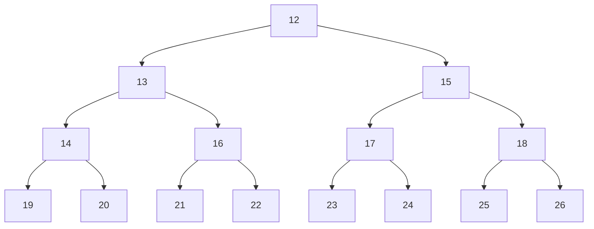
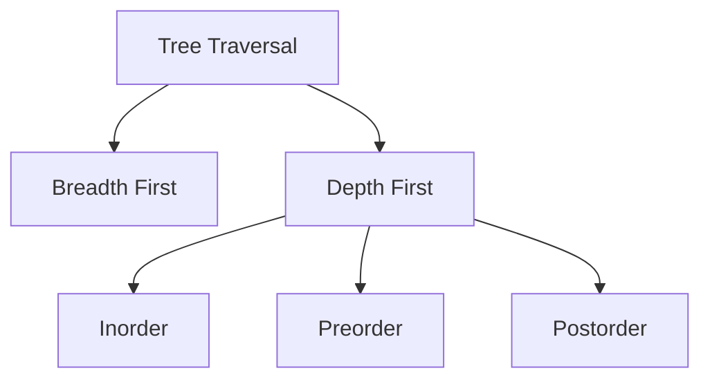

# Tree

## Applications

- To represent Hierarchical data
  - Organisation structure
  - Folder structure
  - XML/HTML content(JSON objects)
  - In OOPs (Inheritance)
- Binary Serach Tree
- Binary Heap
  - B/B+ Trees in DBMS
  - Spanning and Shotest path trees in Computer Networks
  - Expression trees in Compilers

## Tree Construction in JAVA

```java
public class TreeNode {
    int data;
    TreeNode left;
    TreeNode right;

    TreeNode(int x) {
        this.data = x;
        this.left = null;
        this.right = null;
    }
}
```

## Initilisation

```java
TreeNode head = new TreeNode(12);
      head.left = new TreeNode(13);
      head.right = new TreeNode(15);
      head.left.left = new TreeNode(14);
      head.left.right = new TreeNode(16);
      head.right.left = new TreeNode(17);
      head.right.right = new TreeNode(18);
      head.left.left.left = new TreeNode(19);
      head.left.left.right = new TreeNode(20);
      head.left.right.left = new TreeNode(21);
      head.left.right.right = new TreeNode(22);
      head.right.left.left = new TreeNode(23);
      head.right.left.right = new TreeNode(24);
      head.right.right.left = new TreeNode(25);
      head.right.right.right = new TreeNode(26);
```



## Traversals



## Inorder

```java
  public static void inOrder(TreeNode head) {
      if (head == null)
         return;
      inOrder(head.left);
      System.out.print(head.data + " ");
      inOrder(head.right);
   }
```

## Preorder

```java
 public static void preOrder(TreeNode head) {
      if (head == null)
         return;
      System.out.print(head.data + " ");
      preOrder(head.left);
      preOrder(head.right);
   }
```

## Postorder

```java
   public static void postOrder(TreeNode head){
      if(head==null) return;
      postOrder(head.left);
      postOrder(head.right);
      System.out.print(head.data + " ");
   }
```

## Height of Tree

```java
public static int Height(TreeNode head) {
      if (head == null)
         return 0;
      return Math.max(Height(head.left), Height(head.right)) + 1;
   }
```

## Nodes At K distance

```java
   public static void NodesAtKdist(TreeNode head, int k) {
      if(head==null)
         return;
      if(k==0)
         System.out.print(head.data+" ");
      NodesAtKdist(head.left, k-1);
      NodesAtKdist(head.right, k-1);

   }
```

## Level Order Traversal

```java
 public static void levelOrderTraversal(TreeNode head) {
      if (head == null)
         return;
      Queue<TreeNode> queue = new LinkedList<>();
      queue.add(head);

      while (!queue.isEmpty()) {
         // TreeNode current = queue.peek();
         // queue.remove(); or
         TreeNode current = queue.poll();
         System.out.print(current.data + " ");

         if (current.left != null)
            queue.add(current.left);

         if (current.right != null)
            queue.add(current.right);
      }
   }


```

## Level Order Traversal Line by Line

```java
   public static void levelLineOrderTraversal(TreeNode head) {
      if (head == null)
         return;
      Queue<TreeNode> q = new LinkedList<TreeNode>();
      q.add(head);
      q.add(null);
      while (!q.isEmpty()) {
         TreeNode temp = q.poll();
         if (temp == null) {
            if (!q.isEmpty()) {
               q.add(null);
               System.out.println();
            }
            continue;
         }
         System.out.print(temp.data + " ");
         if (temp.left != null)
            q.add(temp.left);
         if (temp.right != null)
            q.add(temp.right);
      }
   }

```

## Level Order Traversal Line by Line Scaled Method

```java
 public static void levelOrderTraversal2(TreeNode head) {
      if (head == null)
         return;
      Queue<TreeNode> q = new LinkedList<TreeNode>();
      q.add(head);
      while (!q.isEmpty()) {
         int size = q.size();
         for(int i=0;i<size;i++){
            TreeNode temp = q.poll();
            System.out.print(temp.data + " ");
            if (temp.left != null)
               q.add(temp.left);
            if (temp.right != null)
               q.add(temp.right);
         }
         System.out.println();
      }
   }
```

## Get Size

```java
  public static int getSize(TreeNode head){
      if(head==null) return 0;
      return getSize(head.left)+getSize(head.right)+1;
   }
```

## Get Max Node

```java
  public static int getMaxNode(TreeNode head){
      if(head==null) return Integer.MIN_VALUE;
      return Math.max(head.data,Math.max(getMaxNode(head.left),getMaxNode(head.right)));
   }
```
