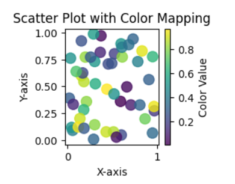

# *Matplotlib*

- Matplotlib is a data visualization library in python used in 2D plots of arrays.
- One of the greatest benefits of visualization is that it allows us visual access to huge amount of data in easy way.
- Matplotlib consists of several plots such as bars , histogram , line  , scatter  , pie , area etc....
- We can install by using following command in our Terminal :

  - python -m pip install -U matplotlib
- There comes a variety of plots

  * Matplotlib Line Plot
  * Matplotlib Bar Plot
  * Matplotlib Histograms Plot
  * Matplotlib Scatter Plot
  * Matplotlib Pie Charts
  * Matplotlib Area Plot

### *****Matplotlib Line Plot*****

- A line plot is a type of plot used to visualize relationships between two continuous variables.
- colours , line style  and markers can be set during plotting

```
x = np.linspace(0 , 3*np.pi , 200)

# defining the function
sin_y = np.sin(x)
cos_y = np.cos(x)

# plotting the function


plt.figure(figsize=(18,5))

plt.plot(x , sin_y , '*' , label ='Sin' , color='green' , linewidth=3)
plt.plot(x , cos_y , '+', label ='Cosine' , color='red' , linewidth=5)


plt.xlabel('X')
plt.ylabel('Sin and Cosine')

plt.title('Graph')
plt.legend(loc='upper right')

# for styling the graph
plt.style.use('seaborn-v0_8-dark')

# for saving the graph
plt.savefig('sine_cosine.png')

plt.show()
```

#### Basic styling:

* **Alpha**: Transparency of the markers in the scatter plot.
* **Colorbar**: A bar showing the colors used in the plot and the corresponding values.
* **Colormap**: A color mapping used to convert scalar data to colors.
* **Edgecolors**: The color of the edges of the markers in a scatter plot.
* **Sizes**: The size of the markers in a scatter plot.

### ****Matplotlib Bar Plot****

By using[ matplotlib](https://www.geeksforgeeks.org/python-matplotlib-an-overview/) library in Python  , it allows us to access the functions and classes provided by the library for plotting. There are two lists x and y are defined . This function creates a bar plot by taking x-axis and y-axis values as arguments and generates the bar plot based on those values.

```
# importing matplotlib module 
from matplotlib import pyplot as plt

# x-axis values
x = [5, 2, 9, 4, 7]

# Y-axis values
y = [10, 5, 8, 4, 2]

# Function to plot the bar
plt.bar(x, y)

# function to show the plot
plt.show()

```


### Matplotlib Histograms Plot

By using the matplotlib module defines the y-axis values for a histogram plot. Plots in the  ****,**** histogram using the hist() function and displays the plot using the show() function. The hist() function creates a histogram plot based on the values in the y-axis list.

```
# importing matplotlib module 
from matplotlib import pyplot as plt

# Y-axis values
y = [10, 5, 8, 4, 2]

# Function to plot histogram
plt.hist(y)

# Function to show the plot
plt.show()

```


### Matplotlib Pie Charts

By importing the module Matplotlib in Python to create a pie chart with three categories and respective sizes. The [ plot .pie()](https://www.geeksforgeeks.org/plot-a-pie-chart-in-python-using-matplotlib/)  function is used to generate the chart, including labels, percentage formatting, and a starting angle. A title is added with [plt. title(),](https://www.geeksforgeeks.org/matplotlib-pyplot-title-in-python/) and [plt. show() ](https://www.geeksforgeeks.org/matplotlib-pyplot-show-in-python/)displays the resulting pie chart, visualizing the proportional distribution of the specified categories.

```
import matplotlib.pyplot as plt

# Data for the pie chart
labels = ['Geeks 1', 'Geeks 2', 'Geeks 3']
sizes = [35, 35, 30]

# Plotting the pie chart
plt.pie(sizes, labels=labels, autopct='%1.1f%%', startangle=90)
plt.title('Pie Chart Example')
plt.show()

```


### Matplotlib Area ****Plot****

By importing [Matplotlib](https://www.geeksforgeeks.org/python-introduction-matplotlib/) we ****sky blue****generated an area chart with two lines (‘Line 1’ and ‘Line 2’). The area between the lines is shaded in a ****skyblue**** color with 40% transparency. The x-axis values are in the list ‘x’, and the corresponding y-axis values for each line are in ‘y1’ and ‘y2’. Labels, titles ****legends**** , and legend are added, and the resulting area chart is displayed.

```
import matplotlib.pyplot as plt

# Data
x = [1, 2, 3, 4, 5]
y1, y2 = [10, 20, 15, 25, 30], [5, 15, 10, 20, 25]

# Area Chart
plt.fill_between(x, y1, y2, color='skyblue', alpha=0.4, label='Area 1-2')
plt.plot(x, y1, label='Line 1', marker='o')
plt.plot(x, y2, label='Line 2', marker='o')

# Labels and Title
plt.xlabel('X-axis'), plt.ylabel('Y-axis'), plt.title('Area Chart Example')

# Legend and Display
plt.legend(), plt.show()

```


### Scatter Plot with Color Mapping

In this example Python code uses Matplotlib and NumPy to generate a scatter plot with random data. The `x` and `y` arrays represent the coordinates, and the `colors` array provides color values. The plot includes a color mapping using the ‘viridis’ colormap, a color bar for reference, and axis labels. Finally, the plot is displayed using `plt.show()`.

```
import matplotlib.pyplot as plt
import numpy as np

# Generate random data
np.random.seed(42)
x = np.random.rand(50)
y = np.random.rand(50)
colors = np.random.rand(50)

# Create a scatter plot with color mapping
plt.scatter(x, y, c=colors, cmap='viridis', s=100, alpha=0.8)

# Add color bar for reference
cbar = plt.colorbar()
cbar.set_label('Color Value')

# Set plot title and labels
plt.title('Scatter Plot with Color Mapping')
plt.xlabel('X-axis')
plt.ylabel('Y-axis')

# Display the plot
plt.show()

```




## Axes class

**Axes** is the most basic and flexible unit for creating sub-plots. Axes allow placement of plots at any location in the figure. A given figure can contain many axes, but a given axes object can only be in one figure. The axes contain two axis objects 2D as well as, three-axis objects in the case of 3D. Let’s look at some basic functions of this class.

### axes() function

**`axes()`** function creates axes object with argument, where argument is a list of 4 elements [left, bottom, width, height]. Let us now take a brief look to understand the *axes()* function.

```
x = np.linspace(0,10,50)
print(x)

fig ,ax = plt.subplots(2,2)

y = np.sin(x)
ax[0,0].plot(x,y)
ax[0,0].set_title('Sin Wave')


y = np.cos(x)
ax[0,1].plot(x,y)
ax[0,1].set_title('Cos Wave')

y = np.tan(x)
ax[1,0].plot(x,y)
ax[1,0].set_title('Tan Wave')


y = np.random.randn(1000)
ax[1,1].hist(y,bins = 40)
ax[1,1].set_title('Random Distribution')


plt.tight_layout()
plt.show()
```


```
ax = plt.axes(projection = '3d')

z = np.linspace(0,15,1000)
x = np.cos(z)
y = np.tan(z)

ax.plot3D(x,y,z, 'blue')
```

```
from mpl_toolkits.mplot3d import Axes3D
fig  = plt.figure()
ax   = fig.add_subplot(111, projection = '3d')

x = np.random.rand(100)
y = np.random.rand(100)
z = np.random.rand(100)

ax.scatter(x,y,z, c = 'red', marker = '*')

ax.set_xlabel('X')
ax.set_ylabel('Y')
ax.set_zlabel('Z')

plt.tight_layout()

plt.show()
```
