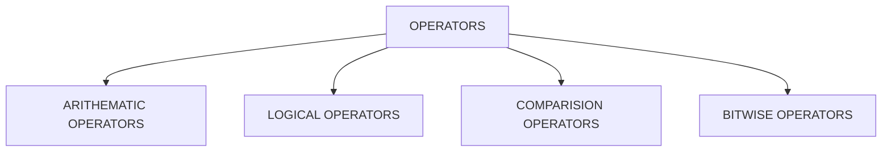

# PYTHON

- ### It is High Level Language general purpose Programming Language.
- ### It was created by Guido van Rossum in 1991.

## Data Types

- ### Integer

  - 10 ,13
  - it ranges from -infinty to + infinity
- ### Float

  - 1.20 , -34.045 , -23.0
  - it ranges from -infinty to + infinity but only floating values
- ### Boolean

  - True
  - False
- ### String

  - Anything written in double quotes or tripple quotes or double tripple quotes. Ex: "Satyam" , ''' Rajiv'''
- ### Complex

  - A+Bj  , where A is the real part and B is the imaginary part

## OPERATORS

### Arithematic Operators:

- '+' , '-' , '*' , '/' include arithematic operators used for operations like addition , substraction , multiplication , division etc....
- 2+3 = 5
- 5-4 = 1
- 4*9 = 36
- 9/4 = 2.25

### Logical Operators:
