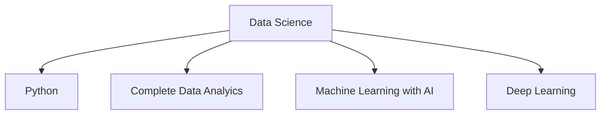
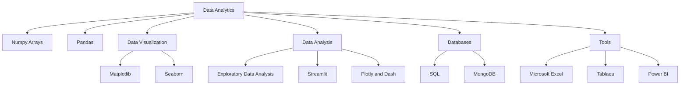

# Data Science

### Data Science is a Large field that uses scientific methods, processes, algorithms, and systems to extract knowledge and insights from structured and unstructured data.

# Data Analytics

### This is the field of Data science which deals with the handling of data i.e collecting the data , cleaning it  , making it able to do analysis , analysing it and then extracting the useful information and proving a analysis to the company.

These are the sub parts of Data Analytics which is needed to be studied durig this journey.

- NUMPY ARRAYS
- PANDAS
- DATA VISUALIZATION

  - MATPLOTLIB
  - SEABORN
- DATA CLEANING
- EXPLORATORY DATA ANALYSIS (EDA)
- SOFTWARES

  - STREAMLIT
  - PLOTLY AND DASH
- DATABASES

  - SQL
  - MONGODB
- MATHS REQUIRED

  - STATISTICS
  - PROBABILITY
  - MATRIX
  - SYSTEM OF LINEAR EQUATIONS
  - VECTORS
- WEB SCRAPING
- TOOLS

  - EXCEL
  - TABLEAU
  - POWER BI

