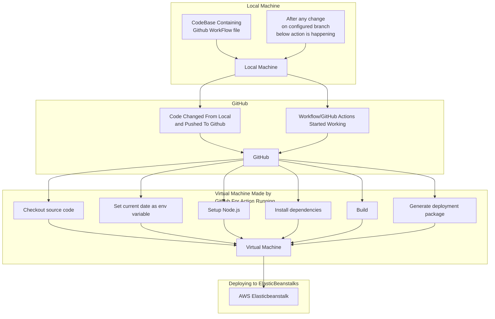

# AWS Elasticbeanstalks

## What is AWS Elasticbeanstalks?

AWS Elastic Beanstalk is an easy-to-use service for deploying and scaling web applications and services developed with Java, .NET, PHP, Node.js, Python, Ruby, Go, and Docker on familiar servers such as Apache, Nginx, Passenger, and IIS.

## How to deploy a web application using AWS Elasticbeanstalks?

1. Open the Elastic Beanstalk console using this preconfigured link: [https://console.aws.amazon.com/elasticbeanstalk](https://console.aws.amazon.com/elasticbeanstalk)
2. Choose Create New Application.
3. In the Application Name box, type a name for your application, and then choose Create.
4. Choose Create one now to create an environment in the AWS Management Console.
5. Choose the platform that matches your application code.
6. Choose the platform version that matches your application code.
7. Choose the sample application to deploy.
8. Choose Create environment.
9. Choose the URL to open your running sample application.

## Difference between application and environment in AWS Elasticbeanstalks?

- An application is a logical collection of Elastic Beanstalk components, including environments, versions, and environment configurations. In Elastic Beanstalk, you can create and manage multiple applications. An environment is a versioned, runnable instance of an application. You can run one or more environments in an application.

## Instance traffic and scaling

1. **Capacity Settings** :

- **Min instances** : Specifies the minimum number of instances that Elastic Beanstalk should maintain for your environment.
- **Max instances** : Specifies the maximum number of instances that Elastic Beanstalk can scale up to based on traffic and load.

2. **Instance Types and AMI** :

- **Instance types** : Defines the type of EC2 instances used in your environment. In this case, `t4g.small` instances are being used.
- **AMI ID** : Specifies the Amazon Machine Image (AMI) used to launch the EC2 instances.

3. **Scaling Settings** :

- **Scaling cooldown** : The amount of time, in seconds, that Elastic Beanstalk should wait before scaling the number of instances again. This helps prevent rapid scaling up and down in response to fluctuating traffic.
- **Breach duration** : The amount of time, in seconds, that a metric must breach the threshold before triggering a scaling action.
- **Upper threshold** : The threshold for the metric (`NetworkOut` in this case) that, when exceeded, triggers scaling up (adding more instances).
- **Lower threshold** : The threshold for the metric that, when not exceeded, triggers scaling down (removing instances).
- **Scale up increment** : The number of instances to add when scaling up.
- **Scale down increment** : The number of instances to remove when scaling down.

4. **Load Balancer Settings** :

- **Load balancer visibility** : Specifies whether the load balancer is public or internal.
- **Load balancer subnets** : Specifies the subnets where the load balancer is deployed.
- **Load balancer type** : Specifies the type of load balancer (e.g., application, network).
- **Load balancer is shared** : Indicates whether the load balancer is shared with other environments.

5. **Other Settings** :

- **IMDSv1** : Controls whether EC2 instance metadata service version 1 is enabled.
- **EC2 Security Groups** : Specifies the security groups associated with the EC2 instances in your environment.
- **Processor type** : Specifies the processor architecture used by the EC2 instances (e.g., `arm64`).
- **Availability Zones** : Specifies the availability zones where instances can be launched.

## Updates, monitoring, and logging

**Monitoring:**

- **System** : Indicates the level of monitoring for the environment. In this case, it's set to "enhanced," which likely means that Elastic Beanstalk is collecting more detailed system-level metrics.
- **CloudWatch Custom Metrics - Instance** : This setting is not configured (`—`), indicating that no custom metrics specific to instances are being sent to CloudWatch.
- **CloudWatch Custom Metrics - Environment** : Similarly, no custom metrics specific to the environment are being sent to CloudWatch.
- **Log Streaming** : Indicates whether log streaming to CloudWatch Logs is activated. It's currently deactivated.
- **Retention** : Specifies the number of days logs are retained in CloudWatch Logs. Logs are retained for 7 days in this case.
- **Lifecycle** : Indicates whether lifecycle monitoring is activated. It's currently set to false.

**Updates:**

- **Managed Updates** : Indicates whether managed updates are activated. Managed updates automatically apply updates to the underlying platform version of your Elastic Beanstalk environment.
- **Deployment Batch Size** : Specifies the number of instances that can be updated simultaneously during a deployment. It's set to 100% of instances (`Deployment batch size type`).
- **Command Timeout** : The maximum time, in seconds, that Elastic Beanstalk waits for a deployment command to finish.
- **Deployment Policy** : Defines the deployment strategy. Here, it's set to "AllAtOnce," which means that all instances are updated at the same time during a deployment.
- **Health Threshold** : Specifies the threshold for considering the deployment successful based on health checks.
- **Ignore Health Check** : Indicates whether health checks are ignored during deployment. It's set to false, meaning health checks are not ignored.
- **Instance Replacement** : Specifies whether instances are replaced during a deployment. It's set to false.
- **Platform Software** : Indicates whether lifecycle management for platform software is activated. It's set to false.
- **Proxy Server** : Specifies the proxy server used. Here, it's set to nginx.
- **Logs Retention** : Specifies the number of days logs are retained on instances. Logs are retained for 7 days.
- **Rotate Logs** : Indicates whether log rotation is activated.
- **Update Level** : Specifies the level of updates. Here, it's set to "minor."
- **X-Ray Enabled** : Indicates whether AWS X-Ray tracing is enabled. It's currently deactivated.

### Let's see how to deploy a web application using AWS Elasticbeanstalks using GitHub Actions.

```yaml
name: Deploy Develeopment Server to Beanstalk

on:
  push:
    branches: [dev]

jobs:
  build:
    runs-on: ubuntu-latest
    steps:
      - name: Checkout source code
        uses: actions/checkout@v4

      - name: Set current date as env variable
        id: current-date
        run: echo "NOW=$(date +'%Y-%m-%dT%H:%M:%S')" >> $GITHUB_OUTPUT

      - name: Setup Node.js
        uses: actions/setup-node@v4
        with:
          node-version: 18

      - name: Install dependencies
        run: npm i

      - name: Build
        run: npm run build

      - name: Generate deployment package
        run: zip -r ${{ steps.current-date.outputs.NOW }}.zip . -x '*.git*' -x '*node_modules*'

      - name: Deploy to AWS Elasticbeanstalk
        uses: einaregilsson/beanstalk-deploy@v21
        with:
          aws_access_key: ${{ secrets.AWS_ACCESS_KEY_ID }}
          aws_secret_key: ${{ secrets.AWS_SECRET_ACCESS_KEY }}
          application_name: backend-dev
          environment_name: backend-dev-env
          version_label: ${{ github.sha }}
          region: ap-south-1
          deployment_package: ${{ steps.current-date.outputs.NOW }}.zip
          existing_bucket_name: backend-dev-deployment
```



#### Some more Explanation of Above Workflow for some Jobs

##### Checkout source code Job

- **Name** : "Checkout source code"
- This is just a descriptive name for the step to indicate what it does.
- **Uses** : `actions/checkout@v4`
- This is a GitHub Action that's being utilized to perform the checkout operation.
- `actions/checkout` is the name of the action.
- `@v4` specifies the version of the action to use. In this case, it's version 4.
- **Role** :
- The role of this step is to fetch the latest source code from your repository and make it available for subsequent steps in the workflow.
- It essentially clones your repository into the working directory of the workflow runner (typically the GitHub Actions runner).
- This step is crucial for workflows as it ensures that subsequent steps have access to the latest version of your codebase, enabling them to perform tasks such as building, testing, and deploying your application.

##### **Generate Deployment Package** :

- This step creates a deployment package that will be used to deploy your application to AWS Elastic Beanstalk.
- The `zip` command is used to create a zip file containing your application files, excluding `.git` directory and `node_modules` directory.
- The output of this step is the name of the generated zip file, which includes the current date and time.

##### **Deploy to AWS Elastic Beanstalk** :

- This step is responsible for deploying your application to AWS Elastic Beanstalk.
- It uses the `einaregilsson/beanstalk-deploy` GitHub Action to handle the deployment process.
- Configuration options for the deployment are provided using the `with` key.
  - `aws_access_key` and `aws_secret_key`: These are AWS credentials used for authentication.
  - `application_name` and `environment_name`: These specify the Elastic Beanstalk application and environment to which the deployment will be made.
  - `version_label`: This is set to `${{ github.sha }}`, which typically represents the Git commit SHA of the code being deployed.
  - `region`: Specifies the AWS region where Elastic Beanstalk is located.
  - `deployment_package`: This parameter specifies the path to the deployment package created in the previous step.
  - `existing_bucket_name`: Specifies the name of an existing Amazon S3 bucket where the deployment package will be uploaded. This bucket is used by Elastic Beanstalk to access the deployment package.

##### Important Questions Related to ElasticBeanstalks

1). Elastic beanstalks stores that zip file first in s3 ?

Yes, that's correct. When you deploy an application to AWS Elastic Beanstalk using the AWS Management Console, AWS CLI, or API, Elastic Beanstalk stores the deployment package (in your case, the zip file) in an Amazon S3 bucket.

Here's how the deployment process typically works:

1. You generate a deployment package (such as a zip file) containing your application code and any other necessary files.
2. When you initiate a deployment to Elastic Beanstalk, whether through the AWS Management Console, CLI, or API, Elastic Beanstalk uploads this deployment package to an Amazon S3 bucket.
3. Elastic Beanstalk then retrieves the deployment package from the S3 bucket and deploys it to the instances in your Elastic Beanstalk environment.
4. Once the deployment is complete, the deployment package remains in the S3 bucket, where it can be accessed in case of future deployments or for reference.

This mechanism allows Elastic Beanstalk to efficiently manage the deployment process by separating the storage of the deployment package from the deployment itself. It also enables Elastic Beanstalk to scale deployments across multiple instances in your environment, as instances can simultaneously retrieve the deployment package from the S3 bucket during deployment.

2). By this my s3 is getting full day by day what can we do?

If your Amazon S3 bucket used for Elastic Beanstalk deployments is getting full day by day, you may want to implement strategies to manage the storage usage effectively. Here are some steps you can take to address this issue:

1. **Retention Policy** : Implement a retention policy to automatically delete older deployment packages from the S3 bucket after a certain period. For example, you can configure lifecycle rules in S3 to transition or expire objects based on their age.
2. **Versioning** : If versioning is enabled for your S3 bucket, consider enabling lifecycle policies to manage object versions. You can specify rules to delete older versions of objects after a certain period while retaining the latest version.
3. **Review and Cleanup** : Regularly review the contents of the S3 bucket and identify any unnecessary or obsolete deployment packages. You can manually delete these files or automate the cleanup process using scripts or AWS SDKs.
4. **Optimize Deployment Packages** : Review your deployment process and optimize the size of deployment packages. Minimize unnecessary files and dependencies included in the package to reduce storage consumption.
5. **Archive to Glacier** : For long-term storage of historical deployment packages that are rarely accessed, consider archiving them to Amazon Glacier. Glacier offers lower storage costs compared to standard S3 storage but with longer retrieval times.
6. **Cost Monitoring** : Monitor your AWS billing and usage reports to track storage costs associated with the S3 bucket. This can help identify trends and anomalies in storage usage and take appropriate actions to optimize costs.
7. **Use Multiple Buckets** : If your deployment packages include large files or datasets that are rarely accessed, consider using separate S3 buckets with different lifecycle policies based on access frequency and retention requirements.

By implementing these strategies, you can effectively manage storage usage in your S3 bucket used for Elastic Beanstalk deployments and optimize costs associated with AWS storage services.
