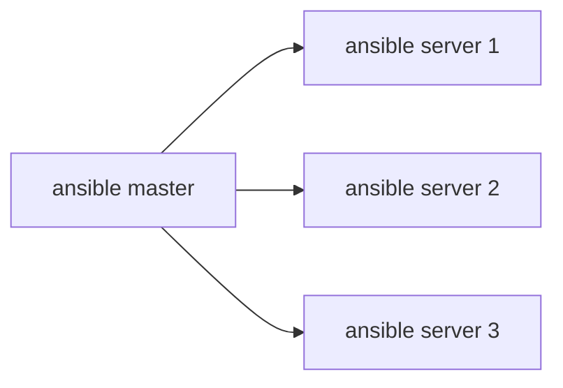

# Ansible

- In simple let say we have three servers, one for web server, one for database server and one for application server. We need to install some packages on all three servers. We can do it manually or we can use Ansible to automate the process.

Ansible is an open-source automation tool, commonly used for configuration management, application deployment, task automation, and orchestration. It simplifies the process of managing systems and applications, enabling administrators to automate repetitive tasks efficiently.

## Features

### Agentless Architecture

One of the key features of Ansible is its agentless architecture. Unlike some other automation tools, Ansible doesn't require installing agents on remote systems. Instead, it uses SSH (Secure Shell) protocol to communicate with the target machines, which makes it lightweight and easy to deploy.

### Infrastructure as Code

Ansible allows you to define your infrastructure as code using YAML (YAML Ain't Markup Language) syntax. This approach enables you to describe the desired state of your systems and applications in a declarative manner, making it easier to understand and manage infrastructure configurations.

### Playbooks

In Ansible, tasks are organized into playbooks. A playbook is a YAML file that contains a set of tasks to be executed on remote hosts. Playbooks can also define variables, templates, handlers, and more, providing a flexible and modular way to manage infrastructure.

### Idempotent Execution

Ansible follows the idempotent principle, meaning that running the same playbook multiple times will result in the same state, regardless of the initial state of the system. This ensures consistency and predictability in your infrastructure management workflows.

### Extensibility

Ansible is highly extensible, with a vast collection of modules that cover a wide range of use cases, from system administration tasks to cloud provisioning and beyond. Additionally, you can create custom modules to extend Ansible's functionality and integrate it with other tools and systems.

## Getting Started

To get started with Ansible, you'll need to install it on a control node, which can be your local machine or a dedicated server. Ansible is available for various operating systems, including Linux, macOS, and Windows.

Once installed, you can begin writing playbooks to automate tasks such as package installation, configuration management, service deployment, and more. Ansible's documentation provides comprehensive guides and examples to help you learn and master its capabilities.

## Example Playbook

```yaml
---
- name: Configure Nginx
  hosts: web_servers
  become: true
  tasks:
    - name: Install Nginx
      apt:
        name: nginx
        state: present

    - name: Copy Nginx configuration file
      template:
        src: nginx.conf.j2
        dest: /etc/nginx/nginx.conf
      notify:
        - restart nginx

  handlers:
    - name: restart nginx
      service:
        name: nginx
        state: restarted
```

In this example playbook, we define tasks to install Nginx, copy a configuration file, and restart the Nginx service. We target the hosts under the group `web_servers`, and we use the `become` directive to execute tasks with administrative privileges.

## Conclusion

Ansible is a powerful automation tool that simplifies the management of systems and applications. Its agentless architecture, infrastructure as code approach, and idempotent execution make it an ideal choice for automating various IT operations tasks. Whether you're managing a small-scale infrastructure or a large, complex environment, Ansible can help streamline your workflows and improve efficiency.



- Creating a file on all the three servers using single command on ansible master

```vim
ansible-playbook create_file.yml -i /home/ubuntu/ansible/hosts --private-keys= ~/.ssh/ansible_key
```

```yaml
name: This Playbook will create one file on each servers
hosts: all
become: true
tasks:
  - name: create a file
    file:
      path: /home/ubuntu/demo.txt
      state: touch
```

- We can also automate docker on all three servers
