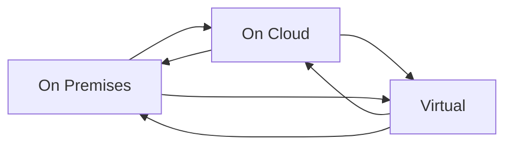
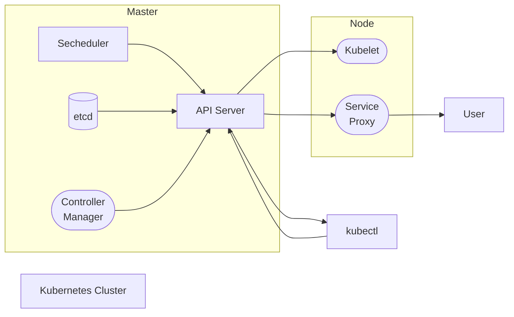
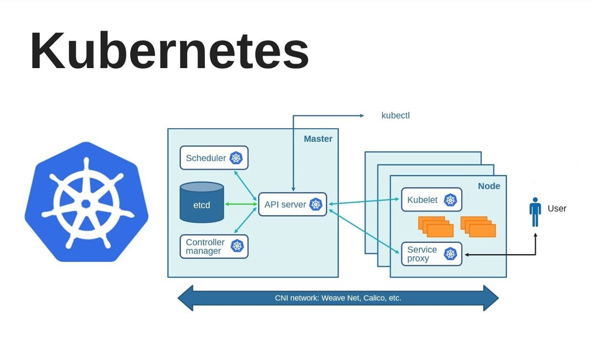
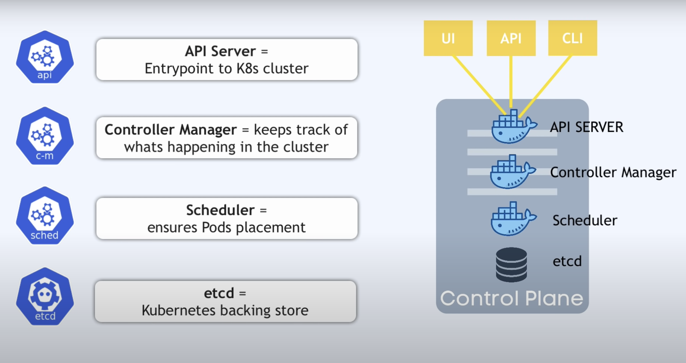
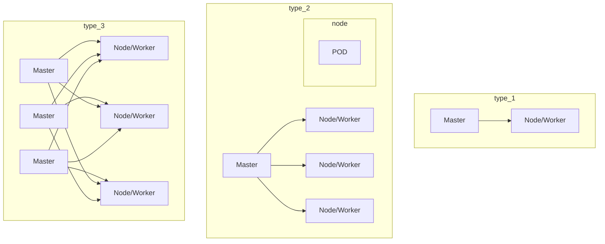
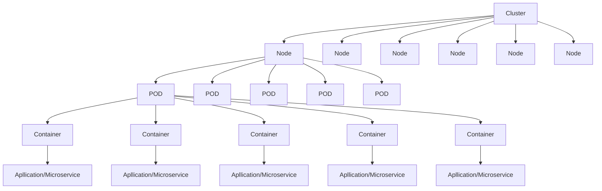

# Kubernetes

- Another name K8s
- Contsiner Management tool
- **Kubernetes is an Open-Source Container Management tool which automates Container deployment, Container Scaling & Load Balancing.**
- It schedules, runs. and manages isolated Containers which are running on virtual/Physical/Cloud Machines.
- All top Cloud providers Support Kubernetes

## HISTORY

- Google developed an internal system Called 'borg' later named as Omega deploy and manage thousands google application and services on their cluster
- In 2014, google introduced Kubernetes an open Source platform written in"'Golang' and later donated to **CNCF(Cloud Native Computing Foundation**).

## ONLINE PLATFORM FOR K8s

- Kubernetes playground.
- Play with k8s
- Play with Kubernetes Classroom

## CLOUD BASED K8s SERVICES

- GKE -> Google Kubernetes Services
- AKS Azure Kubernetes Services
- Amazon Eks (Elastic Kubernetes Services)

## KUBERNETES INSTALLATION TOOL

- Minicube
- Kubeadm

## Alternative of Kubernetes

- **Docker Swarm** is **a container orchestration tool for clustering and scheduling Docker containers** . With Swarm, IT administrators and developers can establish and manage a cluster of Docker nodes as a single virtual system.

## Problems with Containers

- **_Problems with Scaling up the Containers_**
  - Containers Cannot Communicate with each other.
  - Autoscaling and and Load Balancing was not possible
  - Containers had to be manage Carefully

## Features of Kubernetes

- Orchestration (Clustering of any no. Containers running on different n/w)
- Autoscaling(Both horizontal and Vertical Scalling)
- Auto-Healing
- Load Balancing
- Platform Independent (cloud/virtual/Physical)
- Fault Tolerance (Node /POD failure)
- Rollback (going back to previous Version)
- Health Monitoring of Containers
- Batch Execution (one time ,Sequential, Parallel)
- **_Custering_**



| Fetaures                                | Kubernates                                                                         | Docker Swarm                                                             |
| --------------------------------------- | ---------------------------------------------------------------------------------- | ------------------------------------------------------------------------ |
| Insttallation and Cluster configruation | Complicated and time consuming                                                     | Fast and Easy                                                            |
| Support                                 | K8s can work with almost all conatiner<br />types like rocket , docker ,containerD | Work with docker only                                                    |
| GUI                                     | Available                                                                          | Not Available                                                            |
| Data Volumes                            | only shared with conatiners in same<br />**POD**                                   | can be shared with any containers                                        |
| Updates and Roleback                    | Process scheduling to maintain services<br />while updating                        | Progressive updates of service health<br />monitoring through the update |
| Auto Scalling                           | Supports both Horizontal and Vertical Scalling                                     | Not support autoscalling                                                 |
| Logging and Monitoring                  | Inbuilt tool for monitoring                                                        | used third party tool like splunk                                        |

## KUBERNETES Architecture






## Types



- Mater Slave Architecture
- Client Server Architecture



- We should keep only one container in one pod
- pod is immortal

## Working with Kubernetes

- We Create manifest (yml)
- Apply this to Cluster (to master) to bring into desired state.
- Pod runs on node, which is Controlled by master
- ### Role of Master Node

  Kubernetes Cluster Contains Containers running or Bare Metal/VM instances/ Cloud instances.

## Components

### (1). Kube- api-server (For all Communications)

- This api-server interacts directly with user (ie we apply yml or json manifest to Kube-api server)
- This Kube- apiserver is meant to scale automatically as per load
- frontend of control plane

### (2). etcd

- Stores (metadata and status of Cluster)
- etcd is Consistent and high-availableStore (key-value store)
- Source of touch Cluster state (info about state of Cluster)
- **etcd has following features:-**
  - ①. Fully Replicated - The entire state is available on every node in the Cluster.
  - ②. Secure- Implements automatic TLS with Optional Client-Certificate authentication.
  - ③. fast - Benchmarked at 10,000 writes per second.

### (3). Kube-scheduler

- Assigns work to nodes
- It is responsible for distributing work or containers across multiple nodes
- When users make request for the Creation & Management of Pods, kube-scheduler
  is going to take action on these requests.
- Handles Pod Creation and Management
- kube-scheduler match / assign any node to
  Create and run pods.
- It is responsible for scheduling pods to run on nodes.
- It is responsible for binding the pod to a node.
- It is responsible for selecting the node for the pod to run on.
- It is responsible for maintaining the desired state of the pods in the system.

### (4). Kube-controller-manager

- It is responsible for maintaining the desired state of the Cluster.
- It is responsible for maintaining the desired state of the pods in the system.
- It is responsible for maintaining the desired state of the nodes in the system.
- It is responsible for maintaining the desired state of the replication controllers in the system.
- It is responsible for maintaining the desired state of the endpoints in the system.
- It is responsible for maintaining the desired state of the service accounts in the system.

### (5). Kubelet

- It is responsible for running containers on the nodes.
- It is responsible for running the containers on the nodes.
- It is responsible for running the pods on the nodes.
- It is responsible for running the containers in the pods on the nodes.
- It is responsible for running the pods in the nodes.
- It is responsible for running the containers in the nodes.

### (6). Kube-proxy

- It is responsible for maintaining the network rules on the nodes.

### (7). Container Runtime

- It is responsible for running the containers on the nodes.

### (8). Kubectl

- Kubectl is a command-line interface (CLI) tool used to interact with Kubernetes clusters. Kubernetes is an open-source container orchestration platform that automates the deployment, scaling, and management of containerized applications. Kubectl serves as the primary means for developers, administrators, and operators to manage Kubernetes clusters and the resources running on them.

Key features and functions of kubectl include:

1. **Cluster Management**: Kubectl allows users to create, update, and delete Kubernetes clusters. Users can interact with multiple clusters simultaneously, enabling seamless management of distributed environments.
2. **Resource Management**: Users can use kubectl to create, inspect, update, and delete Kubernetes resources such as pods, deployments, services, namespaces, and more. These resources define the desired state of applications running on the Kubernetes cluster.
3. **Deployment Operations**: Kubectl facilitates deploying applications onto Kubernetes clusters. Users can create deployment manifests or use higher-level deployment controllers like Deployments or StatefulSets to manage application lifecycle.
4. **Scaling**: With kubectl, users can scale applications horizontally or vertically by adjusting the number of replicas or the resources allocated to pods.
5. **Monitoring and Debugging**: Kubectl provides commands to monitor the health and status of resources within the cluster. Users can troubleshoot issues by inspecting logs, describing resources, or executing commands within pods.
6. **Security**: Kubectl supports various authentication mechanisms to ensure secure access to Kubernetes clusters. It allows users to configure role-based access control (RBAC) and manage user permissions effectively.
7. **Customization and Extensibility**: Kubectl is highly extensible and customizable through plugins and custom resource definitions (CRDs). Users can extend its functionality to meet specific requirements or integrate with other tools and systems.

Kubectl commands typically follow the syntax:

```bash
kubectl [command] [TYPE] [NAME] [flags]
```

Where:

- `command` specifies the operation to perform (e.g., create, get, describe, delete).
- `TYPE` is the Kubernetes resource type (e.g., pod, deployment, service).
- `NAME` is the name of the resource.
- `flags` are optional parameters to customize the operation.

Overall, kubectl is a powerful tool that simplifies the management and operation of Kubernetes clusters, enabling users to efficiently deploy and manage containerized applications at scale.

### (9). Pod

A Pod is the smallest deployable unit in Kubernetes, representing a single instance of a running process in the cluster. It encapsulates one or more containers, storage resources, and configuration options related to how the containers should run. Pods are fundamental building blocks in Kubernetes, providing a higher-level abstraction over individual containers.

Key features and characteristics of Pods include:

1. **Atomic Unit of Deployment**: Pods serve as the basic unit of deployment in Kubernetes. They encapsulate one or more containers that are tightly coupled and need to share resources or work together.

2. **Co-located Containers**: Pods enable running multiple containers within the same network and storage context. These containers can communicate with each other using local host networking and share the same lifecycle.

3. **Shared Resources**: Containers within a Pod share the same network namespace, IP address, and port space, facilitating inter-container communication through localhost. They can also share volumes mounted into the Pod's filesystem, allowing them to exchange data.

4. **Application Lifecycle Management**: Pods define the desired state of the application, including which containers should be running and their configuration. Kubernetes orchestrates the creation, scaling, and termination of Pods based on the desired state specified in the Pod manifest.

5. **Pod States**: Pods can be in various states during their lifecycle, including Pending, Running, Succeeded, Failed, or Unknown. These states indicate the current status of the Pod and whether it's successfully running its containers.

6. **Pod Lifecycle Hooks**: Pods support lifecycle hooks, allowing users to execute custom logic at different stages of the Pod lifecycle. Hooks include pre-start and post-start actions, enabling tasks such as initialization, configuration, or cleanup.

7. **Resource Management**: Pods can specify resource requests and limits for CPU and memory, ensuring fair resource allocation and preventing resource contention among containers running on the same node.

8. **Pod Affinity and Anti-affinity**: Kubernetes allows users to specify affinity and anti-affinity rules for Pods, influencing how they are scheduled onto nodes. This feature helps optimize resource utilization and improve application performance by controlling Pod placement.

9. **Pod Networking**: Pods are assigned a unique IP address within the Kubernetes cluster, allowing them to communicate with other Pods and external services. Kubernetes networking plugins handle the routing of traffic between Pods and ensure network isolation and security.

Overall, Pods provide a flexible and scalable way to deploy and manage containerized applications in Kubernetes. By encapsulating one or more containers and their associated resources, Pods simplify application deployment, scaling, and management in distributed environments.
