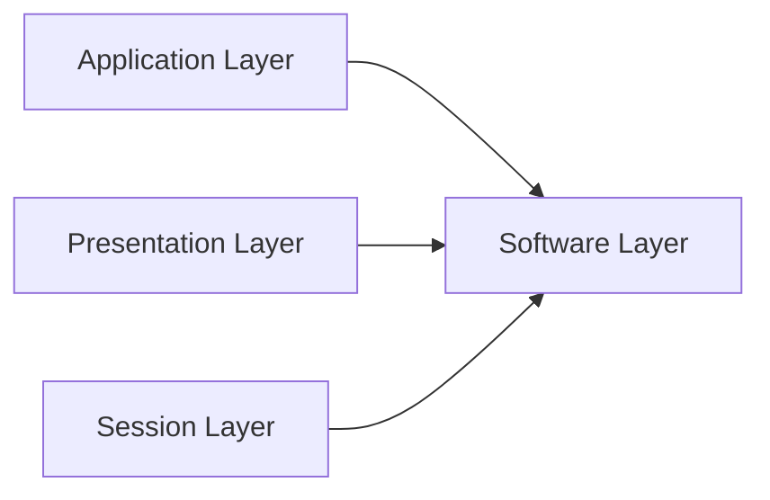
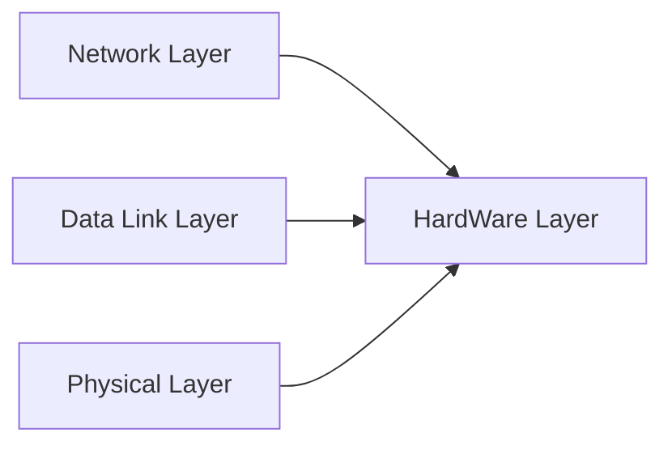
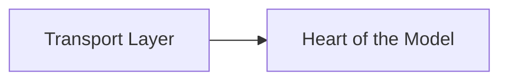
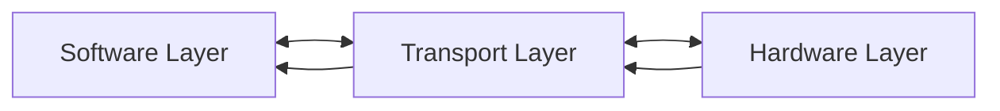
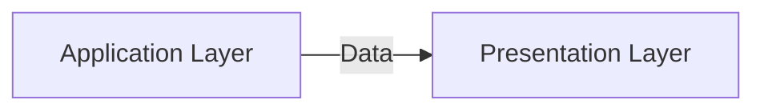
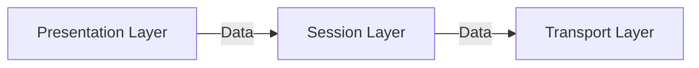
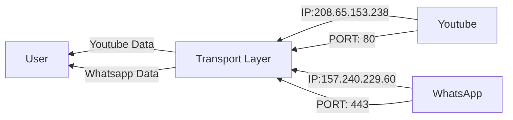
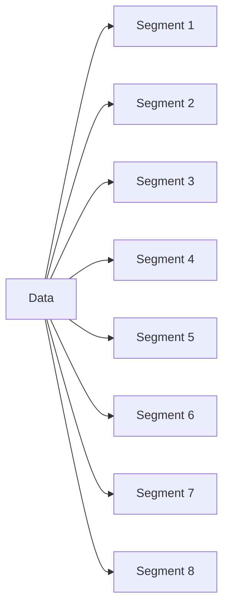
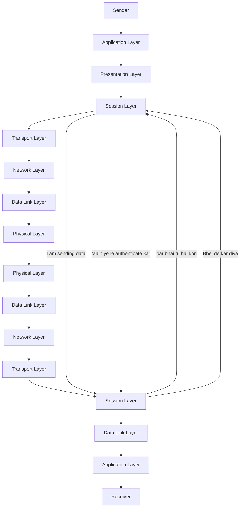

## OSI MODEL

**Open System Interconnection**

- This is a reference model
- 1970's & 80's
- reference model for TCP/IP model
- Protocols & Layered System

  - set up of some rules
- Let us understand Layered system via diagram

  ```mermaid
  graph LR;
  A[Location A] --> B[Location B]
  ```

  - Seven Layers of OSI Model

    ```mermaid
    graph LR;
    A[Application Layer]
    B[Presentation Layer]
    C[Session Layer]
    D[Transport Layer]
    E[Network Layer]
    F[Data Link Layer]
    G[Physical Layer]
    ```

    - (Technique): All People Seems To Need Data Processing









- Application Layer
  - Provide User Interface Like Safari ,Chrome ,Brave
  - Provide Different Protocols for sharing the data
  - Ex: HTTP,FTP,SMTP
  - HTTP: Hyper Text Transfer Protocol(Website viewing)
  - FTP:File Transfer Protcol
  - SMTP:Simple Mail Transfer Protocol
  - HTTPS:Hyper Text Transfer Protocol Secure



- Presenatation Layer

  - Reformat the received data(Converting to ASCII Character)
  - Data Encrypting (AAA-->$#@@)(To save from hacking)
  - Data Compression(File size reduction)(less time more data transfer)
- Session Layer

  - Create and Manage Session(Create Session for sender and Receiver will ready to authenticate and receive)
  - Add Check points (If connection interrupted then resending data from resumed point )
  - Terminate Session



- **- - >Transport Layer**
- If we are using whatsapp and youtube at same time how the system will identify which data is coming from which source so this is done by Transport Layer
- Transport Layer uses port number and ip address to identify data source and by this bits data is differentiated
- Threre is total 65,536 port numbers



- Transport Lyer also decides which Connection type should be used to transport data
- TCP/UDP
  - If data will be transferred by TCP then this will be connection oriented protocol
  - TCP is connection oriented
  - UDP is connection less
  - In connection oriented model first connection is established then communication starts
  - In connection less model no conection is established just messages are sent



- Transport layer divides data in to segments
- Convert data to segments
- Flow Control
- Error Control
- **Network Layer**

  - Segments to packets

    - Each Packet go through different network before reaching the destination
    - Network Layer selects the quickest path for a packet to reach destination
    - Routers help the network layer in finding the best path
    - Network layer uses ip address to transfer a packet
    - once the ip address is assigned it will not change

    ```mermaid
    graph LR;
    D[Segment]-->A[Packet 1]
    D-->B[Packet 2]
    D-->C[Packet 3]
    D-->E[Packet 4]
    D-->F[Packet 5]
    D-->G[Packet 6]
    D-->H[Packet 7]
    D-->I[Packet 8]
    ```
- **Data Link Layer**

  - Packets to frames
  - how many frames that will be totally dependent on hardware used in data link layer
  - Mostly Hardware in data link layer is Network Interface Card(NIC)
  - NIC:
    - In which lan is connected
    - Swich and hub also work in this layer
  - In this layer to transfer the data we use MAC Address
  - And data is transferred system to system
  - Media Access Controller Layer
    - Desices which system will receive the media
- **Physical Layer**

  - Decides how raw bits will be transferred through physical medium
  - If Physical Medium are wires then Electric Signal will be used to transmit data
  - If Wireless like wifi then radio signals will be used to transfer data
  - Physical Layer also decides the representation signal for 1 and 0 in a communication medium
  - Lifetime of a bt is also decided
  - Data rate also decided in this layer
  - also check mode of communication (simplex,half duplex,full duplex)


