# Operating System

## OS:

- Operting System is a software that takes the control of our machine after it get turned on.
- some basic tests happen
- some power on self tests happen
- then control is given to the operating system
- and Operating System becomes incharge of the system
- Operating System provides us basic services and we call them system calls for saving data to harddisk ,mouse events ,keyboard events
- **Contractor**
- Provide an interface to the user to communicate with hardware of the system

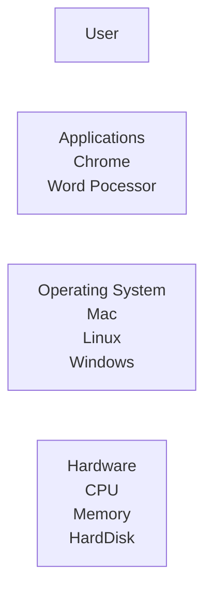

## Systems without OS

- In the absence of an OS, **our PC will boot using a small piece of firmware known as the BIOS** (Basic Input/Output System). The BIOS governs very simple features such as resetting the clock, voltage regulation or diagnosing system errors.
- Our System is made for doing one task at a time but how can we overcome that
- like we want to do multi tasking like using 10 aplications once a time so Operating system came here
- Even In the presence of os, our system do only one process at a time but OS is very smart it does very very very fast swiching between the processes
- So by the OS it is possible to do multiple task a time

## **Services**

- Abstraction
  - Our OS extracts the hardware and provides the system calls without writting any assembly or binary code by the user
- Resource Management
  - OS manages the resources of the system like CPU, Memory, Harddisk, etc
  - Process Management
    - OS manages the processes of the system
    - It decides which process will run first and which will run later
    - It also decides which process will run for how much time
  - Protection and Security
    - OS provides the security to the system
    - It provides the security to the processes
    - It provides the security to the data

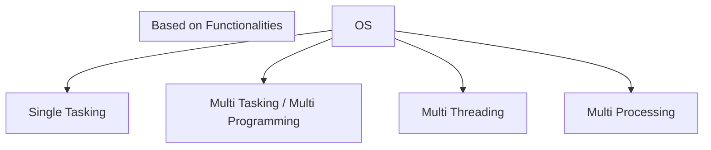

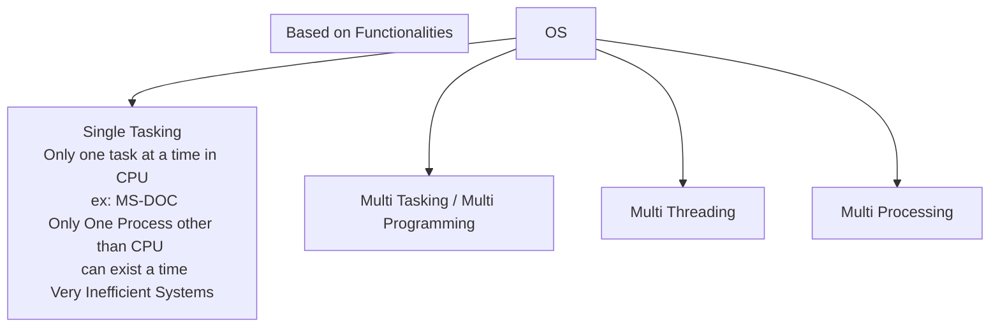

### Single Tasking

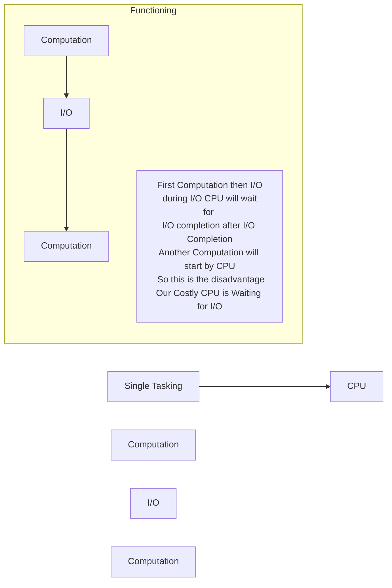

### Multi Programming

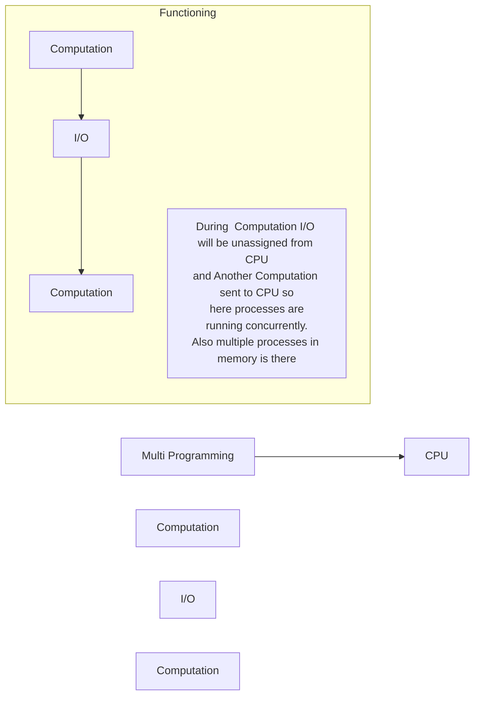

### Multi Tasking

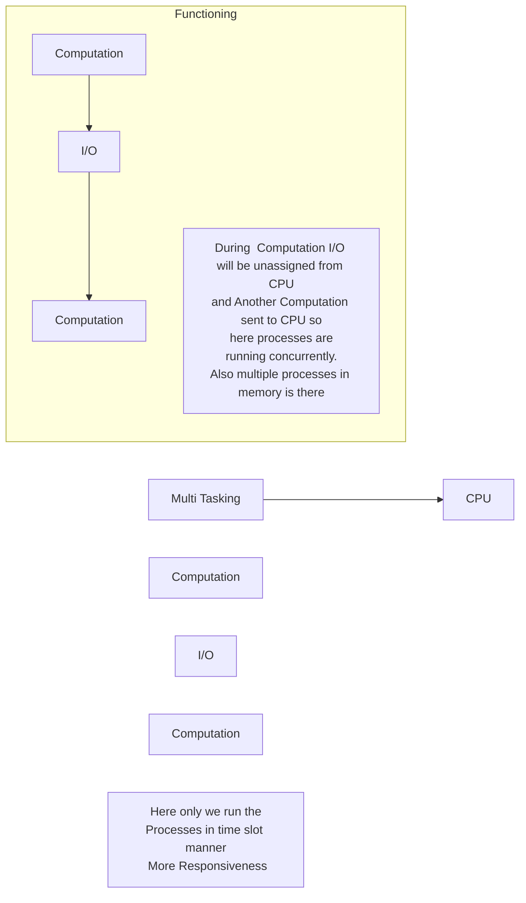

- Multi Tasking is also known as Time Sharing
- Multi Tasking is more responsive because we run the processes in time slot manner. We assign time t1 to c1 and t1 to c2 and so on
- Here only we run the Processes in time slot manner More Responsiveness

### Multi Threading

- Multiple processes in a OS
- Multiple threads in a process
- Running multiple threads in a process is known as Multi Threading
- Multi Threading is more responsive than Multi Tasking
- Multi Threading is more efficient than Multi Tasking
- Multi Threading is more efficient than Multi Tasking because in Multi Tasking we have to switch between the processes and in Multi Threading we have to switch between the threads
- Switching between the threads is more efficient than switching between the processes
- Example: Chrome Browser is a process and each tab in chrome browser is a thread so we can say that chrome browser is a multi threaded process
- Almost all the modern OS are multi threaded
- Thread : a smallest unit of execution

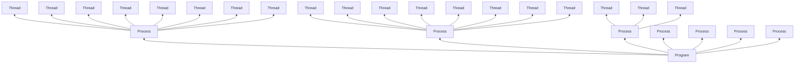

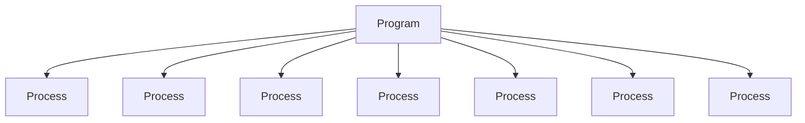

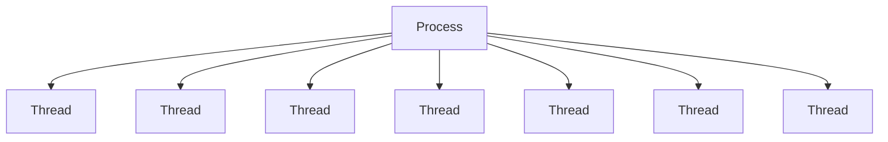

- Multiple threads running concurrently
- Switching from one thread to another thread is less costly than switching from one process to another process

#### POSIX Threads

- standard library for working with POSIX threads

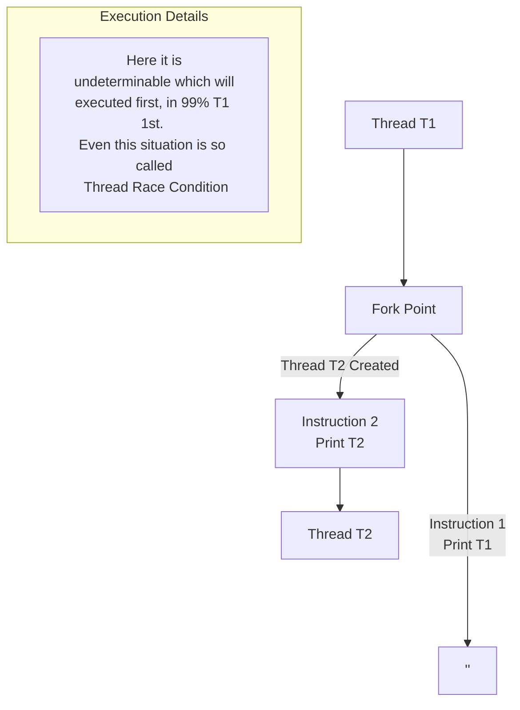

```c
// This is a simple program to demonstrate how to create a thread

#include <stdio.h>
#include <stdlib.h>
#include <pthread.h> /* For working with POSIX threads*/
#include <unistd.h>  /* For pause() and sleep() */
#include <errno.h>	 /* For using Global variable errno */

/* A thread callback fn must have following prototypes 
 * void *(*thread_fn)(void *)
 * */
static void *
thread_fn_callback(void *arg) {

	char *input = (char *)arg;

	while(1) {
		printf("input string = %s\n", input);
		sleep(1);
	}
}

void
thread1_create() {

	/* opaque object, dont bother about its internal
	 * members */
	pthread_t pthread1;

	/* Take some argument to be passed to the thread fn,
 	 * Look after that you always paas the persistent memory
 	 * as an argument to the thread, do not pass caller's 
 	 * local variables Or stack Memory*/
	static char *thread_input1 = "I am thread no 1";

	/* Return 0 on success, otherwise returns errorcode, all
 	 * pthread functions return -ve error code on failure, they
 	 * do not set global 'errno' variable */
	int rc = pthread_create(&pthread1, 
				   NULL, 
				   thread_fn_callback,
				   (void *)thread_input1);
	if(rc != 0) {

		printf("Error occurred, thread could not be created, errno = %d\n", rc);
		exit(0);
	}
}

int
main(int argc, char **argv){

	thread1_create();
	printf("main fn paused\n");
	pause(); // pause() is a system call, it will not return until a signal is received 
    //thread will create child threads and and wait for them to complete
	return 0;
}

```

```json
main fn paused
input string = I am thread no 1
input string = I am thread no 1
input string = I am thread no 1
input string = I am thread no 1
input string = I am thread no 1
and so on .....
```

### Multi Processing

- having our system with multiple processors
- Divide processes among the processors
- Divide threads among the processors

### Multi User

- Multiple users can use the system at a time
- Example: Server,Cloud

### Multi Threading vs Multi Tasking

- Multi Tasking
  - Listening to music and Browsering the Web
- Multi Threading
  - Downloading a file in browser and Browsering the Web in the same browser
  - **Real World Example**

    - Word Processsor
      - Typing
      - Spell Check
      - Printing
      - Saving
      - Formatting
        at the same time
    - Chrome Browser
      - Downloading a file
      - Browsering the Web
      - Playing a Video
      - Playing a Game
        at the same time
    - Modern IDEs
      - Compiling
      - Debugging
      - Typing
      - Formatting
      - Saving
      - Spell Check
      - Running
        at the same time
  - Advantages

    - Parallelism
      - Multiple threads running concurrently
    - Responsiveness
    - Better Resource Utilization
    - Improved Performance
  - Disadvantages

    - Difficulty in writting , testing and debugging
    - Race Condition
    - Example of Race Condition| Thread 1                    | Thread 2                    |
      | --------------------------- | --------------------------- |
      | int a = 10;                 |                             |
      | a++;                        |                             |
      | write a back to the memory; |                             |
      |                             | read a;                     |
      |                             | a++;                        |
      |                             | write a back to the memory; |
      | a=12 finally                |                             |
    - Another Sequence of Execution| Thread 1                    | Thread 2                    |
      | --------------------------- | --------------------------- |
      | read a;                     |                             |
      | a++;                        |                             |
      |                             | read a;                     |
      | write a back to the memory; |                             |
      |                             | a++;                        |
      |                             | write a back to the memory; |
      | a=11 finally                |                             |
    - Can lead to deadlocks

    ```mermaid
    graph LR;
    T1-->R2
    R2-->T2
    T2-->R1
    R1-->T1
    subgraph DeadLocks
    A[R1,R2 is unsharable<br> so only one use them at a time<br> so if T1 is using R1 and T2 is using R2<br> and T1 wants R2 and T2 wants R1<br> then DeadLocks will occur]
    end
    ```

### Threads

- If Our Process is Multi threaded then multiple stacks will be there
- Multiple Functions might be running Concurrently or Parallelly
- Concurrent Execution :
  - Multiple Functions running at the same time
  - Scheduler will decide which function will run first and which will run later
  - One will be doing I/O and other will be doing Computation
- Parallel Execution :
  - Multiple Functions running at the same time on multiple processors

```mermaid
graph BT;
subgraph Thread 1
A[Stack1<br>--<br><br>--<br>Heap1<br>Data1<br>Code1]
end
subgraph Thread 2
B[Stack2<br>--<br><br>--<br>Heap1<br>Data1<br>Code1]
end
subgraph Thread 3
C[Stack3<br>--<br><br>--<br>Heap1<br>Data1<br>Code1]
end
subgraph All<br> are sharing Heap<br> Data and Code
end
```

#### Advantages of Threads

- Faster to create/Terminate the threads than processes
- Faster to switch between the threads than processes
- Multiple threads in a process
  - Threads share the same address space
  - Easy to communicate between the threads
  - context switching is easier
  - Easy to share the data between the threads
- Lightweight
  - Threads are lightweight than processes
  - Thread creation means only stack creation

#### Types of Threads

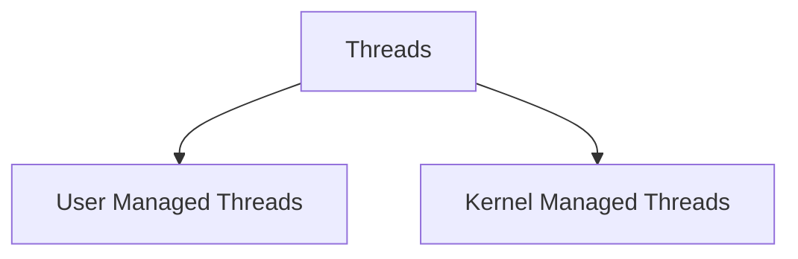

##### User Managed Threads vs Kernel Managed Threads

| User Managed Threads                                                                                                              | Kernel Managed Threads                                                 |
| --------------------------------------------------------------------------------------------------------------------------------- | ---------------------------------------------------------------------- |
| Manageement in User Space                                                                                                         | Management in Kernel Space                                             |
| Context Switching is faster                                                                                                       | Context Switching is slower                                            |
| Blocking: One thread might block the other threads                                                                                | Blocking: A thread blocks it self Only                                 |
| MultiCore or MultiProcessor : Can not take advantage of MultiCore or MultiProcessor Only Concurrent execution on single processor | MultiCore or MultiProcessor : Take full advantage of Multi core System |
| Creation/Termination :Fast                                                                                                        | Creation/Termination :Slow                                             |
| Context Switching :Fast                                                                                                           | Context Switching :Slow                                                |

##### Mapping of User Managed Threads to Kernel Managed Threads

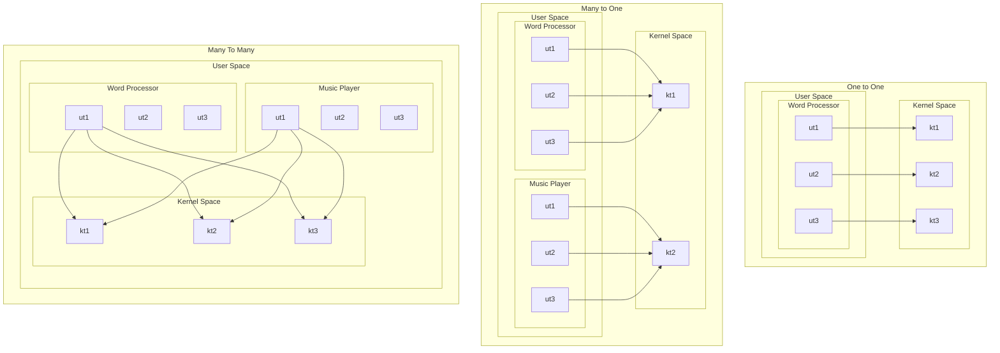


