# Program

- A program is that which resides on our harddisk
  - Like c++ program in .cpp

# Process

- A process is nothing but a program in execution

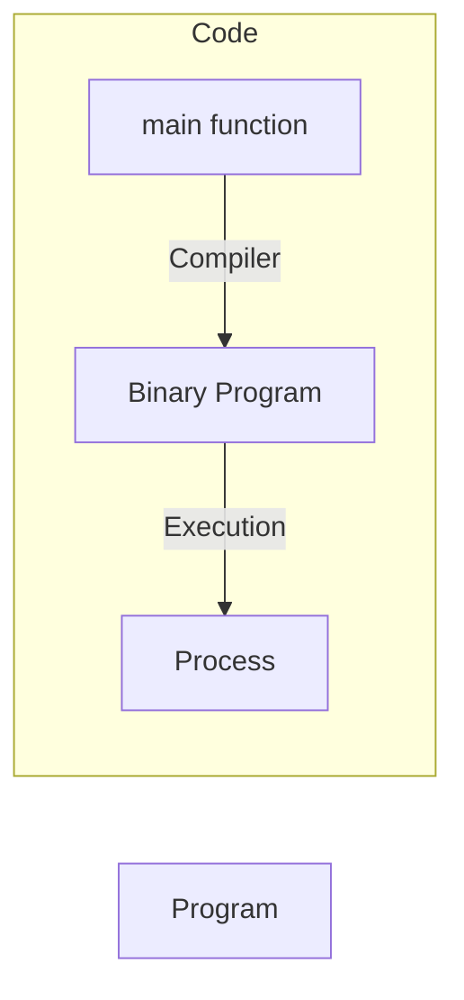

# Single Tasking System(MS DOS)


- In Single Tasking System, only one program can be executed at a time
- When a program is finished, it is terminated and removed from memory
- Then the next program is loaded into memory and executed
- If Process is doing so I/O operation, then CPU is idle and waiting for I/O operation to complete and this is very inefficient and wastage of CPU time

# Multi Programming System

- Where multiple processes runs at the same time and CPU is never idle

# Multi Tasking System

- Where multiple processes runs at the same time and CPU is never idle and a time slice is given to each process
- A fixed Quantum of time is given to each process and after that time, the process is preempted and another process is given a chance to execute

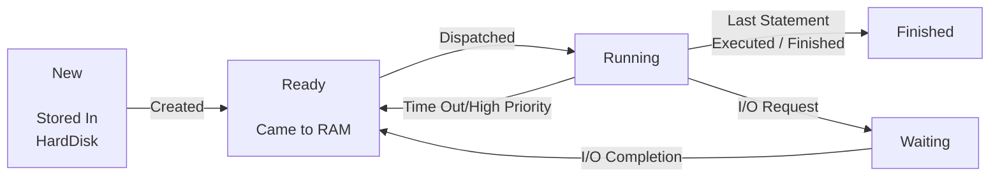

## Some modifications in above diagram

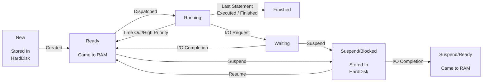


- 5 State Model
- 7 State Model


# Process Control Block(PCB)

- PCB is a data structure maintained by os for every process
- PCB used for storing the collection about the processes
- PCB identified by an integer process ID(PID)
- PCB lies in Kernel Memory space
- PCB deleted once the process id completed

  

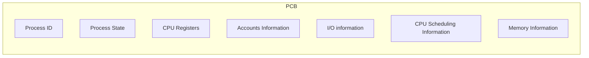

- **Process ID**
  - Unique identification for each processes in the operating system
- **Process State**
  - Current state of process wheter process is running ,ready or waiting
- **Pointer**
  - A pointer to parent process
- **CPU Registers**
  - All the CPU registers where the process is stored for execution for example PC,SP,AX,BX,CX,DX etc
- **Accounts Information**
  - Process priority,Process owner,Process ID
- **I/O information**
  - I/O devices allocated to process
- **CPU Scheduling Information**
  - Process priority,Process state,Process ID
- **Memory Information**
  - Code,Data,Stack

# Process Scheduler

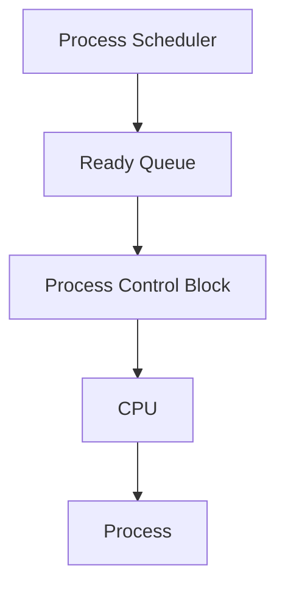

- Process Scheduler is a part of operating system which is responsible for selecting the processes from the ready queue and allocating the CPU to one of them

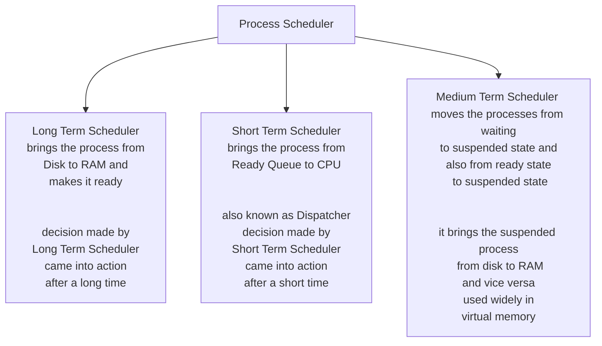

# Queues in OS(Process Scheduling Queues)

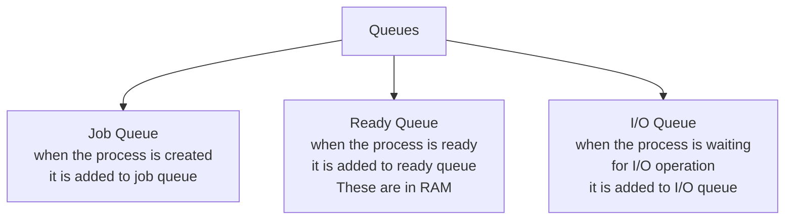

# Short Term Scheduler and Dispatcher

- Short term scheduler is only responsible for selecting the process from the ready queue and then Dispatcher came in to action
- Dispatcher is responsible for allocating the CPU to the selected process
- Dispatcher is also known as context switcher
- Dispatcher is responsible for saving the context of the current process and loading the context of the selected process

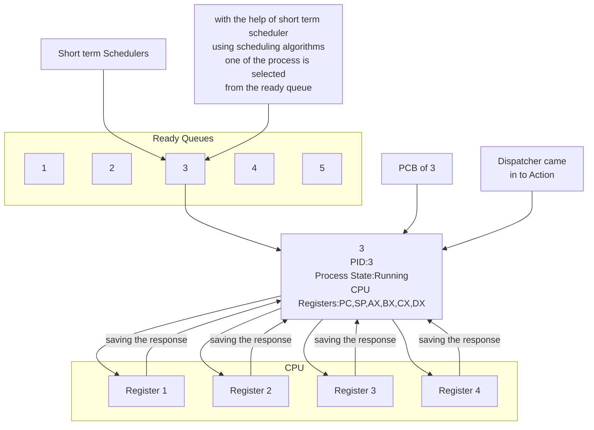

# When Short term Scheduler came into action

- A). when some other processes moves from running to waiting.
- B). When some other processes moves from running to ready
- C). When new/existing process moves to ready(priority is higher)
- D). When a process terminates
- Premptive Scheduling in B and C case only
- Preemptive Scheduling is a scheduling in which a process can be preempted from CPU and another process can be allocated to CPU

# Various Time Related to the Processes


- ⭐Arrival Time: Time at which the process arrives in the ready queue.
- ⭐Completion Time: Time at which process completes its execution.
- ⭐Burst Time: Time required by a process for CPU execution.
- ⭐Turn Around Time: Time Difference between completion time and arrival time.
  Turn Around Time = Completion Time – Arrival Time
- ⭐Waiting Time(W.T): Time Difference between turn around time and burst time.
  Waiting Time = Turn Around Time – Burst Time
- ⭐Arrival Time=1  ⭐Completion Time=6 ⭐Turn Around Time = 6-1=5 ⭐Burst Time=3 ⭐Waiting Time = 5-3=2

# Goals of CPU Scheduling

- ⭐Max CPU Utilization
- ⭐Max Throughput
- ⭐Min Turn Around Time
- ⭐Min Waiting Time
- ⭐Min Response Time
- ⭐Fair CPU Allocation(No starvation)

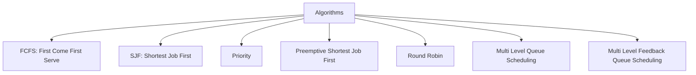

# FCFS Algorithm

- Criteria : Arrival time
- Mode: Premptive
- First come first serve basis algorithm

| Process | Arrival Time | Burn Time |
| ------- | ------------ | --------- |
| P1      | 2            | 6         |
| P2      | 5            | 3         |
| P3      | 1            | 8         |
| P4      | 0            | 3         |
| P5      | 4            | 4         |

- TAT: Turn Around Time = Completion Time - Arrival Time
- TAT = Waiting Time + Burst Time
- RT : Response Time = Time at which process first gets the CPU - Arrival Time
- Gantt Chart

```mermaid
gantt
title FCFS Algorithm Gantt Chart
dateFormat HH:mm 
axisFormat %H:%M
Initial milestone : milestone, m1, 00:00, 0m
    P4 : 3m
    P3 : 8m
    P1 : 6m
    P5 : 4m
    P2 : 3m
    Final milestone:milestone, p2

```

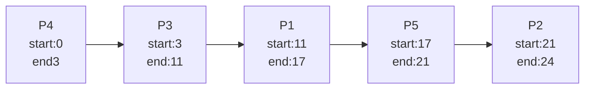

| Process | AT | BT | CT | TAT<br />(CT-AT) | WT<br />(TAT-BT) | RT<br />(Start-AT) | Start Time | End Time |
| ------- | -- | -- | -- | ---------------- | ---------------- | ------------------ | ---------- | -------- |
| P1      | 2  | 6  | 17 | 15               | 9                | 9                  | 11         | 17       |
| P2      | 5  | 3  | 24 | 19               | 16               | 16                 | 21         | 24       |
| P3      | 1  | 8  | 11 | 10               | 2                | 2                  | 3          | 11       |
| P4      | 0  | 3  | 3  | 3                | 0                | 0                  | 0          | 3        |
| P5      | 4  | 4  | 21 | 17               | 13               | 13                 | 17         | 21       |

| Average  WT =             | (9+16+2+0+13)/5=8       |
| -------------------------- | ----------------------- |
| **Average TAT** =  | (15+19+10+3+17)/5 =12.8 |

| Advantages of FCFS           |                                                                        |
| ---------------------------- | ---------------------------------------------------------------------- |
| Simple and Easy to implement |                                                                        |
| Non Premptive                | Once we assign processor<br />to the process we can not un assign back |
| Convoy Effect                | One CPU bound has taken multiple<br />I/O bounds                       |
| Waiting Time                 | Comes due to Convoy effect                                             |

| PID | AT | BT | CT | TAT | WT             | RT | ST | ET |
| --- | -- | -- | -- | --- | -------------- | -- | -- | -- |
| P1  | 0  | 40 | 40 | 40  | 0              | -  | -  | -  |
| P2  | 1  | 3  | 43 | 42  | 39             | -  | -  | -  |
| P3  | 1  | 1  | 44 | 43  | 42<br />Avg=27 | -  | -  | -  |

```mermaid
gantt
    dateFormat HH:mm
    axisFormat %H:%M
    Initial milestone : milestone, m1, 00:00, 0m
    P1: 40m
    P2: 3m
    P3: 1m
    Final milestone : milestone,P3
```

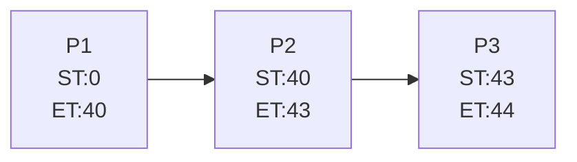

| PID | AT | BT | CT | TAT | WT           | RT | ST | ET |
| --- | -- | -- | -- | --- | ------------ | -- | -- | -- |
| P1  | 1  | 40 | 44 | 43  | 3            | -  | -  | -  |
| P2  | 0  | 3  | 3  | 3   | 0            | -  | -  | -  |
| P3  | 0  | 1  | 4  | 4   | 3<br />Avg=2 | -  | -  | -  |

```mermaid
gantt
    dateFormat HH:mm
    axisFormat %H:%M
    Initial milestone : milestone, m1, 00:00, 0m
    P2: 3m
    P3:1m
    P1:40m
    Final milestone :milestone, P1
```

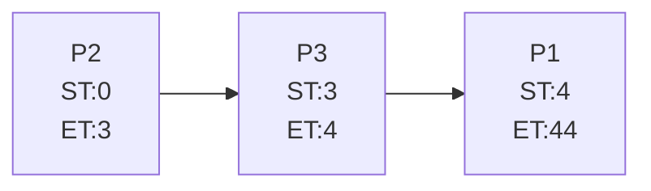


# FCFS With Overhead

- Taking time for next process
  

# Shortest Job First(SJF)

- Shortest Job First is a scheduling algorithm in which the process having the shortest burst time is selected for the execution
- Criteria : Burst time
- Mode:Non Premptive

| PID | AT | BT | CT | TAT | WT | RT | ST | ET |
| --- | -- | -- | -- | --- | -- | -- | -- | -- |
| P1  | 2  | 6  | -  | -   | -  | -  | -  | -  |
| P2  | 5  | 2  | -  | -   | -  | -  | -  | -  |
| P3  | 1  | 8  | -  | -   | -  | -  | -  | -  |
| P4  | 0  | 3  | -  | -   | -  | -  | -  | -  |
| P5  | 4  | 4  | -  | -   | -  | -  | -  | -  |

```mermaid
gantt
title Shortest Job First Gantt Chart
dateFormat HH:mm
axisFormat %H:%M
Initial milestone : milestone, m1, 00:00, 0m
P4:3m
P1:6m
P2:2m
P5:4m
P3:8m
Final milestone:milestone,P3
```

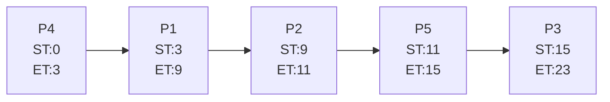

| PID | AT | BT | CT | TAT | WT | RT | ST | ET |
| --- | -- | -- | -- | --- | -- | -- | -- | -- |
| P1  | 2  | 6  | 9  | 7   | 1  | 1  | 3  | 9  |
| P2  | 5  | 2  | 11 | 6   | 4  | 4  | 9  | 11 |
| P3  | 1  | 8  | 23 | 22  | 14 | 14 | 15 | 23 |
| P4  | 0  | 3  | 3  | 3   | 0  | 0  | 0  | 3  |
| P5  | 4  | 4  | 15 | 11  | 7  | 7  | 11 | 15 |

- Avg Waiting time =5.2 and it is lesser
- implemented through mean heap algorithm
- it is greedy algorithm
- TC : O (nlogn)

# SRTF(Shortest Remaining Time First ) Algorithm

- Method with Preemption
- Criteria :Burst
- Mode: Premption
- Premption: Means cpu will execute the process to a fixed quantumn time it will not care for process completion


```mermaid
gantt 
title Shortest Remaining Time First Gantt Chart
dateFormat HH:mm
axisFormat %H:%M
Initial milestone : milestone, m1, 00:00, 0m
P1 :1m
P2:1m
P3:1m
P3:1m
P4:1m
P6:1m
P6:1m
P2:3m
P5:3m
P1:7m
Final milestone : milestone,
```

## Advantages of SRTF

- Minimun Average waiting among all the algorithms
- May cause high waiting and high response times for CPU bound jobs
- I mpractical

# Priority Scheduling

## Priority Scheduling (Non Preemptive)

| PID | Arrival Time | Priority Value | Burn Time |
| --- | ------------ | -------------- | --------- |
| P0  | 0            | 5              | 3         |
| P1  | 1            | 3              | 5         |
| P2  | 2            | 15             | 8         |
| P3  | 3            | 12             | 6         |

| PID | AT | PV | BT | TAT | WT | ST | ET |
| --- | -- | -- | -- | --- | -- | -- | -- |
| P0  | 0  | 5  | 3  | 3   | 0  | 0  | 3  |
| P1  | 1  | 3  | 5  | 21  | 16 | 19 | 22 |
| P2  | 2  | 15 | 8  | 9   | 1  | 5  | 11 |
| P3  | 3  | 12 | 6  | 14  | 8  | 13 | 17 |

```mermaid
gantt
title Priority Scheduling (Non Preemptive) gantt chart
dateFormat HH:mm
axisFormat %H:%M
Initial milestone : milestone, m1, 00:00, 0m
P0:5m
P2:8m
P3:6m
P1:5m
```

## Priority Scheduling (Preemptive)

| PID | Arrival Time | Priority Value | Burn Time |
| --- | ------------ | -------------- | --------- |
| P0  | 0            | 5              | 3         |
| P1  | 1            | 3              | 5         |
| P2  | 2            | 15             | 8         |
| P3  | 3            | 12             | 6         |

| PID | AT | PV | BT | TAT | WT | ST | ET |
| --- | -- | -- | -- | --- | -- | -- | -- |
| P0  | 0  | 5  | 3  | 17  | 14 | 0  | 17 |
| P1  | 1  | 3  | 5  | 21  | 16 | 17 | 22 |
| P2  | 2  | 15 | 8  | 8   | 0  | 2  | 10 |
| P3  | 3  | 12 | 6  | 13  | 7  | 10 | 15 |

```mermaid
gantt
title Priority Scheduling (Non Preemptive) gantt chart
dateFormat HH:mm
axisFormat %H:%M
Initial milestone : milestone, m1, 00:00, 0m
P0:2m
P2:8m
P3:6m
P0:1m
P1:5m
```

- Starving of Low Priority in Priority Scheduling
  - Solution: Aging

# Round Robin Scheduling

- Uses time Quantum
- Circular Queue(ready queue)
- Average waiting time can be higher but response time is good
- Sensitive to quantumn
  - smaller quantum time: context switch overhaed
  - large quantum : become FCFS

| PID<br />Time Quantum=2 | AT | BT |
| ----------------------- | -- | -- |
| P0                      | 0  | 3  |
| P1                      | 1  | 1  |
| P2                      | 1  | 5  |

```mermaid
graph LR;
A[P0<br>0-2]
B[P1<br>2-3]
C[P2<br>3-5]
D[P0<br>5-6]
E[P2<br>6-9]
A-->B-->C-->D-->E
```

# Highest Response Rate Next (HRRN)


# Multilevel Queue Schedulling Algorithm (MLQ)

```mermaid
graph LR;
A[System Process]
B[Interactive Process]
C[Batch Process]
D[Student Process]
E[CPU]
A--Ready Queue 1-->E
B--Ready Queue 2-->E
C--Ready Queue 3-->E
D--Ready Queue 4-->E
X[High Priority]
Y[Medium Priority]
Z[Lowest Priority]
X-->A
Y-->B
Z-->D
T[.........]
T-->C
```

```mermaid
graph LR;
A[System Process<br>P1,P2]
B[Interactive Process<br>P3,P4]
C[Batch Process<br>P5,P6]
D[Student Process<br>P7]
D--Let P7 is Sent-->E
E[CPU<br>P7 executing]
A--Ready Queue 1<br>Round Robin-->E
B--Ready Queue 2<br>FCFS-->E
C--Ready Queue 3<br>SJF-->E
D--Ready Queue 4<br>Priority-->E
X[High Priority]
Y[Medium Priority]
Z[Lowest Priority]
X-->A
Y-->B
Z-->D
T[.........]
T-->C
```

```mermaid
graph LR;
A[System Process<br>P1,P2<br>Lets P8 new came]
B[Interactive Process<br>P3,P4]
C[Batch Process<br>P5,P6]
D[Student Process<br>P7]
E--P7 sent Back-->D
E[CPU<br>P7 suspended<br>P8 came]
A--Ready Queue 1<br>Round Robin-->E
B--Ready Queue 2<br>FCFS-->E
C--Ready Queue 3<br>SJF-->E
D--Ready Queue 4<br>Priority-->E
X[High Priority]
Y[Medium Priority]
Z[Lowest Priority]
X-->A
Y-->B
Z-->D
T[.........]
T-->C
```

- Processes from one queue to another queue will not change
- This will cause startvation
- A process can have a longer wait time and cause starvation

# MultiLevel Feedback Queue Scheduling Algorithm(MLFQ)

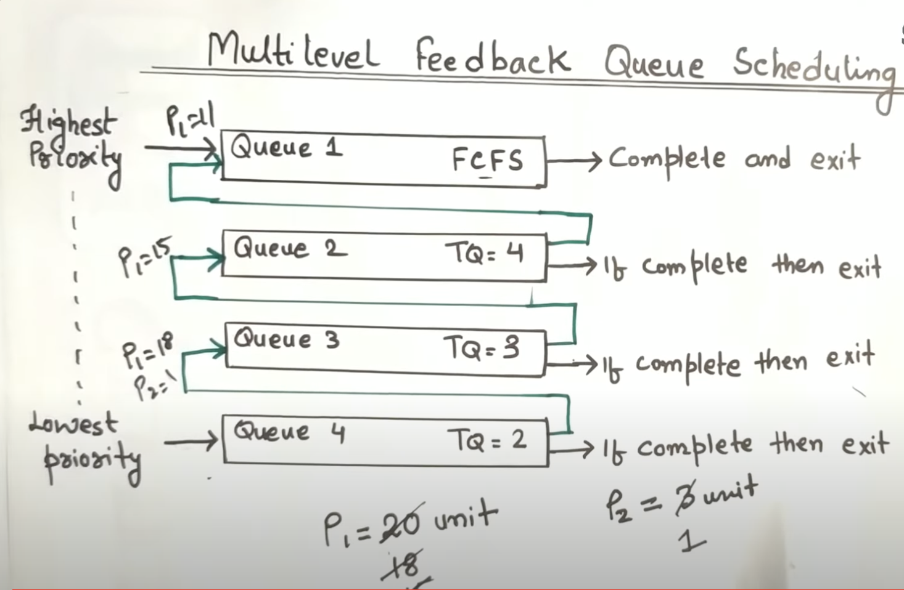

- No starvation problem
- Windows and Mac OS uses MLFQ
- Linux uses MLQ but now it uses more advanced algorithm


