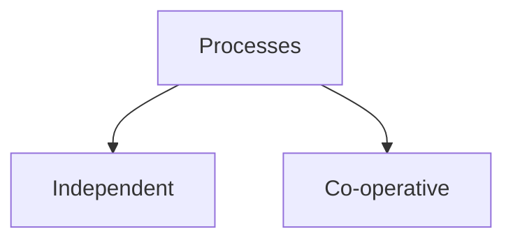

# Process Synchronisation

- Processes can communicate with other



```bash
shubham@SHUBHAMs-MacBook-Air system-design % ps | grep "chrome" | wc
       1       5      37
```

- Process Synchronisation can occurs in both single processor system and multi processor system.
- In single processor system this happen due to concurrent execution.

# Example of Concurrent Execution

```mermaid
gantt
title Shortest Remaining Time First Gantt Chart
dateFormat HH:mm
axisFormat %H:%M
Initial milestone : milestone, m1, 00:00, 0m
P1 :1m
P2:1m
P3:1m
P3:1m
P4:1m
P6:1m
P6:1m
P2:3m
P5:3m
P1:7m
Final milestone : milestone,
```



- Synchronisation occurs with the help of global variables and shared memory.

```cpp
#include <iostream>
#include <thread>
#include <chrono>
const int SIZE = 10;
char Buffer[SIZE];
int in = 0, out = 0;
int count = 0;
// P1 processor

bool stopFlag = false;

void producerThread()
{
    while (!stopFlag)
    {
        while (count == SIZE)
            ;
        Buffer[in] = 'a';
        in = (in + 1) % SIZE;
        count++;
    }
}
// P2 processor
void consumerThread()
{
    while (!stopFlag)
    {
        while (count == 0)
            ;
        char item = Buffer[out];
        out = (out + 1) % SIZE;
        count--;
    }
}

int main()
{
    std::thread producer(producerThread);
    std::thread consumer(consumerThread);
    std::this_thread::sleep_for(std::chrono::seconds(1));
    stopFlag = true;
    producer.join();
    consumer.join();
    std::cout << "Finished" << std::endl;
    return 0;
}


```

## Problems in Process Synchronisation

    - Sequence of Execution 1

| Thread 1                    | Thread 2                    |
| --------------------------- | --------------------------- |
| int a =10;                  | -                           |
| a++;                        | -                           |
| write a back to the memory; | -                           |
| -                           | read a;                     |
| -                           | a++;                        |
| -                           | write a back to the memory; |
| a=12 finally                | a=12 finally                |

Another Sequence of Execution

| Thread 1                    | Thread 2                    |
| --------------------------- | --------------------------- |
| read a;                     | -                           |
| a++;                        | -                           |
| -                           | read a;                     |
| write a back to the memory; | -                           |
| -                           | a++;                        |
| -                           | write a back to the memory; |
| a=11 finally                |                             |

- Can lead to deadlocks

```cpp

int x=10;
void deposit(int x){
// entry section
balance=balance+x;  // critical section //here balance value=90 initially =80
// exit section
}
void withdaw(int x){
// entry section 
balance=balance-x;// critical section //here balance value=70 initially =80
//exit section
}
// only one process should be allowed to enter critical section
```

# Goals of Synchronisation Mechanism

- Critical Section: Where we are accessing the value of shared Global variable
- due to this race condition occurs
- We can take example of Single room Washroom

## Mutual Exclusion

- Only one process should be present in Critical section
- So only one person will be using the washroom at a time

## Progress

- Other processes would we waiting for forst to complete
- other processes would not be blocking anthor processes that is happenning currently
- like not another person will be locking the door while one is inside the washroom and for others that are also waiting

## Bounded Waiting(Fair)

- Same processes will not be running multiple times
- like same person will not be using the washrooom who already have used

## Performance

- Entered process should be fast
- like entered person will have to do fast his work

# Overview of Synchronisation

## Disabling Interruption Implementation

- Processors before going to critical section says Hey don't interrupt me i am going to critical section
- but as we know how scheduling mechanism works
- if higher priority process acme then our os assign higher priority process for execution and stops current one
- so it is not possilble to so first statment like **Disabling Interruption** can not be done
- also we are allowing a process to disable interrupts also allowing an user process to disable interrupt which may cause serious issue and cause damage to system forever.
- so Disabling Interruption is not feasible
- also it is not feasible in multi processor system in single processor system we can implement this

## Locks (Mutex) Implementation

- Basic building block to implement synchronisation
- we acquire the lock and go into the critical section and then we will release the lock
- i can be preempted only when lock processes are waiting for me
- Locks can be implemented both in software and hardware(most common impl.) both
- Software Impl.
  - Peterson Implementation
  - Bakery Algorithm

## Semphore Implementation
