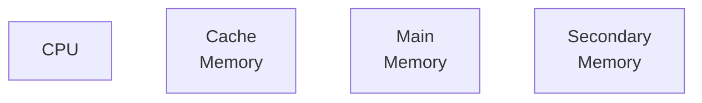

# Memory Management

## Memory Hierarchy



- The things we need frequently are very closer to cpu like caching
- Access time should be very less
- Capacity should be high
- Cost should be low

## Address Binding

- Mapping of relocatable addresses to physical address
- cpp-> binary file
- binary file-> execuatble binary

  ```mermaid
  graph LR;
  subgraph Execuatble Binary
  A[001 <br> 002 <br> 003<br> 004 <br> 005 <br>006<br> Relative <br>or<br> Relocatable <br> Addresses]
  end
  subgraph Physical Addresses
  B[000 <br>001 <br>\<br> /<br>\<br> /<br>\<br> /<br>\<br> /<br>\<br> /<br> 50K]
  end
  A-->B
  ```

- Can happen at different stages

  - At Compile time
  - Load time
  - Rum time(in modern computers) -->Logical Addresses are created by CPU

### Run Time Binding

```mermaid
graph TD;
A[CPU]
A--Logical<br>Address-->B
subgraph MMU<br>Memory Management Unit<br>
C[Limit<br> Register]
C-->B
B[<]
B--No-->D[to OS]
B-->F[+]
G[Relocation<br> Register]
G-->F
F-->H
end
E[MainMemory]
F--Physical Address-->E

```

## Evolution of Memory Management
