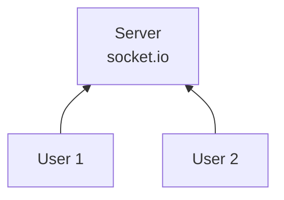
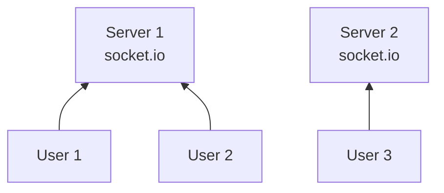
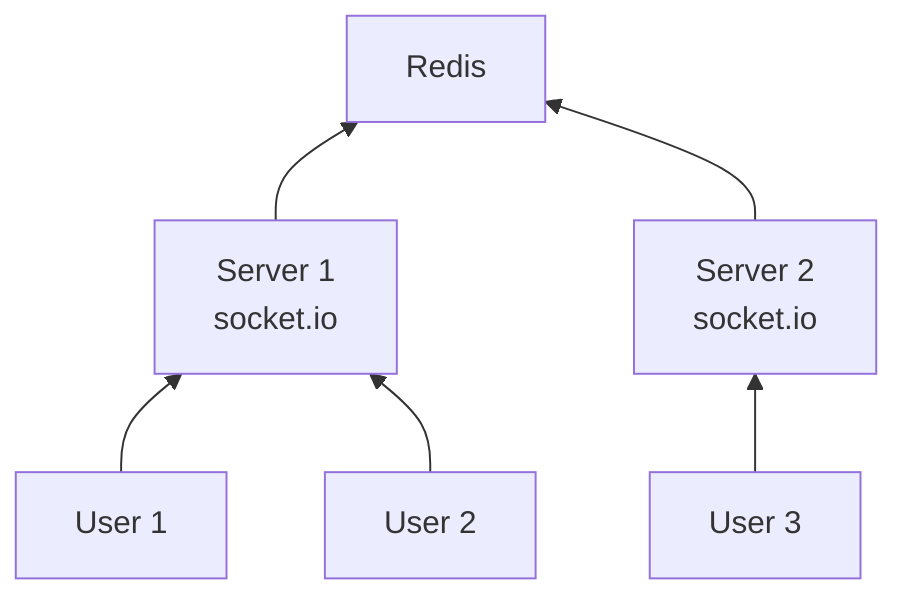
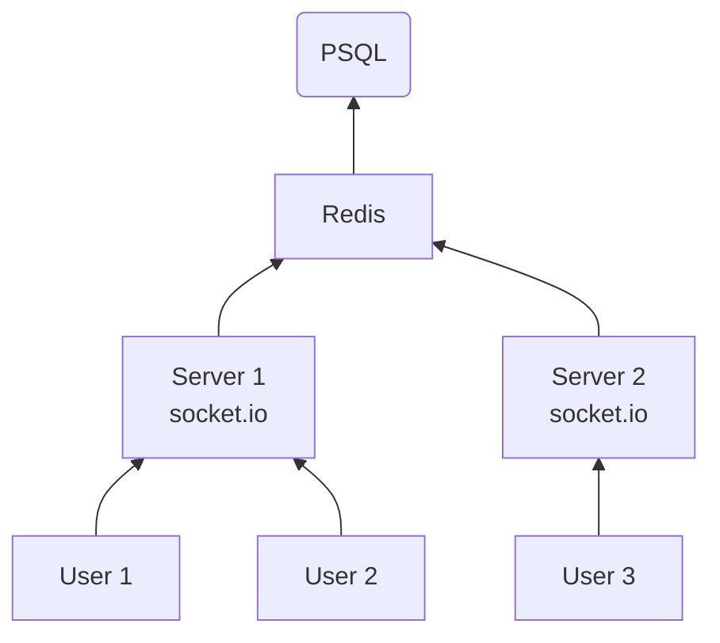
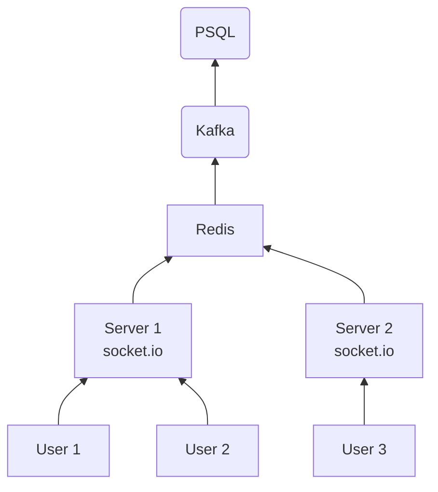

## Scalable Chat App

**Normal Chat App**

- No problem till now because both the users are connected with same server so here socket connect is successful
- Now some a day load on server is increased so i though waht can we do
  - We can do vetical scalling increased the system property whre the system is hosted
  - Now if after some day we reached the limit of increament and users are increasing day by day
  - so we will introduce one more server
  - so here we are goint to do Horizontally scalling

- so here socket connection is not possible between User 1 and User 3

- Now our problem is resolved all the users are connected with each other
- Now we will save datas to our database

- Now here one problem arises like now read and write to database is increased so our database can be down after some times
- so now what we will do

