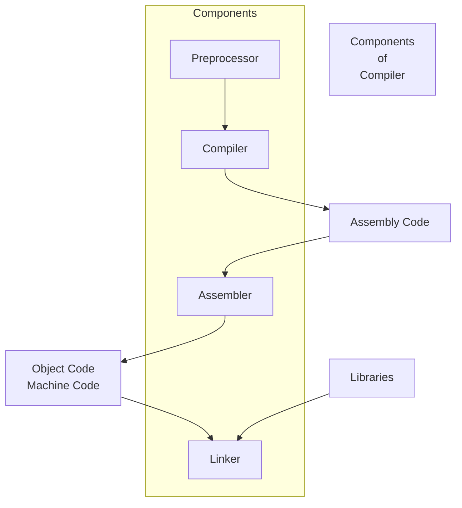
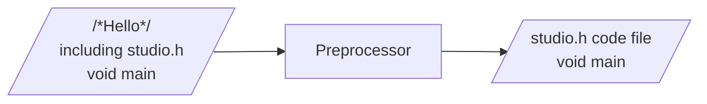
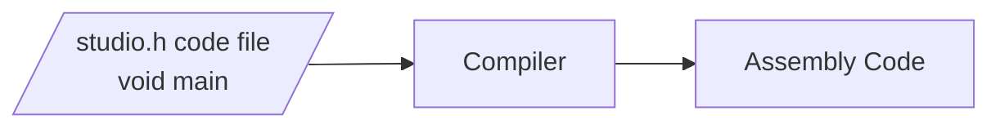
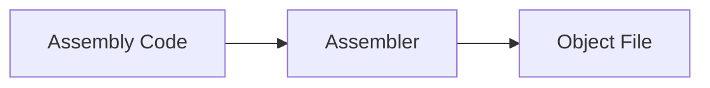
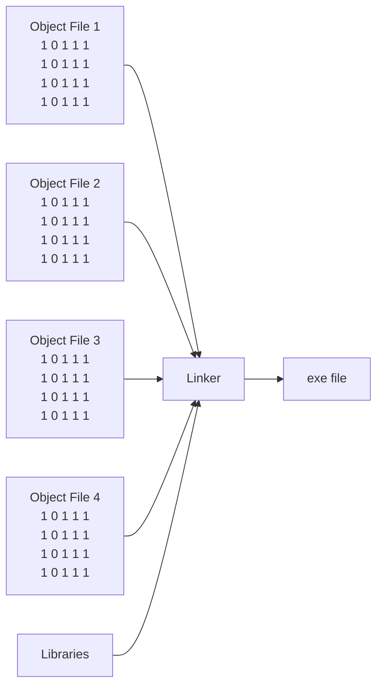
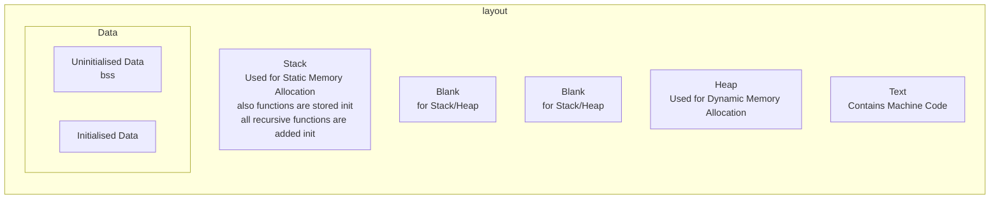

# Rust

## Understanding C program Compilation Process





- Preprocessor will remove comments and include the codes of heder file in the source code



```cpp
int main() {
	int x = 1;
	x = x + 2;
	return x;
}
```

```objectivec
main:
   PUSH %BP
   MOV  %SP, %BP
@main_body:
   SUB  %SP, $8, %SP
   MOV  $1, -8(%BP)
   MOV  $2, -4(%BP)
   MOV  $5, -8(%BP)
   MOV  -8(%BP), %13
   JMP  @main_exit
@main_exit:
   MOV  %BP, %SP
   POP  %BP
   RET 
```

[C to Assembly Convertor](http://www.ctoassembly.com/)





## Let's dive deeper

### Structures in C

```c
#include <stdio.h>
// define a structure
struct student
{
    int roll;
    char name[20];
    float marks;
};
// total space occupied by structure is equal to the sum of the size of all members
int main()
{
    // declare a structure variable
    struct student s1;
    // input data
    printf("Enter roll: ");
    scanf("%d", &s1.roll);
    printf("Enter name: ");
    scanf("%s", s1.name);
    printf("Enter marks: ");
    scanf("%f", &s1.marks);
    // print data
    printf("Roll: %d\n", s1.roll);
    printf("Name: %s\n", s1.name);
    printf("Marks: %.2f\n", s1.marks);
    struct student students[5];
    for (int i = 0; i < 5; ++i)
    {
        printf("Enter roll for student %d: ", i + 1);
        scanf("%d", &students[i].roll);
        printf("Enter name for student %d: ", i + 1);
        scanf("%s", students[i].name);
        printf("Enter marks for student %d: ", i + 1);
        scanf("%f", &students[i].marks);
    }
    for (int i = 0; i < 5; ++i)
    {
        printf("\nStudent %d:\n", i + 1);
        printf("Roll: %d\n", students[i].roll);
        printf("Name: %s\n", students[i].name);
        printf("Marks: %.2f\n", students[i].marks);
    }
    // using pointer
    struct student *ptr;
    ptr = &s1;
    printf("\nUsing pointer:\n");
    printf("Roll: %d\n", ptr->roll);
    printf("Name: %s\n", ptr->name);
    printf("Marks: %.2f\n", ptr->marks);


    return 0;
}
```

### Union in C

```c
#include <stdio.h>
#include <string.h>
// define a union
union student
{
    int roll;
    char name[20];
    float marks;
};
// total space occupied by union is equal to the size of the largest member
int main(){
    // declare a union variable
    union student s1;
    // input data
    printf("Enter roll: ");
    scanf("%d", &s1.roll);
    printf("Enter name: ");
    scanf("%s", s1.name);
    printf("Enter marks: ");
    scanf("%f", &s1.marks);
    // print data
    printf("Roll: %d\n", s1.roll);
    printf("Name: %s\n", s1.name);
    printf("Marks: %.2f\n", s1.marks);
    union student students[5];
    for (int i = 0; i < 5; ++i)
    {
        printf("Enter roll for student %d: ", i + 1);
        scanf("%d", &students[i].roll);
        printf("Enter name for student %d: ", i + 1);
        scanf("%s", students[i].name);
        printf("Enter marks for student %d: ", i + 1);
        scanf("%f", &students[i].marks);
    }
    for (int i = 0; i < 5; ++i)
    {
        printf("\nStudent %d:\n", i + 1);
        printf("Roll: %d\n", students[i].roll);
        printf("Name: %s\n", students[i].name);
        printf("Marks: %.2f\n", students[i].marks);
    }
    // using pointer
    union student *ptr;
    ptr = &s1;
    printf("\nUsing pointer:\n");
    printf("Roll: %d\n", ptr->roll);
    printf("Name: %s\n", ptr->name);
    printf("Marks: %.2f\n", ptr->marks);

    return 0;
}
```

### Structures vs Union

```c
#include <stdio.h>
#include <string.h>
//we can access only one member at a time in union
union student
{
    int roll;
    char name[20];
    float marks;
};
int main(){
    union student s1;
    s1.roll = 1;
    strcpy(s1.name, "John");
    s1.marks = 99.99;
    printf("Roll: %d\n", s1.roll);
    printf("Name: %s\n", s1.name);
    printf("Marks: %.2f\n", s1.marks);
    s1.roll = 2;
    printf("Roll: %d\n", s1.roll);
    strcpy(s1.name, "Jane");
    printf("Name: %s\n", s1.name);
    s1.marks = 100.00;
    printf("Marks: %.2f\n", s1.marks);
    return 0;
}
```

### Enumeration

```c
#include <stdio.h>
#include <string.h>
enum weeks
{
    Monday,
    Tuesday,
    Wednesday,
    Thursday,
    Friday,
    Saturday,
    Sunday
};
int main()
{
    enum weeks today;
    today = Wednesday;
    printf("Day %d\n", today + 1);
    for(int i = Monday; i <= Sunday; ++i)
    {
        printf("Day %d\n", i + 1);
    }
    return 0;
}
```

### Memory Allocation

```c
#include <stdio.h>
#include <string.h>
int main(){
    // static memory allocation
    // memory is allocated at compile time
    //example:
    int a[5];
    int a[5] = {1, 2, 3, 4, 5};
    // dynamic memory allocation
    // memory is allocated at run time
    // example:
    int *ptr;
    ptr = (int *)malloc(5 * sizeof(int));
    free(ptr);

    return 0;
}
```

### Malloc

```c
#include <stdio.h>
#include <string.h>
#include <stdlib.h>
int main()
{  // malloc() memory allocation
    // malloc() is a function that allocates memory at run time and
    // returns a pointer of type void which can be casted into pointer of any form.
    // syntax: ptr = (cast-type*) malloc(byte-size)
    // initialises each block with some garbage value
    // large blocks of memory
    int n = 5;
    int *ptr;
    int arr[n];
    ptr =(int *)malloc(n * sizeof(int));
    for (int i = 0; i < n; i++)
    {
        *(ptr + i) = i + 1;
    }
    for (int i = 0; i < n; i++)
    {
        printf("The value of %d element is: %d\n", i + 1, ptr[i]);
    }
    free(ptr);

    return 0;
}
```

### Calloc

```c
#include <stdio.h>
#include <string.h>
#include <stdlib.h>
int main(){
    // calloc() contiguous allocation
    // calloc() is a function that allocates memory at run time and
    // returns a pointer of type void which can be casted into pointer of any form.
    // syntax: ptr = (cast-type*) calloc(n, datatype-size)
    // initialises each block with 0
    // small small blocks of memory
    int n = 5;
    int *ptr;
    int arr[n];
    ptr =(int *)calloc(n, sizeof(int));
    for (int i = 0; i < n; i++)
    {
        *(ptr + i) = i + 1;
    }
    for (int i = 0; i < n; i++)
    {
        printf("The value of %d element is: %d\n", i + 1, ptr[i]);
    }
    free(ptr);

    return 0;
}
```

### Realloc

```c
#include <stdio.h>
#include <string.h>
#include <stdlib.h>
int main(){
    //realloc() re allocataion
    // realloc() function is used to dynamically change memory allocation of a previously allocated memory.
    // maintains the previous values and new blocks are initialised with garbage values
    // syntax: ptr = realloc(ptr, newSize);
    // large blocks of memory
    int n = 5;
    int *ptr;
    int arr[n];
    ptr =(int *)malloc(n * sizeof(int));
    for (int i = 0; i < n; i++)
    {
        *(ptr + i) = i + 1;
    }
    for (int i = 0; i < n; i++)
    {
        printf("The value of %d element is: %d\n", i + 1, ptr[i]);
    }
    // Reallocating ptr using realloc()
    ptr = realloc(ptr, 10 * sizeof(int));
    for (int i = 5; i < 10; i++)
    {
        *(ptr + i) = i + 1;
    }
    for (int i = 0; i < 10; i++)
    {
        printf("The value of %d element is: %d\n", i + 1, ptr[i]);
    }
    free(ptr);
    return 0;
}
```

# Memory Layout of C program



## Heap Overflow & Stack Overflow

- When memory limit exceeded due to large allocation of memory in heap, it is called heap overflow.
- We continuously allocate memory in heap and deallocate memory from heap. If we allocate memory in heap more than the limit of heap, it is called heap overflow.
- We continuously push data into stack and pop data from stack. If we push data into stack more than the limit of stack, it is called stack overflow.
- When memory limit exceeded due to large allocation of memory in stack, it is called stack overflow.
- Higher dimensional arrays cause stack overflow.
- Recursive functions cause stack overflow.

# Buffer Overflow

- Buffer overflow is a vulnerability in low level codes of C and C++.
  - Buffer is a temporary storage area in RAM.
  - Buffer : Sequential section of memory allocated to contain anything from a character string to an array of integers.
  - Buffers are designed to store data in a sequential manner.
- When a program tries to store more data in a buffer than it was intended to hold, it is called buffer overflow.
- Buffer overflow can cause program to crash.
- Buffer overflow can cause malicious code to be executed.
- Buffer overflow can cause security vulnerability.
- Buffer overflow can cause data corruption.
- Buffer overflow can cause the program to misbehave.
- In c/c++ due to to dangling pointer, buffer overflow can occur.
- In Rust, buffer overflow cannot occur due to dangling pointer.
- Uust guraantees memory safety.
- Rust is a memory safe language.
- Rust is a system programming language.
- Rust is a multi paradigm language.
- Rust is a compiled language.
- Rust is a systems programming language that runs blazingly fast, prevents segfaults, and guarantees thread safety.

# Why Rust preferrable for developers

- fast
- memory safe
- low overhead
- adaptable
- simple to apply
- strong typed and statically typed

## Memory management in Rust

- Rust uses a memory management system that involves ownership, borrowing, and lifetimes.
- Ownership is a unique feature of Rust.
- Ownership is a unique feature of Rust that allows Rust to achieve memory safety without garbage collector.
- Ownership is a unique feature of Rust that allows Rust to achieve memory safety without reference counting.
