# Latency

- Time taken to send a message from one point to another point

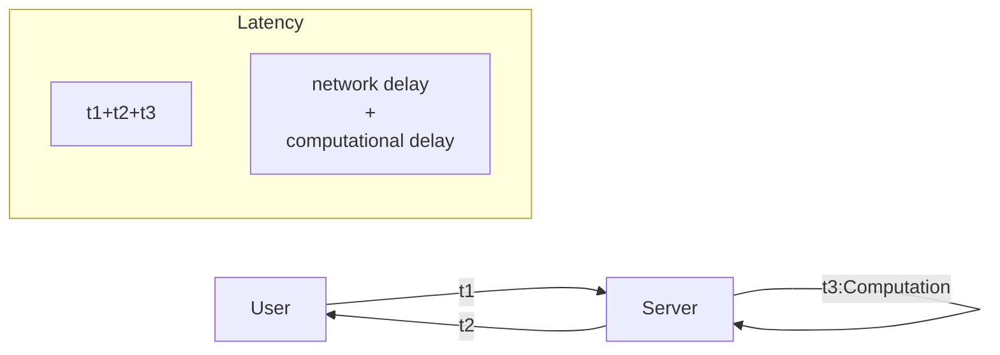

Monolithic<<Distrubuted :Latency

## Methods to reduce Latency

- Caching
  - Caching is the process of storing some data in the cache on the server. The cache is a temporary storage component area where the data is stored so that in future, data can be served faster rather than searching from the original location.
- CDN
  - CDNs are geographically distributed network of proxy servers and their data centers are spread across the globe to provide high availability and performance by distributing the service spatially relative to end users.

```js
function getName(userId){
.........we are getting this after 1000 lines of code.....
}
```

```js
function getName(userId="abc"){
if(userId==="abc"){
return [...results];
}
......... 1000 lines of code.....
}
```

- Upgrading the hardware

# Throughput

- Volume of data that can be handled by the system in a given time
- Amount of data transmitted per unit of time .
- Process rate flow
- Measured in bits per second
- Throughput is the number of such actions executed or results produced per unit of time.
- Distributed System has more throughput than Monolithic System because of multiple replicas

## Causes of Low Throughput

- Network Congestion
- Slow Network
- Latency
- Protocol Overhead
- Slow Server
- Slow Database

## Methods to increase Throughput

- Caching
- CDN
- Load Balancer
- Upgrading the hardware
- Use distributed system

# Availability

- The probability that a system will work as expected when required during the period of a mission.
- Goggle has 99.99% availability
- 99.99% availability means 52.56 minutes of downtime per year
- 99.999% availability means 5.26 minutes of downtime per year
- 99.9999% availability means 31.5 seconds of downtime per year
- 99.99999% availability means 3.15 seconds of downtime per year
- 99.999999% availability means 0.315 seconds of downtime per year
- In distributed system if any of the system fails then the entire system will not fail
- Availability of distributed system is more than monolithic system because of multiple replicas

## Causes of Low Availability

- Single point of failure
- Network Congestion
- Slow Network
- Latency
- Monoilithic System

## Methods to increase Availability

- Replication
- Redundancy
  - Each nodes are synchronized with each other
- Distributed System

# Consistency

- When a user updates a data then the user should get the updated data

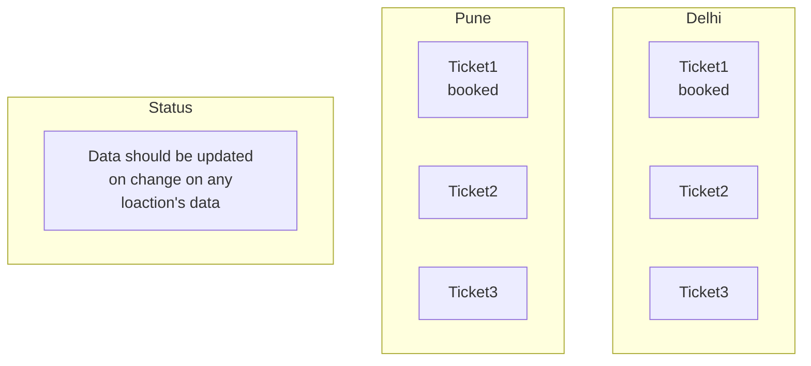

- Consistency in monolithic system is easy
- Consistency in distributed system is difficult
- Because of multiple replicas, users are getting different servers for their use

## Types of Consistency

| Strong Consistency                                                                                          | Eventual Consistency                                                                                             | Weak Consistency                                                                         |
| ----------------------------------------------------------------------------------------------------------- | ---------------------------------------------------------------------------------------------------------------- | ---------------------------------------------------------------------------------------- |
| when the system doesn't allow<br />read operation until the data <br />is written to <br />all the replicas | when the system allows read<br />operation <br />even if the data is not written <br />to <br />all the replicas | Not need to update all<br />the replicas <br />it depends upon the<br />business logics |
| Example: Ticket Booking                                                                                     | Example: Social media post<br />Update                                                                           |                                                                                          |

# CAP Theorem

- C Consistency
- A Availability
- P Partition Tolerance:
  - One server is down but the system is still working using replicas
- CAP Theorem says that we can only have two of the three properties at a time and compromise on the third one
- CAP Theorem is applicable for distributed system
- In banking system we compromise during update
- In social media we compromise consistency
- CP/AP Only
- Blog Website - AP
- Multiplayer Game - CP
- Stock Market - CP
- Banking System - CP
- Social Media - AP
- Ticket Booking - CP
- Video Streaming - AP

# Lamport Logical Clock

- For Distributed System


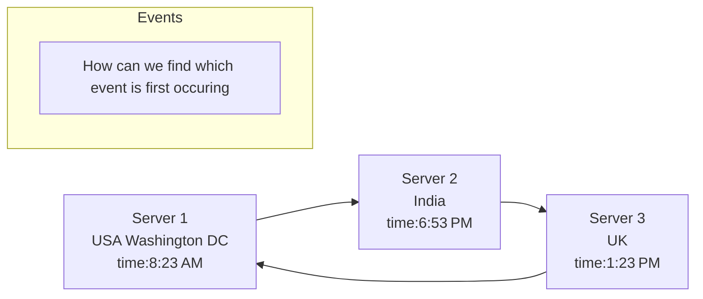

# Scalability

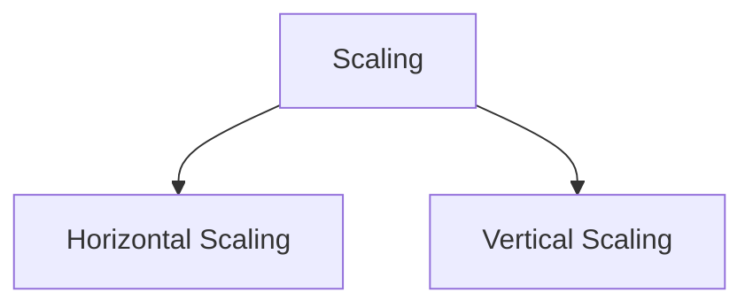

## Vertical Scaling

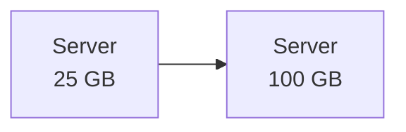

### Pros

- Easy Implementation
- Less Power
- Management Easy
- Security

### Cons

- Single Point of failure
- Limitation of storage (After a limit we can not increase the Storage)
- Price (same company's machine equipment add on)

## Horizontal Scaling

### Pros

- No Single Point of failure
- No Limitation of storage
- No Price Isuue we can use less costly machine for less consumotion need where we need that

### Cons

- Security maintainance issue
- Management issue
- More Power Consumption
- Complex Implementation

# Redundancy and Replication

## Redundancy

- Simply duplication of nodes or components so that when a node or component fails the duplicate node is availabe to service

### Types

- **Active Redundancy:**
  - Activite Redundancy is considered when each unit is operating/active and responding to the action.Multiple nodes are connected to a load balancer and each unit recives an equal load
- **Passive Server**
  - Passive Redundancy is considered when each unit is not operating/active and not responding to the action.Multiple nodes are connected to a load balancer and each unit recives an equal load

## Replication

- **Redundancy along with Synchronisation**
- Copy along this sync
- All the data should be copy to all the server
- Used in databases

### Types

- **Active Replication**
  - Active Replication is considered when each unit is operating/active and responding to the action.Multiple nodes are connected to a load balancer and each unit recives an equal load
  - also all will be doing the same work like read and write in case of database
  - All nodes would be master
- **Passive Replication**
  - Passive Replication is considered when each unit is not operating/active and not responding to the action.Multiple nodes are connected to a load balancer and each unit recives an equal load
  - also all will be doing the same work like read and write in case of database
  - One node would be master and other would be slave
  - Master will be doing the write operation and slave will be doing the read operation
  - if instaly we are updating then asynchronisation will be there
  - if we are updating to slave after some scheduled time then asynchronisation will be there

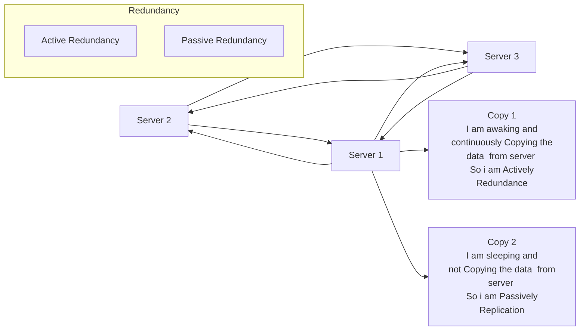

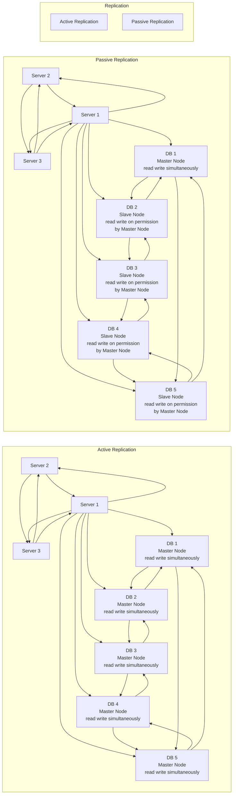

# Load Balancer

- Process of efficient distribution of incoming network traffic across all nodes in a distributed system
## NGINX

- Pronounciation :Engine X
- PowerFul Web Server
- Uses non-threaded and event driven structure
- Used as a reverse proxy server, load balancer, mail proxy server, and HTTP cache

**Diagram of Normal HTTP Connection**

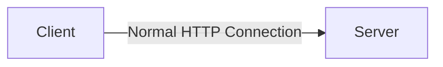

**Diagram of HTTP Connection with VPN**

- Forward Proxy Sever is used to connect to the VPN

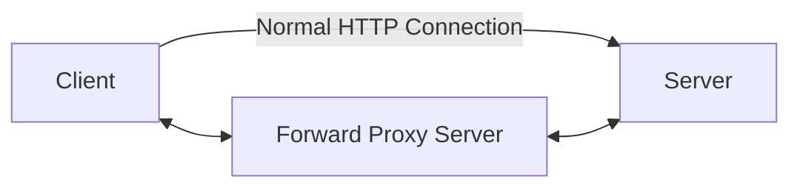

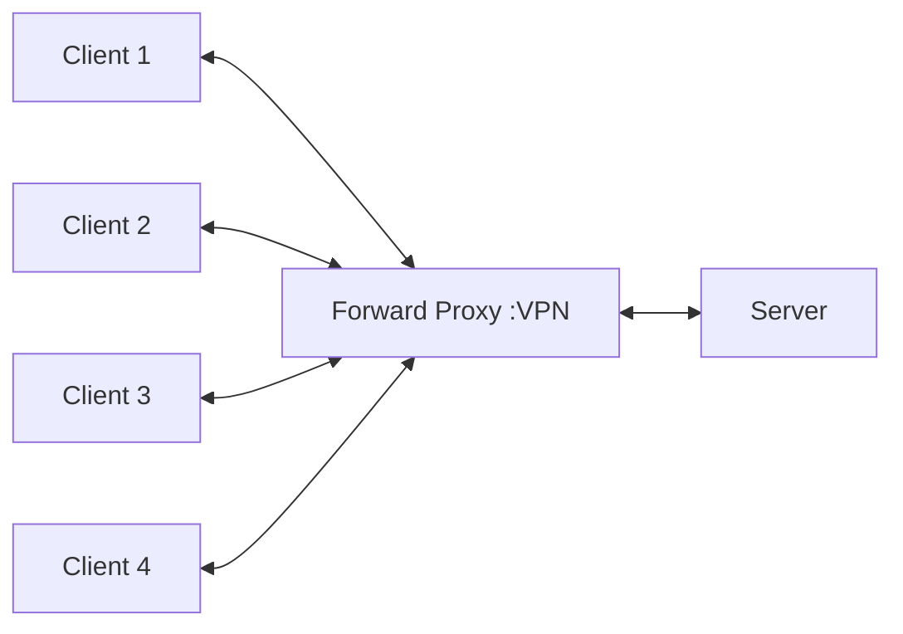

- Server is not able to identify the client in forward proxy server
  - Forward Proxy Server is used to connect to the VPN

**Connection of NGINX**

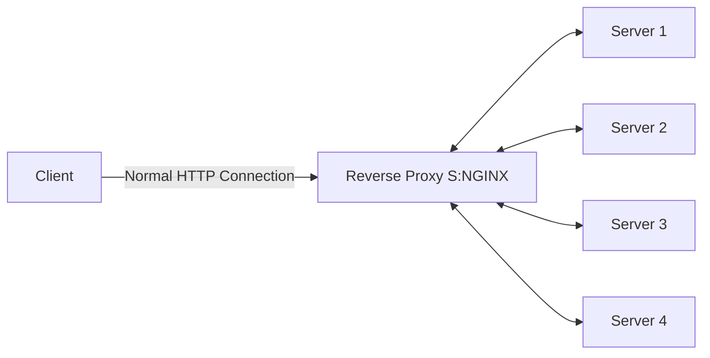

- NGINX is used to connect to the VPN
  - Client is not able to identify the server in NGINX case

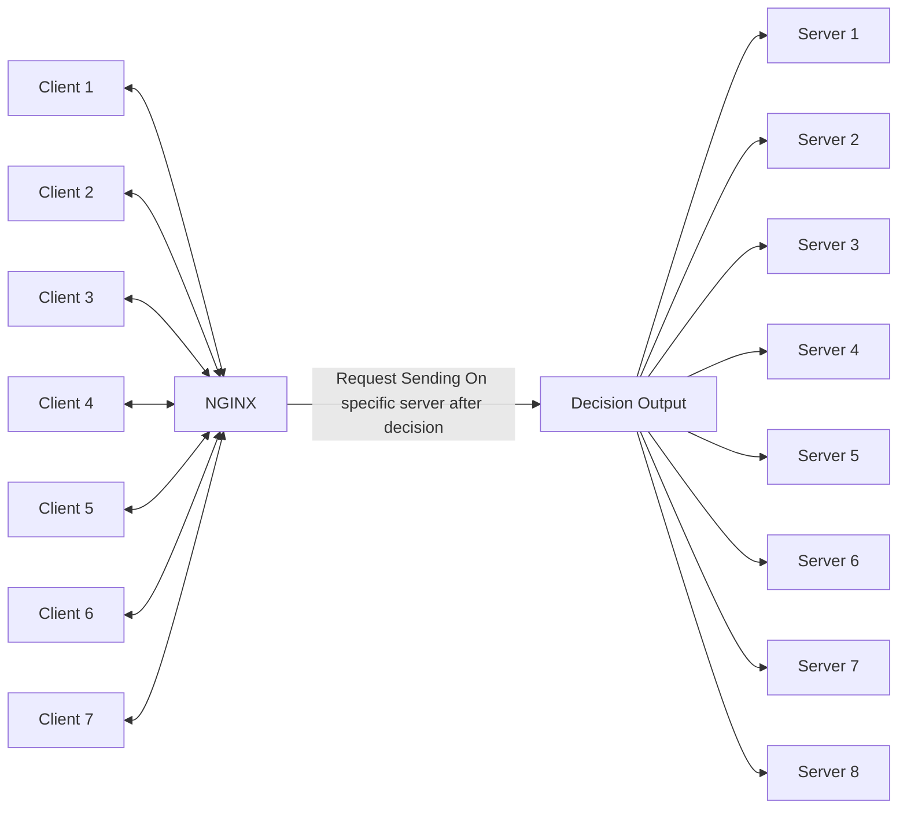

**More Clearation**

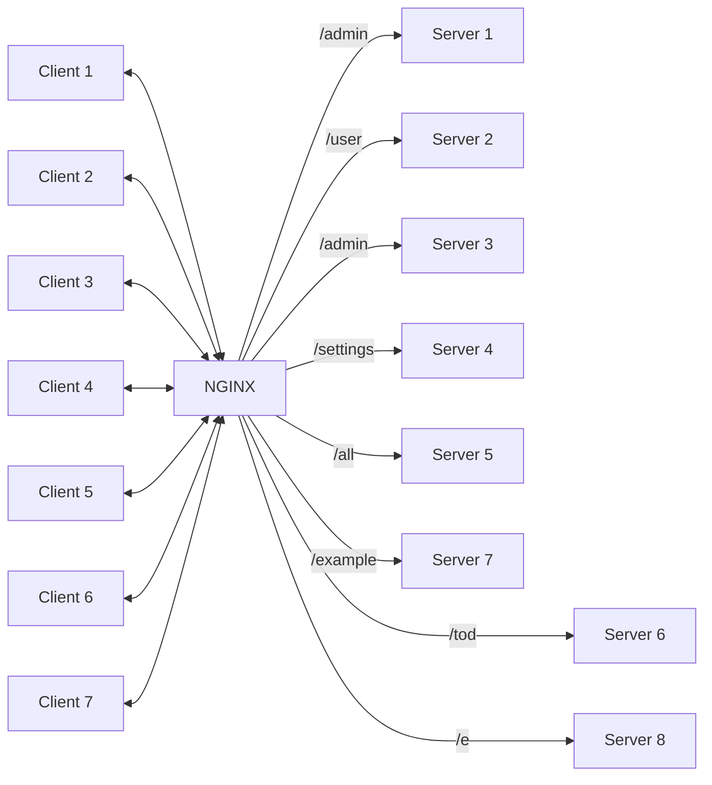

## Contributions

- Can Handle 10000 Concurrent Requests
- Catche HTTP Requests
- Act as Reverse Proxy
- Act as Load Balancer
- Act as an API Gateway(see upper example)
- Serve and Cache Static files like images ,videos etc.
- Handle SSL Certificates
- Load distribution is equal over all the servers
- Health Check of all the servers
- Ensures High Availability, Scalability and Reliability
- NGINX is used by 66% of the world's busiest websites
## When to use Load Balancer
- In distributed system
- In Microservices Architecture
- Not In Monolithic Architecture
## Challenges
- Single Point of Failure
## Solutions
- Multiple Load Balancer
- Passive Load Balancer
- Active Load Balancer
## Advantages
- Optimized Resource Usage
- Reduced Processing Time
- Better User Experience
- Improved Scalability
- Prevents Overloading of a single server
- Better Security
- Prevents Downtime
- Flexibility
- Redundancy
## Load Balancing Algorithms
- Round Robin(Static) Algorithm
  - Rotation fashion
  - 1st request goes to 1st server
  - 2nd request goes to 2nd server
  - 3rd request goes to 3rd server
  - 4th request goes to 4th server
  - 5th request goes to 1st server
  - 6th request goes to 2nd server
  - 7th request goes to 3rd server
  - 8th request goes to 4th server
  - 9th request goes to 1st server
  - 10th request goes to 2nd server
  - 11th request goes to 3rd server
  - and so on
- Weighted Round Robin(Static) Algorithm
  - similar to Round Robin but servers have different capacity
  - so work will be distributed according to the capacity of the server
- IP Hash Algorithm
  - IP address of the client is used to determine which server receives the request
  - so if the client is same then the server will be same
  - here we hash the ip of user then we generate a number and that number will represent the server
- Source IP Hash(Static) Algorithm
  - similar to IP Hash Algorithm but here we hash the ip of server then we generate a number and that number will represent the server
  - we use ip of both source and destination
- Least Connection(Dynamic) Algorithm
  - server with least connection will be selected
  - if server 1 has 10 connection
  - server 2 has 5 connection
  - server 3 has 3 connection
  - server 4 has 2 connection
  - then server 4 will be selected
- Least Response Time(Dynamic) Algorithm
  - Server will see active connection and response time
  - server with least response time will be selected
  - if server 1 has 10 ms response time
  - server 2 has 5 ms response time
  - server 3 has 3 ms response time
  - server 4 has 2 ms response time
  - then server 4 will be selected