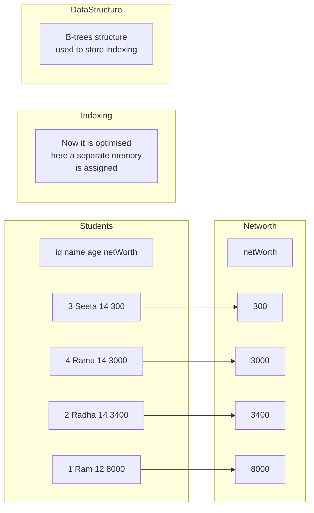
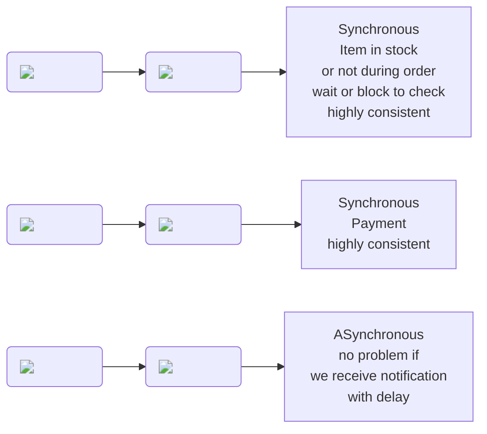

# Normalisation

- Putting data in multiple table to reduce redundancy

# Denormalisation

- Putting data in one table to increase performance

## Benefits of Denormalisation

- Faster reads
- Simpler queries
- Management Convenience
- High availability
- Reduces the network calls
- Reduces the number of joins

## Drawbacks of Denormalisation

- Slower writes
- Redundant data- wastage of space and money
- Increase Complexity
- Data inconsistency
- Difficult to maintain

# Indexing

- Indexing is a way to optimize the performance of a database by minimizing the number of disk accesses required when a query is processed. It is a data structure technique which is used to quickly locate and access the data in a database.



- Used in Read Intensive Application

# Synchronous Communication



```

```
