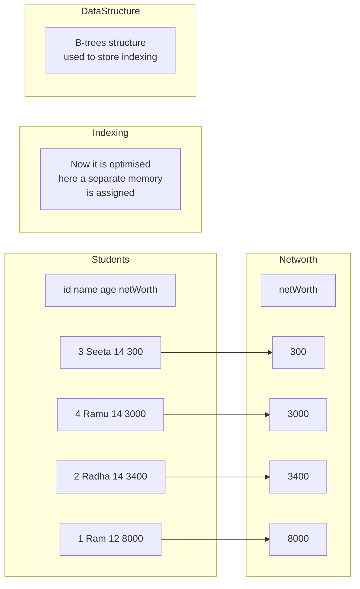
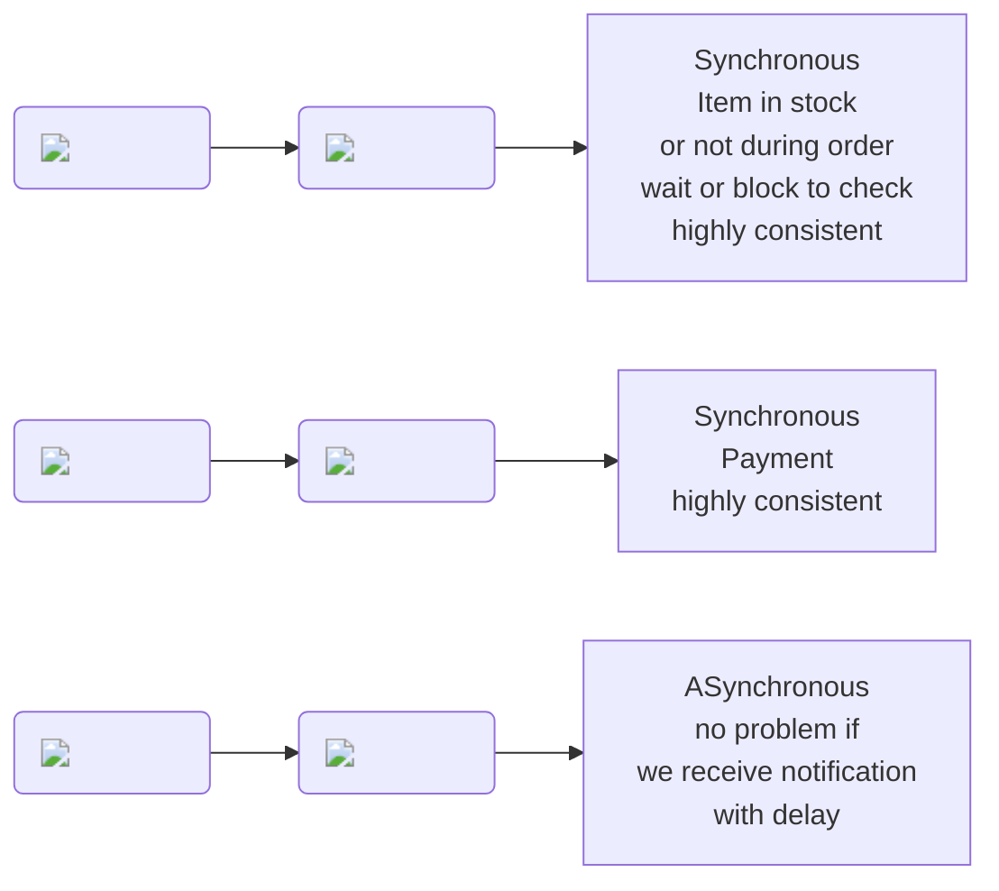
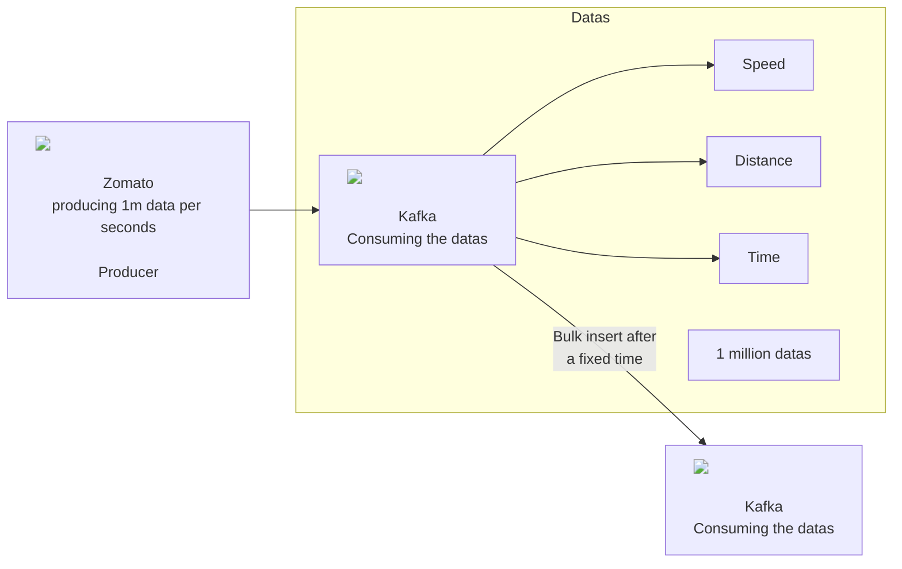

# Normalisation

- Putting data in multiple table to reduce redundancy

# Denormalisation

- Putting data in one table to increase performance

## Benefits of Denormalisation

- Faster reads
- Simpler queries
- Management Convenience
- High availability
- Reduces the network calls
- Reduces the number of joins

## Drawbacks of Denormalisation

- Slower writes
- Redundant data- wastage of space and money
- Increase Complexity
- Data inconsistency
- Difficult to maintain

# Indexing

- Indexing is a way to optimize the performance of a database by minimizing the number of disk accesses required when a query is processed. It is a data structure technique which is used to quickly locate and access the data in a database.

- Used in Read Intensive Application

# Synchronous Communication

## Where Asynchronous Communication is necessary

- Computation takes a lot of time
- Scalability of application
- Avoid Cascading Failures

# Message Based Communication

- Client send requests in the form of messages to the server and server send response in the form of messages to the client
- so it is asynchronous communication

## Producer

## Consumer

## Agent

## P2P Model

- Peer to Peer Model
- Email are not sent immediately
- Email are stored in the queue and then sent
- Email are sent in the form of messages
- Email are sent asynchronously

## Public Subscriber Model

- Email are sent to all the subscribers
- Email are sent in the form of messages
- Email are sent asynchronously

## Examples

- Kafka
- RabbitMQ
- ActiveMQ
- Amazon SQS

# Kafka 

- Zomato :

  - Live loaction of delivery partner we see
  - life feed we are getting each second of driver location
  - this can not be done using data base because if we are calling database each second our database will go down
  - throughput of database is low
  - throughput of kafka is high
- Kafka has high throughput
- but Kafka's storage is temporary and very low
- DB: throughput low ,storage high, we can query the data

