# System Design

# **What is System**?

- Architecture or Collection of technologies serves a certain set of users to fullfill a certain set of requirements
- Collection of Components that serves a certain set of users to fulfill a certain set of requirements

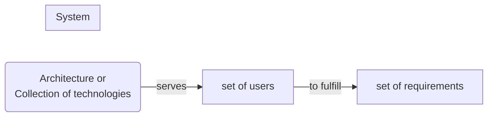

**Computing Systems**

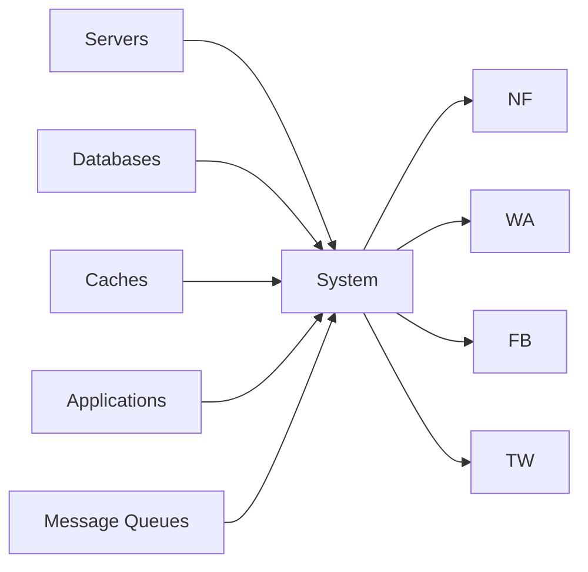

# **What is Design**

- understanding the user requirements and selecting the components ,modules and software technologies,how they are going to be interact with each other to fullfill the requirements

# **System Design**

- Understanding the user requirements and selecting the components ,modules and software technologies,how they are going to be interact with each other to fullfill the requirements

# **Why System Design**

- To handle the scale
- To handle the complexity
- To handle the reliability
- To handle the availability
- To handle the performance
- To handle the security
- To handle the maintainability
- To handle the cost
- To handle the time to market
- To handle the user experience
- To handle the user requirements

# **How to do System Design**

- Understand the user requirements
- Understand the scale
- Understand the complexity
- Understand the reliability
- Understand the availability
- Understand the performance
- Understand the security
- Understand the maintainability
- Understand the cost

# **Components of System Design**

- Components
- Modules
- Software Technologies
- Hardware Technologies
- Network Technologies
- Storage Technologies

# **What is System Design**

- Process of designing the element of a system (app,website,web app) such as **Architectures**,**Modules** and **Components** ,the different **Interfaces** of those components and the **Data** that goes through the system.

# **Types**

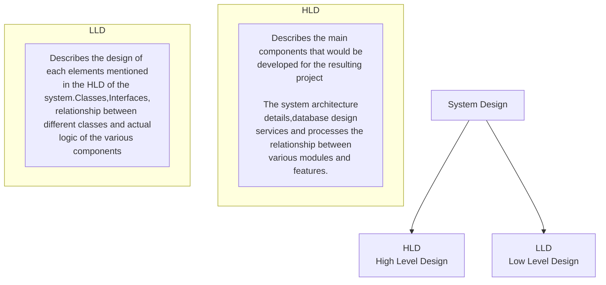

# **Architecture**

- Internal Design Details for buliding the applications

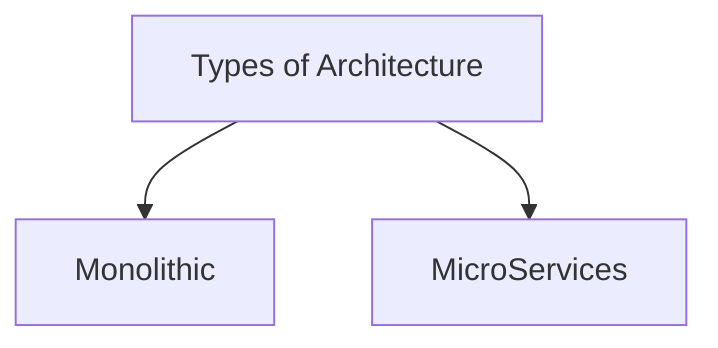

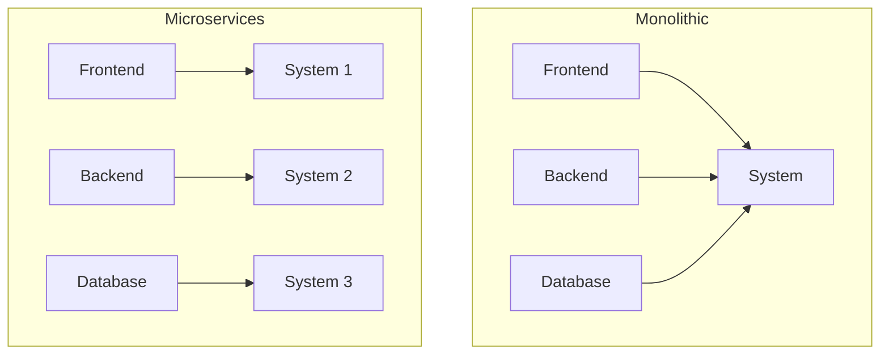

## Monolithic Architecture

- Single Unit
- Single Code Base
- Single Deployment
- Single Database
- Single Unit Testing
- Single Unit of Scaling
- Single Unit of Failure
- Single Unit of Maintainance

## Advantages of Monolithic Architecture

- Single Unit of Deployment
- Single Unit of Scaling
- Integration testing is easy
- Esier to secure
- Fewer Network Calls
- Easy to deploy
- Less Confusion

## Disadvantages of Monolithic Architecture

- Single Unit of Failure can bring down the entire system
- Single module update requires the entire system to be deployed
- Any change in single module's programming language requires the entire system to be deployed
- Single Database so more chances of data corruption or more calls to database

## Distributed System/Microservices Architecture

- collection of multiple individual services that communicate with each other over the network to achieve a common goal

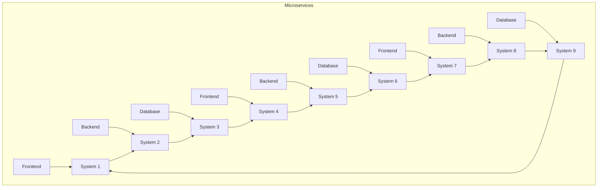

- **If any of the system fails then  the entire system will not fail**
- **It will jump to next system/replica**

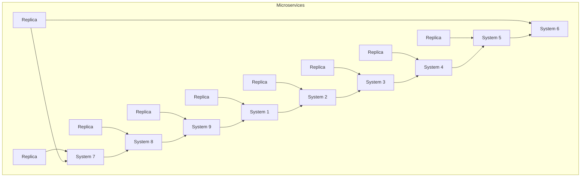

### Advantages of Microservices Architecture

- Easy to scale
- No single point of failure

### Disadvantages of Microservices Architecture

- Complex
- Management of multiple services requires more resources
- Integration testing is difficult
- Difficult to secure
- More Network Calls
- Message may be lost in b/w nodes/services

# Latency

- Time taken to send a message from one point to another point

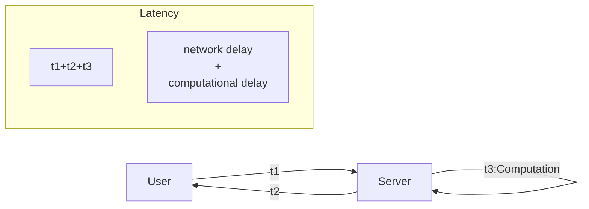

Monolithic<<Distrubuted :Latency

## Methods to reduce Latency

- Caching
  - Caching is the process of storing some data in the cache on the server. The cache is a temporary storage component area where the data is stored so that in future, data can be served faster rather than searching from the original location.
- CDN
  - CDNs are geographically distributed network of proxy servers and their data centers are spread across the globe to provide high availability and performance by distributing the service spatially relative to end users.

```js
function getName(userId){
.........we are getting this after 1000 lines of code.....
}
```

```js
function getName(userId="abc"){
if(userId==="abc"){
return [...results];
}
......... 1000 lines of code.....
}
```

- Upgrading the hardware

# Throughput

- Volume of data that can be handled by the system in a given time
- Amount of data transmitted per unit of time .
- Process rate flow
- Measured in bits per second
- Throughput is the number of such actions executed or results produced per unit of time.
- Distributed System has more throughput than Monolithic System because of multiple replicas

## Causes of Low Throughput

- Network Congestion
- Slow Network
- Latency
- Protocol Overhead
- Slow Server
- Slow Database

## Methods to increase Throughput

- Caching
- CDN
- Load Balancer
- Upgrading the hardware
- Use distributed system

# Availability

- The probability that a system will work as expected when required during the period of a mission.
- Goggle has 99.99% availability
- 99.99% availability means 52.56 minutes of downtime per year
- 99.999% availability means 5.26 minutes of downtime per year
- 99.9999% availability means 31.5 seconds of downtime per year
- 99.99999% availability means 3.15 seconds of downtime per year
- 99.999999% availability means 0.315 seconds of downtime per year
- In distributed system if any of the system fails then the entire system will not fail
- Availability of distributed system is more than monolithic system because of multiple replicas

## Causes of Low Availability

- Single point of failure
- Network Congestion
- Slow Network
- Latency
- Monoilithic System

## Methods to increase Availability

- Replication
- Redundancy
  - Each nodes are synchronized with each other
- Distributed System

# Consistency

- When a user updates a data then the user should get the updated data

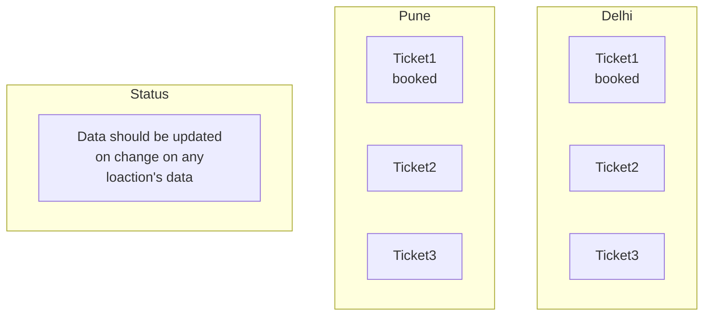

- Consistency in monolithic system is easy
- Consistency in distributed system is difficult
- Because of multiple replicas, users are getting different servers for their use

## Types of Consistency

| Strong Consistency                                                                                          | Eventual Consistency                                                                                             | Weak Consistency                                                                         |
| ----------------------------------------------------------------------------------------------------------- | ---------------------------------------------------------------------------------------------------------------- | ---------------------------------------------------------------------------------------- |
| when the system doesn't allow<br />read operation until the data <br />is written to <br />all the replicas | when the system allows read<br />operation <br />even if the data is not written <br />to <br />all the replicas | Not need to update all<br />the replicas <br />it depends upon the<br />business logics |
| Example: Ticket Booking                                                                                     | Example: Social media post<br />Update                                                                           |                                                                                          |

# CAP Theorem

- C Consistency
- A Availability
- P Partition Tolerance:
  - One server is down but the system is still working using replicas
- CAP Theorem says that we can only have two of the three properties at a time and compromise on the third one
- CAP Theorem is applicable for distributed system
- In banking system we compromise during update
- In social media we compromise consistency
- CP/AP Only
- Blog Website - AP
- Multiplayer Game - CP
- Stock Market - CP
- Banking System - CP
- Social Media - AP
- Ticket Booking - CP
- Video Streaming - AP

# Lamport Logical Clock

- For Distributed System


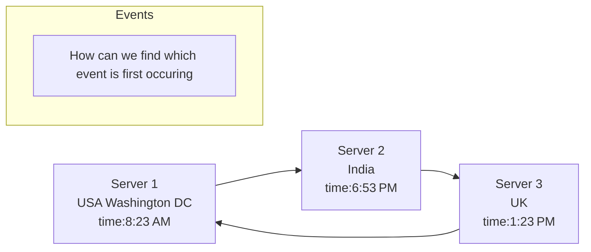

# Scalability

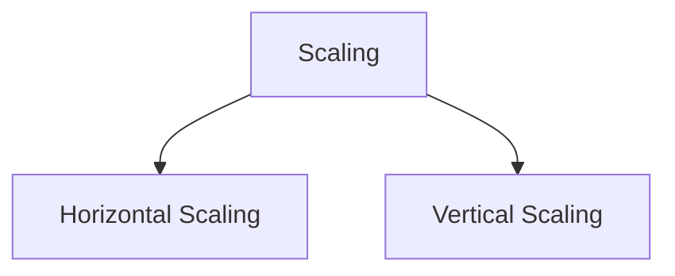

## Vertical Scaling

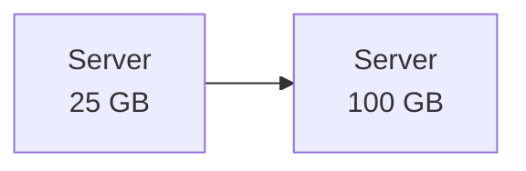

### Pros

- Easy Implementation
- Less Power
- Management Easy
- Security

### Cons

- Single Point of failure
- Limitation of storage (After a limit we can not increase the Storage)
- Price (same company's machine equipment add on)

## Horizontal Scaling

### Pros

- No Single Point of failure
- No Limitation of storage
- No Price Isuue we can use less costly machine for less consumotion need where we need that

### Cons

- Security maintainance issue
- Management issue
- More Power Consumption
- Complex Implementation

# Redundancy and Replication

## Redundancy

- Simply duplication of nodes or components so that when a node or component fails the duplicate node is availabe to service

### Types

- **Active Redundancy:**
  - Activite Redundancy is considered when each unit is operating/active and responding to the action.Multiple nodes are connected to a load balancer and each unit recives an equal load
- **Passive Server**
  - Passive Redundancy is considered when each unit is not operating/active and not responding to the action.Multiple nodes are connected to a load balancer and each unit recives an equal load

## Replication

- **Redundancy along with Synchronisation**
- Copy along this sync
- All the data should be copy to all the server
- Used in databases

### Types

- **Active Replication**
  - Active Replication is considered when each unit is operating/active and responding to the action.Multiple nodes are connected to a load balancer and each unit recives an equal load
  - also all will be doing the same work like read and write in case of database
  - All nodes would be master
- **Passive Replication**
  - Passive Replication is considered when each unit is not operating/active and not responding to the action.Multiple nodes are connected to a load balancer and each unit recives an equal load
  - also all will be doing the same work like read and write in case of database
  - One node would be master and other would be slave
  - Master will be doing the write operation and slave will be doing the read operation
  - if instaly we are updating then asynchronisation will be there
  - if we are updating to slave after some scheduled time then asynchronisation will be there

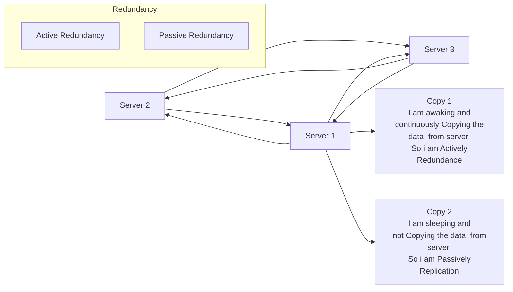

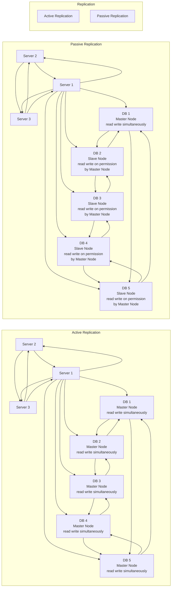

# Load Balancer

- Process of efficient distribution of incoming network traffic across all nodes in a distributed system
## NGINX

- Pronounciation :Engine X
- PowerFul Web Server
- Uses non-threaded and event driven structure
- Used as a reverse proxy server, load balancer, mail proxy server, and HTTP cache

**Diagram of Normal HTTP Connection**

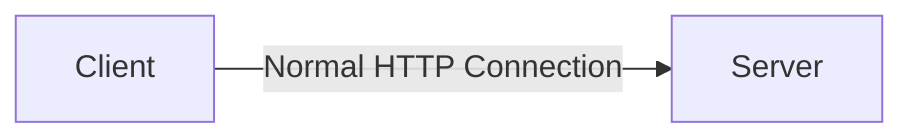

**Diagram of HTTP Connection with VPN**

- Forward Proxy Sever is used to connect to the VPN

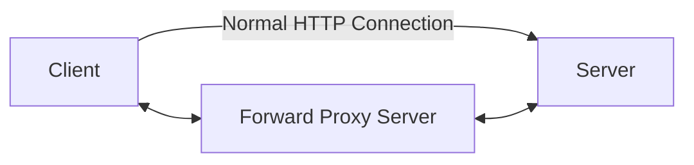

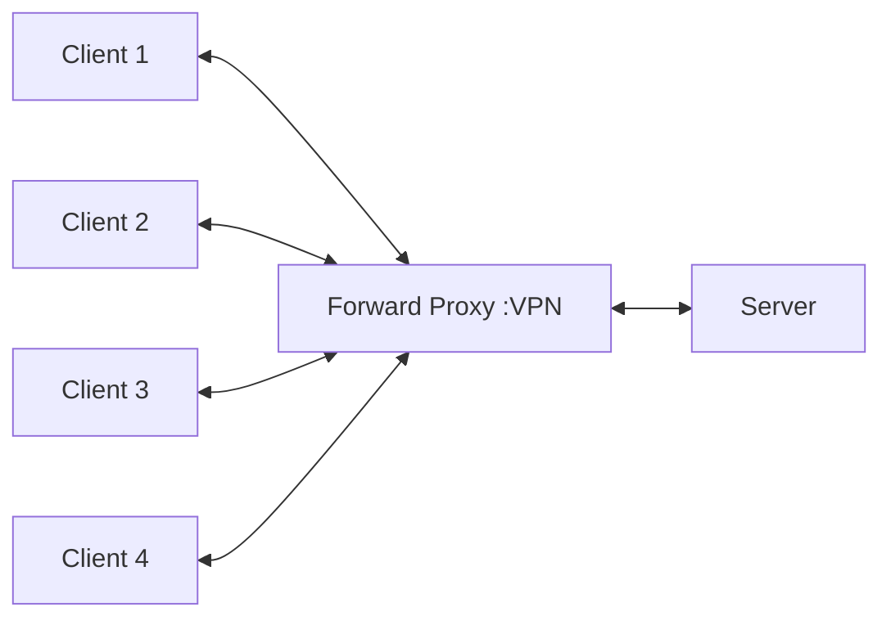

- Server is not able to identify the client in forward proxy server
  - Forward Proxy Server is used to connect to the VPN

**Connection of NGINX**

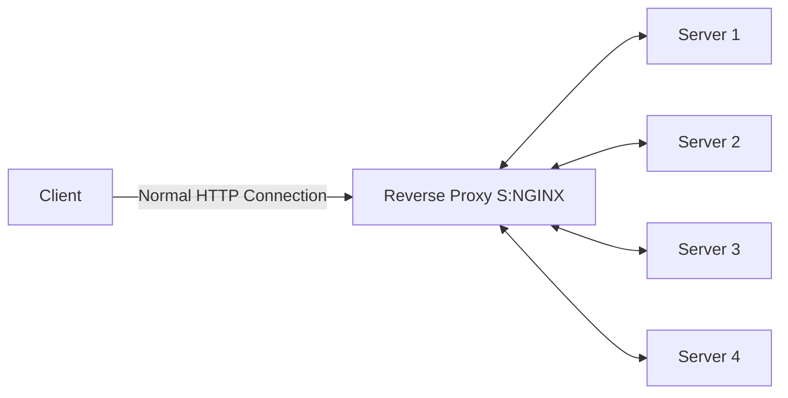

- NGINX is used to connect to the VPN
  - Client is not able to identify the server in NGINX case

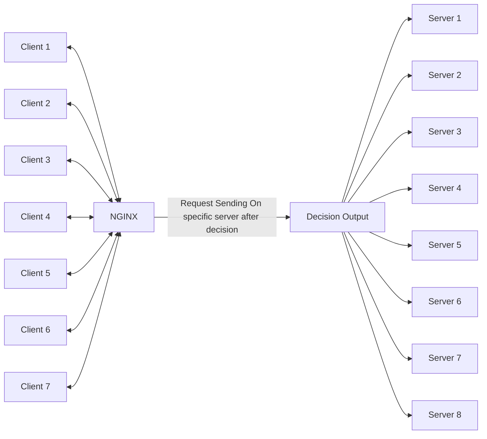

**More Clearation**

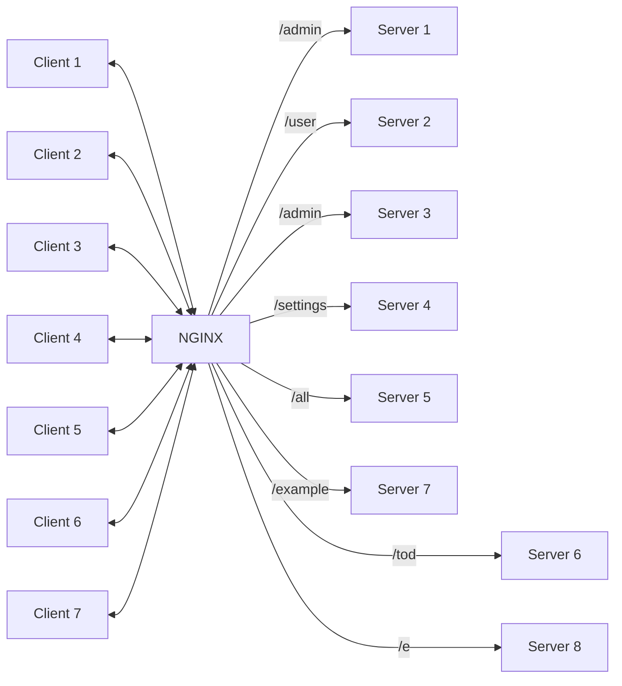

## Contributions

- Can Handle 10000 Concurrent Requests
- Catche HTTP Requests
- Act as Reverse Proxy
- Act as Load Balancer
- Act as an API Gateway(see upper example)
- Serve and Cache Static files like images ,videos etc.
- Handle SSL Certificates
- Load distribution is equal over all the servers
- Health Check of all the servers
- Ensures High Availability, Scalability and Reliability
- NGINX is used by 66% of the world's busiest websites
## When to use Load Balancer
- In distributed system
- In Microservices Architecture
- Not In Monolithic Architecture
## Challenges
- Single Point of Failure
## Solutions
- Multiple Load Balancer
- Passive Load Balancer
- Active Load Balancer
## Advantages
- Optimized Resource Usage
- Reduced Processing Time
- Better User Experience
- Improved Scalability
- Prevents Overloading of a single server
- Better Security
- Prevents Downtime
- Flexibility
- Redundancy
## Load Balancing Algorithms
- Round Robin(Static) Algorithm
  - Rotation fashion
  - 1st request goes to 1st server
  - 2nd request goes to 2nd server
  - 3rd request goes to 3rd server
  - 4th request goes to 4th server
  - 5th request goes to 1st server
  - 6th request goes to 2nd server
  - 7th request goes to 3rd server
  - 8th request goes to 4th server
  - 9th request goes to 1st server
  - 10th request goes to 2nd server
  - 11th request goes to 3rd server
  - and so on
- Weighted Round Robin(Static) Algorithm
  - similar to Round Robin but servers have different capacity
  - so work will be distributed according to the capacity of the server
- IP Hash Algorithm
  - IP address of the client is used to determine which server receives the request
  - so if the client is same then the server will be same
  - here we hash the ip of user then we generate a number and that number will represent the server
- Source IP Hash(Static) Algorithm
  - similar to IP Hash Algorithm but here we hash the ip of server then we generate a number and that number will represent the server
  - we use ip of both source and destination
- Least Connection(Dynamic) Algorithm
  - server with least connection will be selected
  - if server 1 has 10 connection
  - server 2 has 5 connection
  - server 3 has 3 connection
  - server 4 has 2 connection
  - then server 4 will be selected
- Least Response Time(Dynamic) Algorithm
  - Server will see active connection and response time
  - server with least response time will be selected
  - if server 1 has 10 ms response time
  - server 2 has 5 ms response time
  - server 3 has 3 ms response time
  - server 4 has 2 ms response time
  - then server 4 will be selected

# Caching
## What is caching?
- Caching is the process of storing data in a cache.
- A cache is a temporary storage area.
- Caching is used to speed up data access.
- Caching is used to reduce load on underlying resources.
## Real world example
- I have used caching in my project to reduce the load on the database.
- website link :[FMC Weekend](https://www.fmcweekend.in/)
- I have used caching in the following way:
  - I have used caching to store the data of the users who have registered for the event.
- Their Profile data is stored in the cache.
- When the user logs in, the data is fetched from the cache.
- If the data is not present in the cache, then the data is fetched from the database and stored in the cache.
- This reduces the load on the database.
## Types of caching
- There are two types of caching:
  - **In Memory/Local Cache**
  - **Distributed Cache/Internal Cache**
### In Memory/Local Cache
- In Memory/Local Cache is a cache that is stored in the memory of the server.
- Example:
  - Memcached
### Distributed Cache/Internal Cache
- Distributed Cache/Internal Cache is a cache that is stored in a shared network/memory.
- Example:
  - Redis
## When to use caching?
- Caching should be used when:
  - The data is not updated frequently.
  - The data is not sensitive.
  - The data is not large.
  - static content (images, videos,html,css etc.)
  - Example :
    - Read Intensive in Twitter
    - Read Intensive in Facebook
    - Read Intensive in Instagram
## Types of caching we are storing in our project
- Application Server Cache 
- CDN
## Cache Eviction
- Cache eviction is the process of removing an entry from the cache on a definite time or on a condition.
## Cache Eviction Techniques
- How we are deleting the data from the cache?
- There are following types of cache eviction techniques:
  - **LRU (Least Recently Used) Eviction**
  - **LFU (Least Frequently Used) Eviction**
  - **FIFO (First In First Out) Eviction**
  - **MRU(Most Recently Used) Eviction**
  - **LFU (Least Frequently Used) Eviction**
  - **LIFO (Last In First Out) Eviction**
  - **RR (Random Replacement) Eviction**
### LRU (Least Recently Used) Eviction
- In this technique, the entry which is least recently used is removed from the cache.
- Example:
  - If the cache size is 5 and the cache is full.
  - If we want to add a new entry in the cache, then the entry which is least recently used is removed from the cache.
### LFU (Least Frequently Used) Eviction

- In this technique, the entry which is least frequently used is removed from the cache.
- Example:
  - If the cache size is 5 and the cache is full.
  - If we want to add a new entry in the cache, then the entry which is least frequently used is removed from the cache.
### FIFO (First In First Out) Eviction
- In this technique, the entry which is first inserted in the cache is removed from the cache.
- Example:
  - If the cache size is 5 and the cache is full.
  - If we want to add a new entry in the cache, then the entry which is first inserted in the cache is removed from the cache.
### MRU(Most Recently Used) Eviction
- In this technique, the entry which is most recently used is removed from the cache.
- Example:
  - If the cache size is 5 and the cache is full.
  - If we want to add a new entry in the cache, then the entry which is most recently used is removed from the cache.
### LFU (Least Frequently Used) Eviction
- In this technique, the entry which is least frequently used is removed from the cache.
- Example:
  - If the cache size is 5 and the cache is full.
  - If we want to add a new entry in the cache, then the entry which is least frequently used is removed from the cache.
### LIFO (Last In First Out) Eviction
- In this technique, the entry which is last inserted in the cache is removed from the cache.
- Example:
  - If the cache size is 5 and the cache is full.
  - If we want to add a new entry in the cache, then the entry which is last inserted in the cache is removed from the cache.
### RR (Random Replacement) Eviction
- In this technique, the entry which is randomly selected is removed from the cache.
- Example:
  - If the cache size is 5 and the cache is full.
  - If we want to add a new entry in the cache, then the entry which is randomly selected is removed from the cache.
## Cache Invalidation
- Cache Invalidation is the process of removing an entry from the cache on a definite time or on a condition.
## Cache Invalidation Techniques
- How we are deleting the data from the cache?
- There are following types of cache invalidation techniques:
  - **Time To Live (TTL)**
  - **Write Through**
  - **Write Back**
### Time To Live (TTL)
- In this technique, the entry is removed from the cache after a definite time.
- Example:
  - If the cache size is 5 and the cache is full.
  - If we want to add a new entry in the cache, then the entry which is least recently used is removed from the cache.
### Write Through
- In this technique, the entry is removed from the cache after a definite time.
- Example:
  - If the cache size is 5 and the cache is full.
  - If we want to add a new entry in the cache, then the entry which is least recently used is removed from the cache.
### Write Back
- In this technique, the entry is removed from the cache after a definite time.
- Example:
  - If the cache size is 5 and the cache is full.
  - If we want to add a new entry in the cache, then the entry which is least recently used is removed from the cache.
## Cache Consistency
- Cache Consistency is the process of maintaining the consistency of the data in the cache.
## Cache Consistency Techniques
- How we are maintaining the consistency of the data in the cache?
- There are following types of cache consistency techniques:
  - **Write Through**
  - **Write Back**
### Write Through   
- In this technique, the entry is removed from the cache after a definite time.
- Example:
  - If the cache size is 5 and the cache is full.
  - If we want to add a new entry in the cache, then the entry which is least recently used is removed from the cache.
### Write Back
- In this technique, the entry is removed from the cache after a definite time.
- Example:
  - If the cache size is 5 and the cache is full.
  - If we want to add a new entry in the cache, then the entry which is least recently used is removed from the cache.
# File Based Storage System
## What is File Based Storage System?
- File Based Storage System is a system in which the data is stored in the form of files.
- Example:
  - File System
## When to use File Based Storage System?
- File Based Storage System should be used when:
  - The data is not updated frequently.
  - The data is not sensitive.
  - The data is not large.
  - Example :
    - Read Intensive in Twitter
    - Read Intensive in Facebook
    - Read Intensive in Instagram
## Types of File Based Storage System
- There are two types of File Based Storage System:
  - **Local File System**
  - **Distributed File System**
### Local File System
- Local File System is a file system that is stored in the memory of the server.
- Example:
  - Ext4
### Distributed File System
- Distributed File System is a file system that is stored in a shared network/memory.
- Example:
  - HDFS
## Challenges in File Based Storage System
- Data Redundancy
- Data Consistency
- Data Security
- Slow Data Access

# Database
## RDBMS
- RDBMS stands for Relational Database Management System.
- RDBMS is a database management system that is based on the relational model.
- Stored data in the form of tables.
- Connected data with the help of foreign keys.
- Example:
  - MySQL
  - PostgreSQL
  - Oracle
  - Microsoft SQL Server
### Advantages of RDBMS
- Data Redundancy is reduced.
- Data Consistency is maintained.
- Data Security is maintained.
- Data Access is fast.
- Data Integrity is maintained.
### Disadvantages of RDBMS
- Rigid Schema
- Scaling is difficult(Horizontal Scaling)
- High Cost
- Not suitable for unstructured data
- Vertical Scaling is possible but it is expensive and limited.
## NoSQL
- NoSQL stands for Not Only SQL.
- NoSQL is a database management system that is not based on the relational model.
### Types of NoSQL
- There are four types of NoSQL:
  - **Key Value Store**
    - Generrally used for caching.
    - Example:
      - Redis
      - Memcached
  - **Document Store**
    - Brimgs both RDMS and NoSQL together.
    - Used for storing unstructured data.
    - Example:
      - MongoDB
      - CouchDB
  - **Column Store**
    - Used for storing large amount of data.
    - For Data Management during machine learning.
    - Column Store is a type of NoSQL database that stores data in columns rather than rows.
    - Example:
      - Cassandra
      - HBase
  - **Graph Database**
    - Used for storing data in the form of nodes and edges.
    - Used for storing data in the form of graphs.
    - Google Maps
    - Social Media LinkedIn connection graph
    - Example:
      - Neo4j
      - OrientDB

