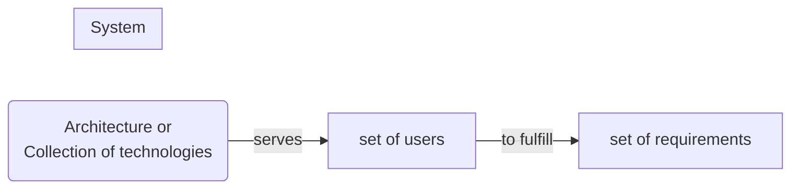
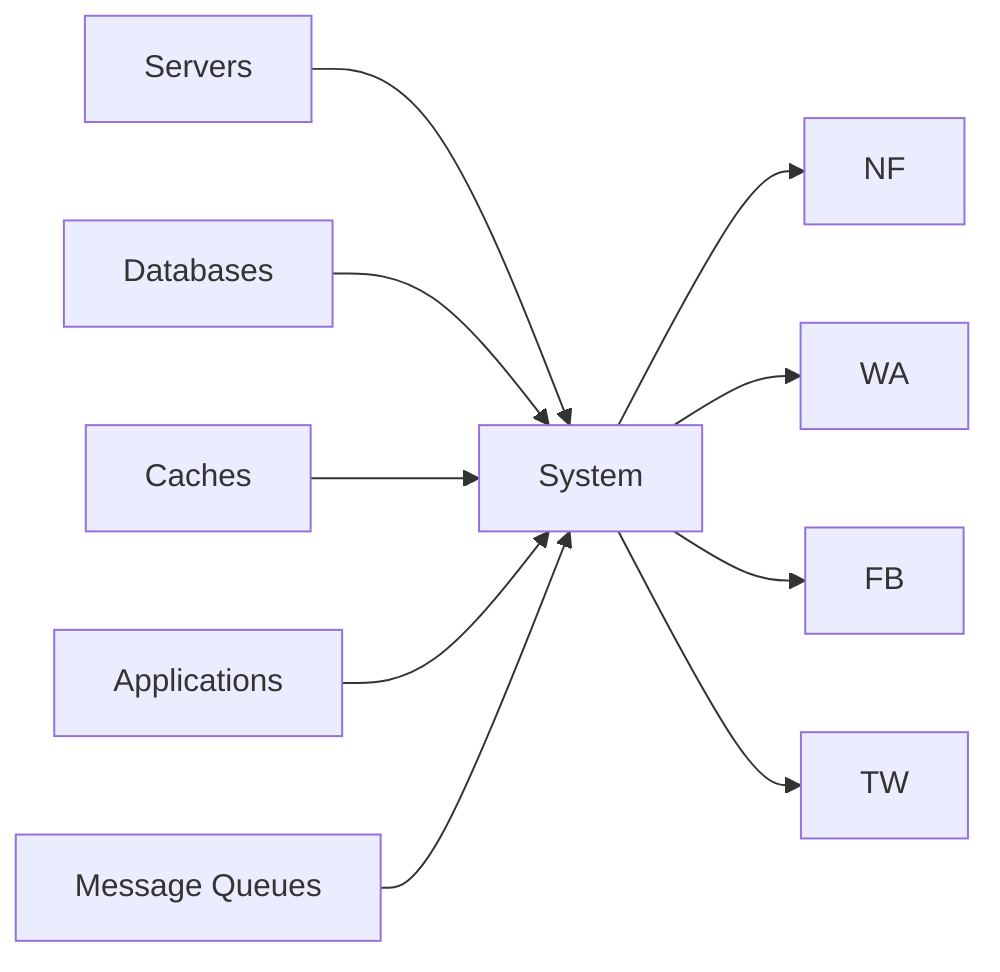
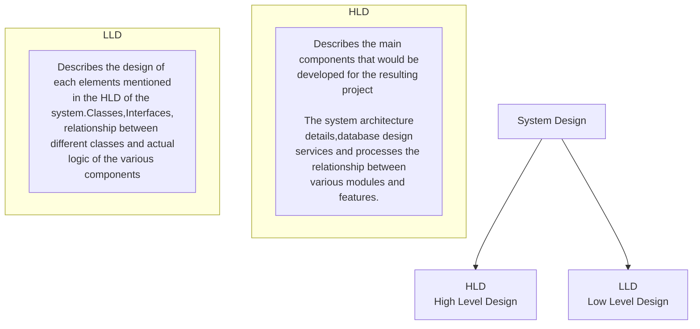
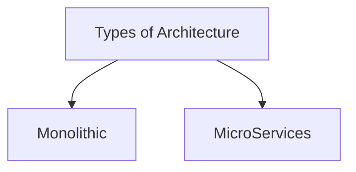
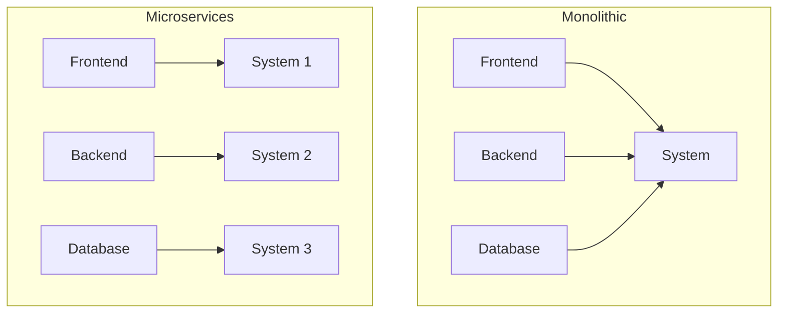

# System Design

# **What is System**?

- Architecture or Collection of technologies serves a certain set of users to fullfill a certain set of requirements
- Collection of Components that serves a certain set of users to fulfill a certain set of requirements

**Computing Systems**

# **What is Design**

- understanding the user requirements and selecting the components ,modules and software technologies,how they are going to be interact with each other to fullfill the requirements

# **System Design**

- Understanding the user requirements and selecting the components ,modules and software technologies,how they are going to be interact with each other to fullfill the requirements

# **Why System Design**

- To handle the scale
- To handle the complexity
- To handle the reliability
- To handle the availability
- To handle the performance
- To handle the security
- To handle the maintainability
- To handle the cost
- To handle the time to market
- To handle the user experience
- To handle the user requirements

# **How to do System Design**

- Understand the user requirements
- Understand the scale
- Understand the complexity
- Understand the reliability
- Understand the availability
- Understand the performance
- Understand the security
- Understand the maintainability
- Understand the cost

# **Components of System Design**

- Components
- Modules
- Software Technologies
- Hardware Technologies
- Network Technologies
- Storage Technologies

# **What is System Design**

- Process of designing the element of a system (app,website,web app) such as **Architectures**,**Modules** and **Components** ,the different **Interfaces** of those components and the **Data** that goes through the system.

# **Types**

# **Architecture**

- Internal Design Details for buliding the applications

## Monolithic Architecture
- Single Unit
- Single Code Base
- Single Deployment
- Single Database
- Single Unit Testing
- Single Unit of Scaling
- Single Unit of Failure
- Single Unit of Maintainance
## Advantages of Monolithic Architecture
- Single Unit of Deployment
- Single Unit of Scaling
- Integration testing is easy
- Esier to secure
- Fewer Network Calls
- Easy to deploy
- Less Confusion
## Disadvantages of Monolithic Architecture
- Single Unit of Failure can bring down the entire system
- Single module update requires the entire system to be deployed
- Any change in single module's programming language requires the entire system to be deployed
- Single Database so more chances of data corruption or more calls to database

