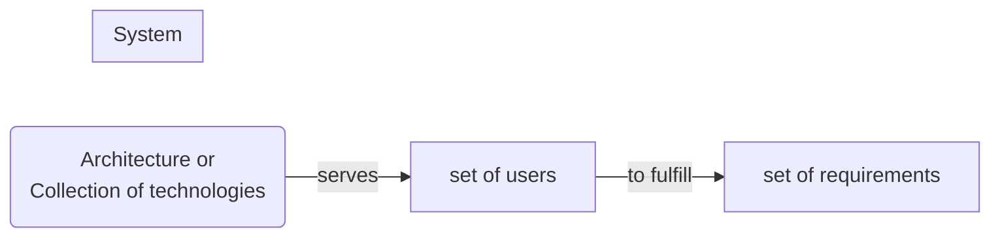
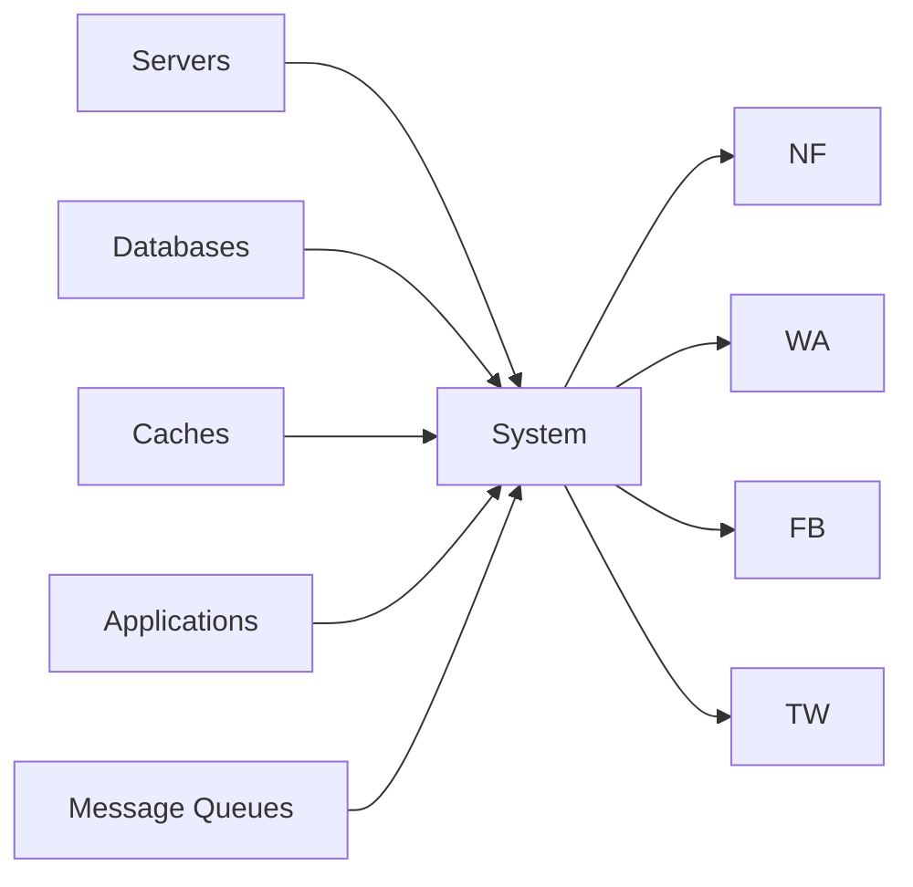
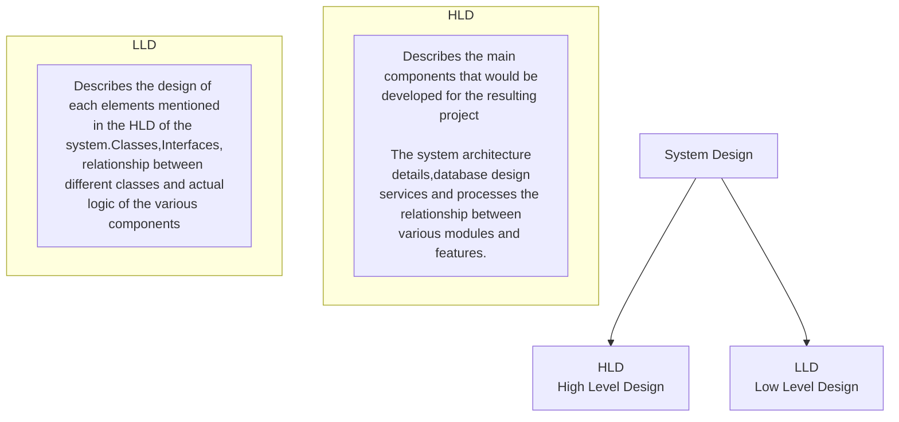
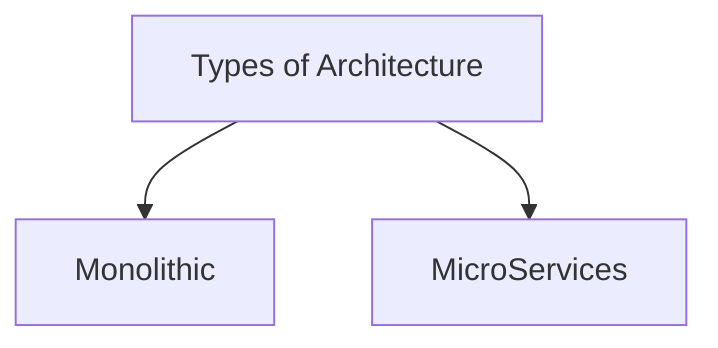
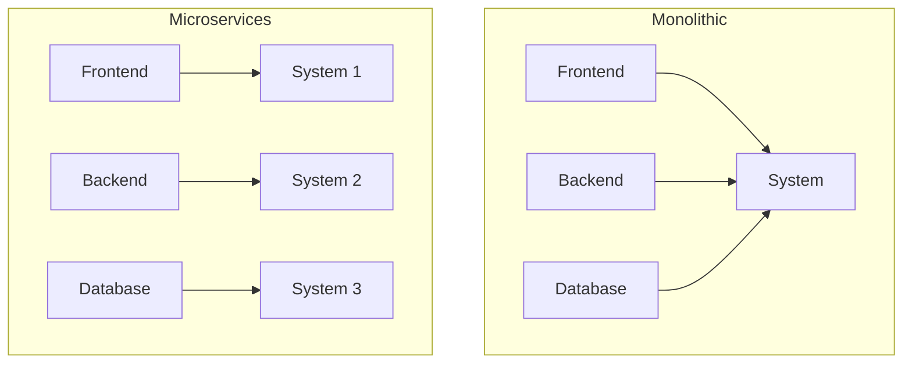
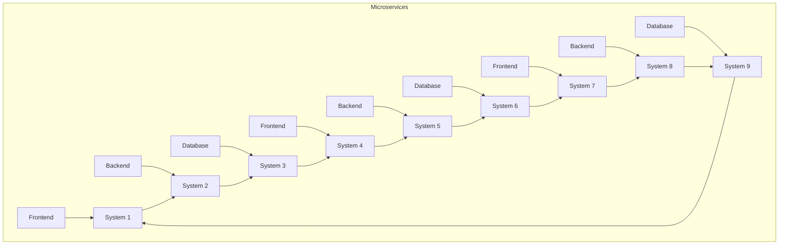
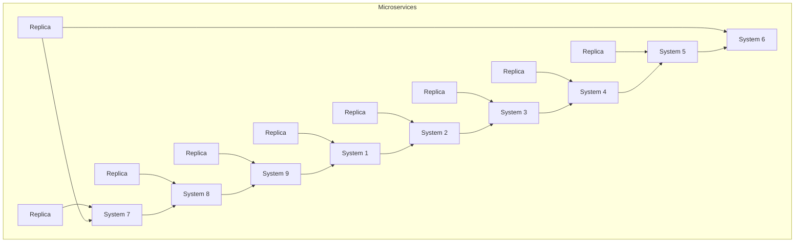
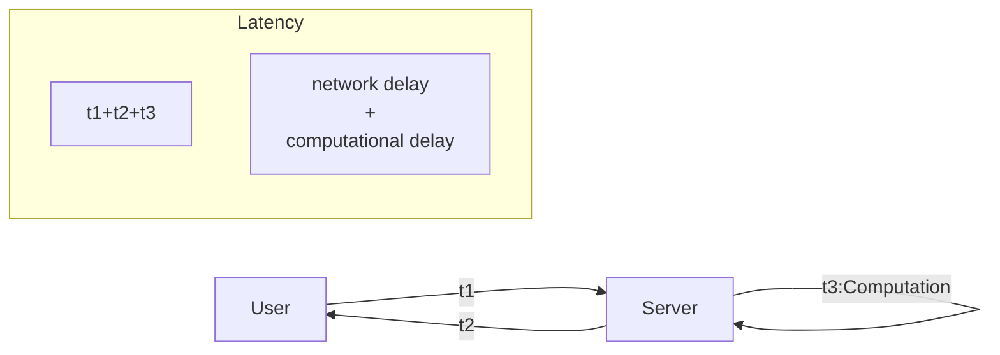
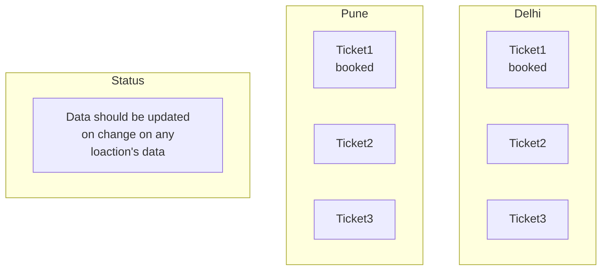

# System Design

# **What is System**?

- Architecture or Collection of technologies serves a certain set of users to fullfill a certain set of requirements
- Collection of Components that serves a certain set of users to fulfill a certain set of requirements



**Computing Systems**



# **What is Design**

- understanding the user requirements and selecting the components ,modules and software technologies,how they are going to be interact with each other to fullfill the requirements

# **System Design**

- Understanding the user requirements and selecting the components ,modules and software technologies,how they are going to be interact with each other to fullfill the requirements

# **Why System Design**

- To handle the scale
- To handle the complexity
- To handle the reliability
- To handle the availability
- To handle the performance
- To handle the security
- To handle the maintainability
- To handle the cost
- To handle the time to market
- To handle the user experience
- To handle the user requirements

# **How to do System Design**

- Understand the user requirements
- Understand the scale
- Understand the complexity
- Understand the reliability
- Understand the availability
- Understand the performance
- Understand the security
- Understand the maintainability
- Understand the cost

# **Components of System Design**

- Components
- Modules
- Software Technologies
- Hardware Technologies
- Network Technologies
- Storage Technologies

# **What is System Design**

- Process of designing the element of a system (app,website,web app) such as **Architectures**,**Modules** and **Components** ,the different **Interfaces** of those components and the **Data** that goes through the system.

# **Types**



# **Architecture**

- Internal Design Details for buliding the applications





## Monolithic Architecture

- Single Unit
- Single Code Base
- Single Deployment
- Single Database
- Single Unit Testing
- Single Unit of Scaling
- Single Unit of Failure
- Single Unit of Maintainance

## Advantages of Monolithic Architecture

- Single Unit of Deployment
- Single Unit of Scaling
- Integration testing is easy
- Esier to secure
- Fewer Network Calls
- Easy to deploy
- Less Confusion

## Disadvantages of Monolithic Architecture

- Single Unit of Failure can bring down the entire system
- Single module update requires the entire system to be deployed
- Any change in single module's programming language requires the entire system to be deployed
- Single Database so more chances of data corruption or more calls to database

## Distributed System/Microservices Architecture

- collection of multiple individual services that communicate with each other over the network to achieve a common goal



- **If any of the system fails then  the entire system will not fail**
- **It will jump to next system/replica**



### Advantages of Microservices Architecture

- Easy to scale
- No single point of failure

### Disadvantages of Microservices Architecture

- Complex
- Management of multiple services requires more resources
- Integration testing is difficult
- Difficult to secure
- More Network Calls
- Message may be lost in b/w nodes/services

# Latency

- Time taken to send a message from one point to another point



Monolithic<<Distrubuted :Latency

## Methods to reduce Latency

- Caching
  - Caching is the process of storing some data in the cache on the server. The cache is a temporary storage component area where the data is stored so that in future, data can be served faster rather than searching from the original location.
- CDN
  - CDNs are geographically distributed network of proxy servers and their data centers are spread across the globe to provide high availability and performance by distributing the service spatially relative to end users.

```js
function getName(userId){
.........we are getting this after 1000 lines of code.....
}
```

```js
function getName(userId="abc"){
if(userId==="abc"){
return [...results];
}
......... 1000 lines of code.....
}
```

- Upgrading the hardware

# Throughput

- Volume of data that can be handled by the system in a given time
- Amount of data transmitted per unit of time .
- Process rate flow
- Measured in bits per second
- Throughput is the number of such actions executed or results produced per unit of time.
- Distributed System has more throughput than Monolithic System because of multiple replicas

## Causes of Low Throughput

- Network Congestion
- Slow Network
- Latency
- Protocol Overhead
- Slow Server
- Slow Database

## Methods to increase Throughput

- Caching
- CDN
- Load Balancer
- Upgrading the hardware
- Use distributed system

# Availability

- The probability that a system will work as expected when required during the period of a mission.
- Goggle has 99.99% availability
- 99.99% availability means 52.56 minutes of downtime per year
- 99.999% availability means 5.26 minutes of downtime per year
- 99.9999% availability means 31.5 seconds of downtime per year
- 99.99999% availability means 3.15 seconds of downtime per year
- 99.999999% availability means 0.315 seconds of downtime per year
- In distributed system if any of the system fails then the entire system will not fail
- Availability of distributed system is more than monolithic system because of multiple replicas

## Causes of Low Availability

- Single point of failure
- Network Congestion
- Slow Network
- Latency
- Monoilithic System

## Methods to increase Availability

- Replication
- Redundancy
  - Each nodes are synchronized with each other
- Distributed System

# Consistency

- When a user updates a data then the user should get the updated data



- Consistency in monolithic system is easy
- Consistency in distributed system is difficult
- Because of multiple replicas, users are getting different servers for their use

## Types of Consistency

| Strong Consistency                                                                                          | Eventual Consistency                                                                                             | Weak Consistency                                                                         |
| ----------------------------------------------------------------------------------------------------------- | ---------------------------------------------------------------------------------------------------------------- | ---------------------------------------------------------------------------------------- |
| when the system doesn't allow<br />read operation until the data <br />is written to <br />all the replicas | when the system allows read<br />operation <br />even if the data is not written <br />to <br />all the replicas | Not need to update all<br />the replicas <br />it depends upon the<br />business logics |
| Example: Ticket Booking                                                                                     | Example: Social media post<br />Update                                                                           |                                                                                          |
# CAP Theorem
- C Consistency
- A Availability
- P Partition Tolerance:
  - One server is down but the system is still working using replicas
- CAP Theorem says that we can only have two of the three properties at a time and compromise on the third one
- CAP Theorem is applicable for distributed system
- In banking system we compromise during update
- In social media we compromise consistency
- CP/AP Only 
- Blog Website - AP
- Multiplayer Game - CP
- Stock Market - CP
- Banking System - CP
- Social Media - AP
- Ticket Booking - CP
- Video Streaming - AP
# Lamport Logical Clock

