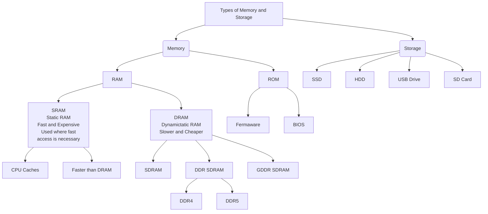

# Memory and Storage Systems

```mermaid
graph TD;
A[Types of Memory and Storage]
B(Memory)
C(Storage)
A-->B
A-->C
D[RAM]
E[ROM]
F[SRAM<BR/>Static RAM<br/> Fast and Expensive<br/>Used where fast <br/> access is necessary]
G[DRAM<BR/>Dynamictatic RAM<br/>Slower and Cheaper]
B-->D
B-->E
D-->F
D-->G
H[CPU Caches]
I[Faster than DRAM]
F-->H
F-->I
J[SDRAM]
K[DDR SDRAM]
G-->J
G-->K
G-->L
L[GDDR SDRAM]
M[DDR4]
N[DDR5]
K-->M
K-->N
O[Fermaware]
P[BIOS]
E-->O
E-->P
Q[SSD]
R[HDD]
C-->Q
C-->R
S[USB Drive]
T[SD Card]
C-->S
C-->T
```
