## Video Transcoding Service

**Examples**

- Youtube
- Udemy
- Unacdemy

```mermaid
graph LR;
A[Teacher] -- Hey Lambda Function I want to upload 10 videos --> λ
λ -- Returns Signed URL Of S3 bucket -->A
```




- Now Teacher If Authorised
- Now a S3 Temporary Bucket is formed using Signed URL


- An EventBridge set up is present on this Bucket

```mermaid
graph LR;
A[EventBridge]--Triggers a lambda function -->λ
λ-->X[Queue Jobs] 
```



- Let's say Queue job has 5 video processing limit
```mermaid
graph LR;
A[Queue Jobs]--5 Jobs-->B[Video Processing]
  ```

