## Video Transcoding Service

**Examples**

- Youtube
- Udemy
- Unacdemy

```mermaid
graph LR;
A[Teacher] -- Hey Lambda Function I want to upload 10 videos --> λ
λ -- Returns Signed URL Of S3 bucket -->A
```




- Now Teacher If Authorised
- Now a S3 Temporary Bucket is formed using Signed URL


[//]: # (```mermaid)

[//]: # (zenuml)

[//]: # (    @Actor Teacher)

[//]: # (    @S3 S3Bucket)

[//]: # (    @Lambda LambdaFunction        )

[//]: # (```)
- An EventBridge set up is present on this Bucket

```mermaid
graph LR;
A[EventBridge]--Triggers a lambda function -->λ
λ-->X[Queue Jobs] 
```



- Let's say Queue job has 5 video processing limit
```mermaid
graph LR;
A[Queue Jobs]--5 Jobs-->B[Video Processing]
 ```
- Now Video Processing is done by Lambda Function
- Redis Based Queue is used to store the jobs
- Now lets say we have 5 lambda functions
- Each lambda function can process 5 videos at a time
- So we can process 25 videos at a time
```mermaid
graph LR;
A[Queue Jobs]--5 Jobs-->B[Video Processing :Consumer]
```

- Now temporary bucket is deleted