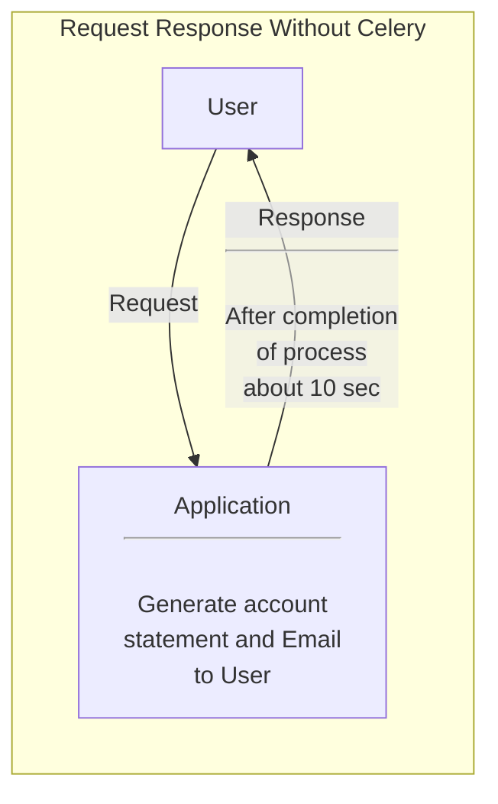
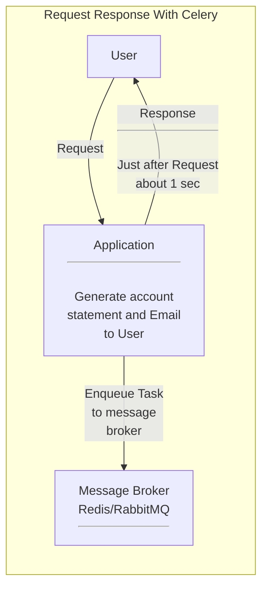

# Celery

- Celery is a simple, flexible, and reliable distributed system to process vast amounts of messages, while providing operations with the tools required to maintain such a system.
- It's a task queue with focus on real-time processing, while also supporting task scheduling.
- Task queues are used as a mechanism to distribute work across threads or machines
- A celery system can consists of multiple workers and brokers , giving way to high availability and horizontal scalling.
- Celery allows you to execute background tasks asynchronously, which is especially useful for long-running or time-consuming operations that shouldn't block the main application.
- Celery is written in Python, but the protocol can be implemented in any language.
- Celery can run on a single machine, on multiple machines, or even across data center.

