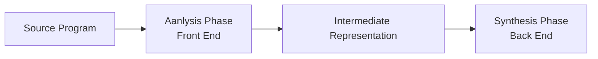
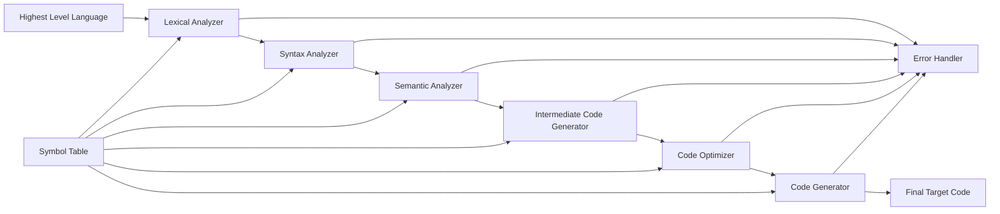
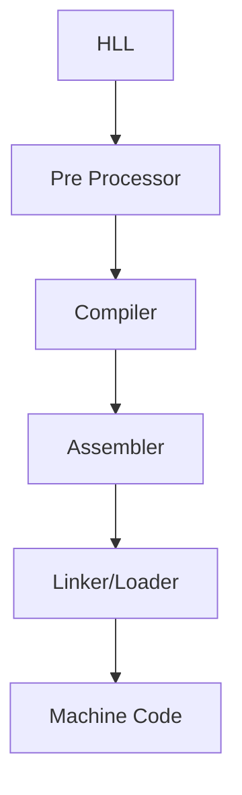

# Compiler

- A software that converts a program written in high level language to low level language.

# Phases of Compiler

- There are two phases of compiler
  - Analysis Phase
  - Synthesis Phase
- Each of them takes input from previous phase and gives output to next phase.

## Analysis Phase

- It is also called as Front End.
- Machine independent phase.
- It takes source program as input and produces intermediate representation and symbol table as output.
- checks for lexical, syntax, semantic and grammer errors.
- It is further divided into three phases
  - Lexical Analysis
  - Syntax Analysis
  - Semantic Analysis

### Lexical Analysis

- It is also called as Scanning.
- It takes source program as input and produces tokens as output.
- It checks for lexical errors.
- It is done by Lexical Analyzer.
- Lexical: It means words or vocabulary of a language.
- Lexeme: It is a sequence of characters in the source program that is matched by the pattern for a token.
- Token: It is a pair consisting of a token name and an optional attribute value.
- Pattern: It is a description of the form that the lexemes of a token may take.
- Lexical Analyzer: It is a program that matches the characters in the source program to the characters in the pattern and produces tokens.
- Lexical Errors: It is an error that occurs when the lexical analyzer cannot recognize a pattern.

### Syntax Analysis

- It is also called as Parsing.
- It takes tokens as input and produces parse tree as output.
- It checks for syntax errors.
- It is done by Syntax Analyzer.
- Syntax Analyzer: It is a program that checks whether the tokens generated by the lexical analyzer are syntactically correct.
- Syntax Errors: It is an error that occurs when the syntax analyzer cannot recognize a pattern.

### Semantic Analysis

- It takes parse tree as input and produces intermediate representation and symbol table as output.
- It checks for semantic errors.
- It is done by Semantic Analyzer.
- Semantic Analyzer: It is a program that checks whether the parse tree generated by the syntax analyzer is semantically correct.
- Semantic Errors: It is an error that occurs when the semantic analyzer cannot recognize a pattern.

## Synthesis Phase

- It is also called as Back End.
- Machine dependent phase.
- It takes intermediate representation and symbol table as input and produces target program as output.
- It is further divided into three phases
  - Intermediate Code Generation
  - Code Optimization
  - Code Generation

### Intermediate Code Generation

- It takes parse tree as input and produces intermediate representation and symbol table as output.
- It is done by Intermediate Code Generator.
- Intermediate Code Generator: It is a program that generates intermediate representation and symbol table.

### Code Optimization

- It takes intermediate representation and symbol table as input and produces optimized intermediate representation and symbol table as output.
- It is done by Code Optimizer.
- Code Optimizer: It is a program that optimizes the intermediate representation and symbol table.

### Code Generation

- It takes optimized intermediate representation and symbol table as input and produces target program as output.
- It is done by Code Generator.
- Code Generator: It is a program that generates target program.

## Symbol Table

- It is a data structure that stores information about the identifiers in the source program.
- It is used by the compiler to collect and store information about the identifiers.
- It is used by the compiler to check whether the identifiers are declared before use.

# Language Processing System

- It is a software that takes a source program as input and produces target program as output.
- The hardware understands the language which human can not understand
- we write the program in high level language which is easy to understand for human
- these programs are the fed into a series of tools and os components which converts the program into machine language which is understood by the hardware
- this series of tools and os components is called language processing system
- it is also called as language processor

- Pre Processor: It is a program that takes a source program as input and produces an expanded source program as output like it expands the heAder files in C language.
- Compiler: It is a program that takes a source program as input and produces an object program as output.
- Assembler: It is a program that takes an assembly language program as input and produces an object program as output.
- Linker/Loader: It is a program that takes an object program as input and produces an executable program as output.
# Details : Phases of Compiler
position= initial + rate*60